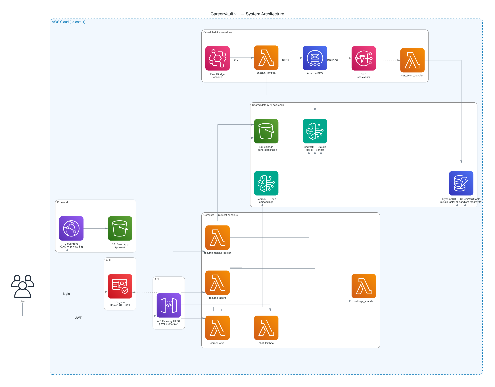
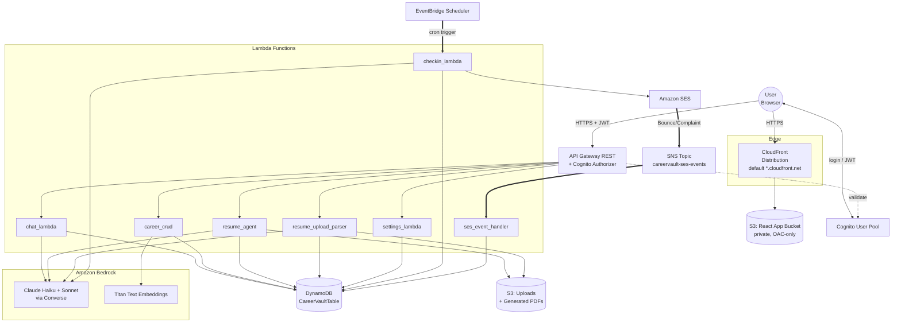
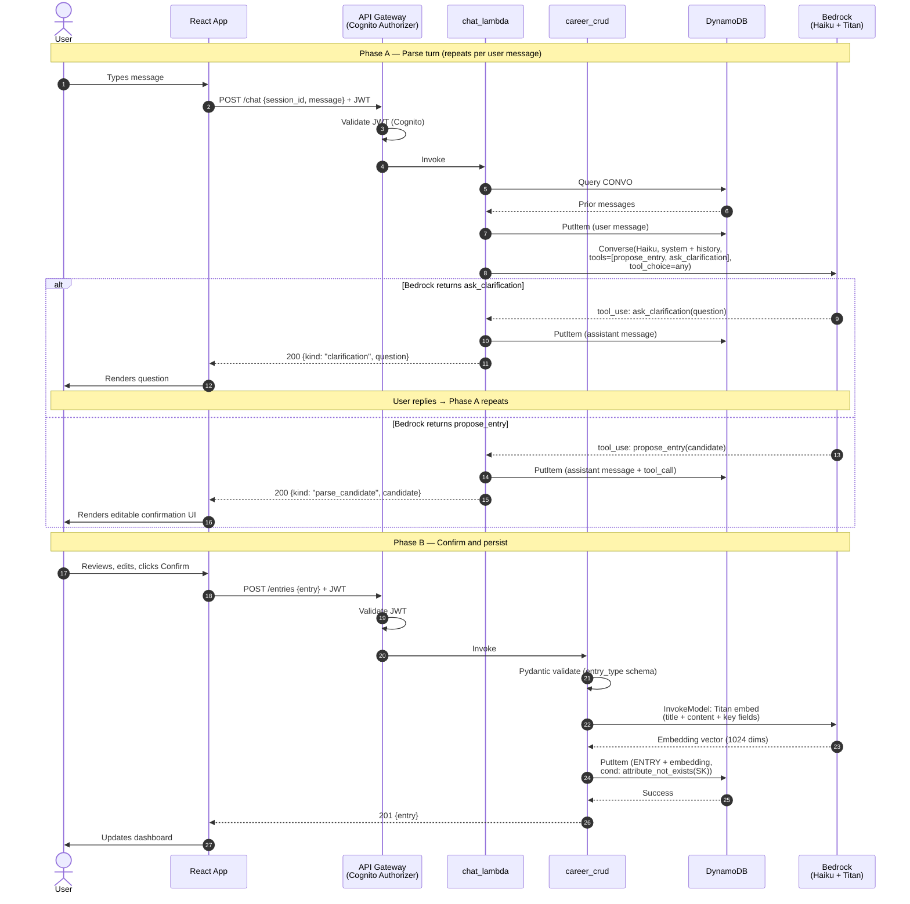
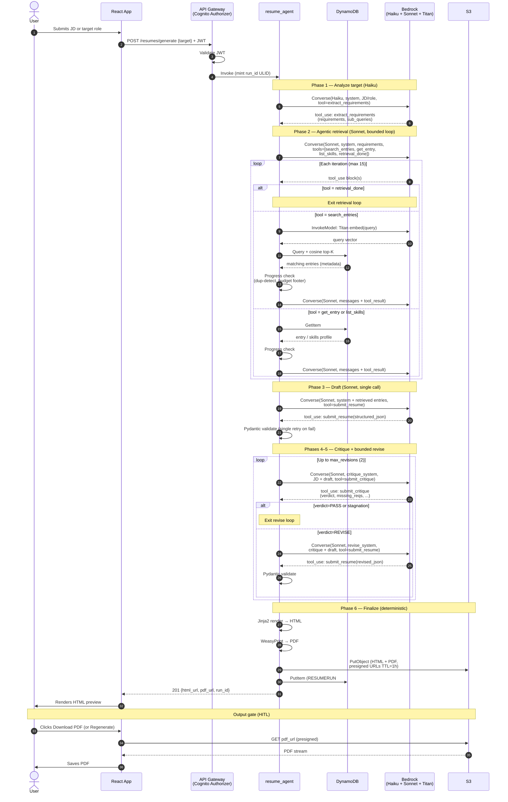
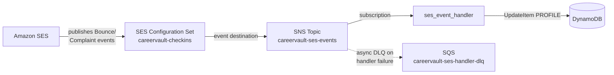

# CareerVault — Architecture Document

**Version:** 2.1
**Status:** **Complete** — architecture phase finalized (1.1–1.7: implementation-driven clarifications)
**Last updated:** 2026-07-29

---

## 0. Overview

This document captures the technical architecture of CareerVault v1, building on the decisions in `careervault-requirements.md` (v0.4) and the ADRs in `careervault-adl.md`. It is the second formal artifact of the project SDLC, sitting between requirements and implementation. With the completion of Section 5 and ADR-023/ADR-025, the architecture phase is closed; implementation follows.

The document is structured as follows:

1. System architecture diagram + rationale
2. Data model (DynamoDB single-table design, including per-type metadata schemas)
3. Key sequence diagrams (entry ingestion, resume agent loop, check-in pipeline)
4. Cross-cutting concerns (observability, IAM, secrets, encryption, async messaging, embedding reliability, operational hygiene)
5. SAM template structure (how the IaC is organized, including Lambda layer composition and the local/CI deployment story)

Each section closes one or more ADRs in the ADL.

---

## 1. System Architecture

### 1.1 Diagram

The current system architecture diagram is maintained as code in [`render_architecture.py`](render_architecture.py) (using the `diagrams` / mingrammer library) and rendered to [`careervault_architecture.png`](careervault_architecture.png) and [`careervault_architecture.pdf`](careervault_architecture.pdf). Regenerate by running `python docs/render_architecture.py` after architecture changes — any change to the system shape updates the script and re-renders **in the same commit**. Authoring conventions live in the project's `render-diagram` skill.



**The rendered PNG above is authoritative.** The Mermaid block below is a text-searchable quick reference; where they disagree, trust the PNG. (The PNG draws representative DynamoDB edges and carries the "all handlers read/write" fact in the node caption to keep the hub legible; the Mermaid enumerates every handler→store edge.)



This is a **Container-level diagram** in the C4 model — each box is a separately deployable thing, and the arrows are the data flows between them. Internal Lambda details surface in the sequence diagrams (section 3).

### 1.2 Rationale by layer

**User & edge.** The user's browser is the only client. Static assets (the React app bundle) come from a private S3 bucket fronted by CloudFront via Origin Access Control. The bucket has no public access — only CloudFront's SigV4-signed requests can reach it. At MVP the app is served on the **default `*.cloudfront.net` domain and CloudFront's default TLS certificate** — no ACM certificate and no Route 53 hosted zone. The custom-domain half of ADR-019 (ACM in us-east-1 + Route 53 alias records + Cognito callback-URL updates) was deferred as a v1.x upgrade per the **ADR-019 amendment (2026-07-15)**: it adds recurring hosted-zone cost and DNS/cert-validation setup for zero functional benefit on a single-user app, and the default CloudFront domain is HTTPS out of the box. The S3 + CloudFront + OAC core of the pattern is unchanged.

**Auth boundary.** The frontend authenticates the user directly against Cognito (hosted UI vs SDK-driven still open — becomes ADR-025). Cognito returns a JWT on successful login, which the frontend sends as `Authorization: Bearer <token>` on every API call. API Gateway has a Cognito authorizer configured that validates the JWT *before* invoking any backend Lambda. The Lambdas themselves never deal with auth — by invocation time, the user is authenticated and the `user_id` is available in the request context.

**Why multiple Lambdas instead of one router Lambda.** A real choice with trade-offs. We're splitting into focused functions for four reasons:

- **IAM least-privilege (NFR-4.4):** each Lambda gets a narrow IAM role. The chat Lambda doesn't need permission to send email; the check-in Lambda doesn't need permission to write to the resume PDF bucket. Tighter blast radius if any one Lambda were compromised.
- **Independent timeouts and memory:** the resume agent might run for 25 seconds with 1024 MB; the settings endpoint should return in 100ms on 256 MB. One configuration per function.
- **Smaller cold-start surface:** a router Lambda would need to load every dependency on cold start. Split functions only pay cold-start cost for the dependencies they actually use. `resume_agent` pulls in WeasyPrint; `settings_lambda` doesn't need to.
- **Independent deployment:** iterating on the check-in Lambda doesn't redeploy unrelated code.

**Data layer — two stores.**

- **DynamoDB** holds all structured data: career entries, user profile/settings, conversation history, goals. Single-table per ADR-005, with the data model fully specified in section 2.
- **S3** holds blob data: user-uploaded resume files (PDF, DOCX) and generated resume PDFs. One bucket with prefixes (`uploads/{user_id}/...` and `generated/{user_id}/...`), not two — IAM scoping and lifecycle policies can both be done at the prefix level.

**AI layer.** All inference goes through Bedrock (ADR-008). Two distinct usages, both `boto3.client('bedrock-runtime')` under the hood:

- **Claude Haiku + Sonnet via Converse** for chat parsing, agent reasoning, resume generation, and check-in personalization.
- **Titan Text Embeddings** for write-time embedding generation in `career_crud`.

A shared `bedrock_client.py` module in a Lambda layer (ADR-023, pending) centralizes this.

**Scheduled flow.** EventBridge Scheduler runs a cron rule (cadence per FR-4.1, default weekly) that invokes `checkin_lambda`. The Lambda reads recent entries from DynamoDB, calls Claude Haiku for a personalized prompt, and ships the email via SES. Post-send, SES publishes Bounce and Complaint events to the `careervault-ses-events` SNS topic; `ses_event_handler` consumes those events and updates the corresponding user's PROFILE so the system can react to deliverability problems. The full event-routing pipeline is detailed in Section 4.5.

### 1.3 What's deliberately not in v1

- **No VPC.** All Lambdas run in the default Lambda network.
- **No API Gateway caching, no CloudFront caching for API routes.**
- **No SQS or Step Functions between Lambdas.**
- **No WAF.**
- **No multi-region.**

### 1.4 Cross-cloud parallels

| Layer | AWS | Azure | GCP |
|---|---|---|---|
| Edge / Static | CloudFront + S3 + OAC | Azure Front Door + Blob Storage + Private Endpoints | Cloud CDN + GCS + signed URLs |
| TLS cert | ACM | App Service Managed Certs / Key Vault | Google-managed SSL |
| Auth | Cognito | Microsoft Entra ID External ID | Identity Platform / Firebase Auth |
| API edge | API Gateway | API Management | API Gateway / Apigee |
| Compute | Lambda | Azure Functions | Cloud Functions / Cloud Run |
| Data | DynamoDB | Cosmos DB | Firestore |
| Blob store | S3 | Blob Storage | Cloud Storage |
| LLM platform | Bedrock | Azure AI Foundry | Vertex AI |
| Scheduler | EventBridge Scheduler | Logic Apps / Azure Functions Timer | Cloud Scheduler |
| Transactional email | SES | Azure Communication Services Email | (typically SendGrid / Mailgun) |

---

## 2. Data Model

The data model follows DynamoDB single-table design per ADR-005, with the entity inventory, key design, and per-type schemas captured here. Underpinning ADRs: ADR-005 (single-table), ADR-022 (per-type metadata), ADR-026 (entity model), ADR-027 (hard delete), ADR-028 (no GSIs at MVP).

### 2.1 Methodology — access-pattern-first

DynamoDB modeling differs fundamentally from relational design. You can't retrieve items by arbitrary properties efficiently — only by primary key (Get), by primary key range (Query), or by scanning the whole table. New query patterns require either restructuring keys or adding Global Secondary Indexes; both have real costs.

The methodology, popularized by Alex DeBrie and Rick Houlihan, is to enumerate every access pattern the application needs *before* designing keys. Keys and indexes are then designed to support all patterns via Get or Query — never Scan.

The same discipline transfers to Cosmos DB and Firestore, both of which technically support more flexible queries but reward upfront access-pattern design at scale.

### 2.2 Access patterns

Twelve access patterns drive the design:

**Profile & settings**
- AP-1: Get a user's profile and settings
- AP-2: Update a user's profile or settings

**Entries** (8 subtypes: JOB, PROJECT, MILESTONE, CERT, AWARD, EDUCATION, VOLUNTEER, HOBBY)
- AP-3: Create a new entry
- AP-4: Get an entry by ID
- AP-5: Update an entry
- AP-6: Delete an entry (hard delete with UI confirm — see ADR-027)
- AP-7: List all entries for a user, sorted by event date (dashboard chronological view)
- AP-8: List entries filtered by type
- AP-9: List entries within a date range (check-in pipeline)
- AP-10: Read all entries for a user (resume agent retrieval + similarity ranking)

**Conversation**
- AP-11: Append a message to a conversation session
- AP-12: Get the message history for a session

AP-7, AP-8, and AP-9 are implemented as filter/sort over AP-10's full read at MVP scale — see section 2.5.

### 2.3 Entity model

Four entity types, captured in ADR-026:

| Entity | Kind | Cardinality per user |
|---|---|---|
| `PROFILE` | Singleton — user profile + settings | exactly 1 |
| `ENTRY` | Career and life events (8 subtypes) | many |
| `GOAL` | Forward-looking goals and target outcomes | many |
| `CONVERSATION_MESSAGE` | Chat session messages | many |

`ENTRY` covers eight subtypes: **JOB**, **PROJECT**, **MILESTONE**, **CERT**, **AWARD**, **EDUCATION**, **VOLUNTEER**, **HOBBY**. The umbrella name (`ENTRY` vs. the earlier `CAREER_ENTRY`) was generalized to accommodate volunteer work and hobbies, which aren't strictly "career" but belong in the same retrieval pool.

**Skills** are modeled hybrid: as `skills_tags` on individual entries (for agent retrieval matching) *and* a curated `skills` list on the PROFILE (for the resume's Skills section).

**Employer** is modeled as a free-text attribute on JOB, PROJECT, and MILESTONE entries (with frontend autocomplete suggestions from past values) rather than as a normalized entity. Personal-scale data doesn't justify the normalization overhead.

### 2.4 Primary key design

Single composite key. Both PK and SK are strings. Captured in ADR-026.

| Entity | PK | SK |
|---|---|---|
| Profile / Settings | `USER#<user_id>` | `PROFILE` |
| Entry (any subtype) | `USER#<user_id>` | `ENTRY#<entry_id>` |
| Goal | `USER#<user_id>` | `GOAL#<goal_id>` |
| Conversation message | `USER#<user_id>` | `CONVO#<session_id>#<message_id>` |

The `<user_id>` is the Cognito `sub` claim from the JWT. All generated IDs are **ULIDs** (lexicographically sortable, time-ordered, 26-char unique identifiers — see glossary).

**Item collection:** All of a user's data shares `PK = USER#<user_id>`, so a single Query against that PK can fetch the entire user state. Entries cluster together by SK prefix (`ENTRY#`), goals cluster together (`GOAL#`), conversation messages cluster by session (`CONVO#<session_id>#`).

**Hot partition note:** DynamoDB partitions data physically by PK hash. A single-user app has no hot-partition risk. For future multi-tenant scaling, `USER#<user_id>` distributes naturally across the partition space.

### 2.5 Access patterns → operations

Every access pattern resolves to a single DynamoDB operation. No Scans, no GSIs.

| AP | DynamoDB operation |
|---|---|
| AP-1 Get settings | `GetItem(PK=USER#u, SK=PROFILE)` |
| AP-2 Update settings | `UpdateItem(PK=USER#u, SK=PROFILE)` |
| AP-3 Create entry | `PutItem` (also calls Bedrock Titan for embedding) |
| AP-4 Get entry by ID | `GetItem(PK=USER#u, SK=ENTRY#id)` |
| AP-5 Update entry | `UpdateItem(PK=USER#u, SK=ENTRY#id)` |
| AP-6 Delete entry | `DeleteItem(PK=USER#u, SK=ENTRY#id)` |
| AP-7 List chronologically | `Query(PK=USER#u, begins_with(SK,"ENTRY#"))`, sort by `event_date` in Lambda |
| AP-8 List by type | Same as AP-7, filter by `entry_type` in Lambda |
| AP-9 List by date range | Same as AP-7, filter by `event_date` in Lambda |
| AP-10 Read all entries | `Query(PK=USER#u, begins_with(SK,"ENTRY#"))` |
| AP-11 Append message | `PutItem` with new ULID |
| AP-12 Get session history | `Query(PK=USER#u, begins_with(SK,"CONVO#<session_id>#"))` |

The **dashboard sorting** happens client-side in React, not in the backend. The Lambda returns the full set; the React frontend exposes sort controls (event date asc/desc, created date asc/desc, grouped by type) and re-sorts the in-memory array on toggle. At MVP scale (hundreds of entries), this is snappier than network round-trips and keeps the backend simpler.

> **AP-5 is a conditional `PutItem`, not `UpdateItem` (slice-3 note).** The table above names `UpdateItem` for AP-5 as the DynamoDB primitive, but `career_crud` implements an edit as a full-item **`PutItem` guarded by `attribute_exists(SK)`**: the edit UI submits the complete re-validated entry, so the write *replaces* the stored item (preserving `created_at`, advancing `updated_at`) rather than patching fields. This avoids composing dynamic `SET`/`REMOVE` expressions — including `REMOVE` for optional fields the user cleared — across the eight subtypes, and it means `career_crud` needs no `UpdateItem` grant (see the §4.2.3 note). The embedding is refreshed inline only when the embedded text changed (ADR-024 edit-path note). `PutItem`'s condition also closes the read-then-write race: an entry deleted between the handler's read and its write fails the condition and returns `404` rather than being resurrected. **AP-10 reads must paginate** (`LastEvaluatedKey`): each entry carries a ~1024-float embedding (~20 KB), so a few dozen entries exceed the 1 MB Query page and a single-page read would silently truncate the list.

### 2.6 GSI strategy — none at MVP (ADR-028)

We considered Global Secondary Indexes for AP-7, AP-8, AP-9 and explicitly chose not to add them. Reasoning:

- **Corpus size.** Hundreds of entries means AP-10 returns 50–500 items. Reading them all and filtering in Lambda is milliseconds, single-digit RCUs.
- **Cost.** Each GSI effectively doubles write throughput consumption (every write to the base table replicates to every GSI).
- **Existing commitment.** ADR-016 already commits the resume agent to "read all entries and rank in Lambda" for vector similarity. The dashboard and check-in pipeline reuse that read pattern at no extra cost.
- **Simplicity.** Fewer moving parts to design, deploy, and reason about.

**Trigger to revisit:** if entry counts grew into the thousands AND CloudWatch showed AP-7 latency degrading, GSI1 sorted on `event_date` would be the first addition. That's a v2 problem.

### 2.7 Per-entry-type metadata schemas (ADR-022)

The schemas are application-level conventions enforced by **Pydantic models** in the Lambda code. DynamoDB itself remains schemaless, so new attributes can be added to any type in the future without table migrations.

**Common attributes (all ENTRY items)**

| Attribute | Type | Required | Notes |
|---|---|---|---|
| `PK` | string | yes | `USER#<user_id>` |
| `SK` | string | yes | `ENTRY#<entry_id>` |
| `entity_type` | string | yes | Always `"ENTRY"` |
| `entry_type` | string | yes | One of the 8 subtypes |
| `entry_id` | string | yes | ULID |
| `title` | string | yes | Short headline |
| `content` | string | yes | Free-text description / parsed details |
| `event_date` | ISO 8601 date | yes¹ | Used for chronological sort |
| `skills_tags` | list of strings | no | For retrieval matching and resume Skills section |
| `embedding` | list of numbers | yes | Titan embedding vector (~1024 dims) |
| `embedding_model` | string | yes | e.g., `"amazon.titan-embed-text-v2:0"` |
| `created_at` | ISO 8601 datetime | yes | System-generated |
| `updated_at` | ISO 8601 datetime | yes | System-generated, refreshed on UpdateItem |

¹ For HOBBY entries with no obvious date, `event_date` falls back to `created_at`. The Lambda normalizes `start_date` / `issued_date` / `awarded_date` into `event_date` at read time for unified sorting.

**JOB**
| Attribute | Type | Required |
|---|---|---|
| `employer` | string | yes |
| `start_date` | ISO date | yes |
| `end_date` | ISO date \| null | no |
| `location` | string | no |
| `employment_type` | enum | no |

**PROJECT**
| Attribute | Type | Required |
|---|---|---|
| `start_date` | ISO date | yes |
| `end_date` | ISO date | no |
| `employer` | string | no |
| `url` | string | no |
| `related_job_id` | string | no |

**MILESTONE**
| Attribute | Type | Required |
|---|---|---|
| `employer` | string | no |
| `related_job_id` | string | no |
| `impact_metric` | string | no |

**CERT**
| Attribute | Type | Required |
|---|---|---|
| `issuer` | string | yes |
| `issued_date` | ISO date | yes |
| `expires_date` | ISO date | no |
| `credential_id` | string | no |
| `credential_url` | string | no |

**AWARD**
| Attribute | Type | Required |
|---|---|---|
| `issuer` | string | no |
| `awarded_date` | ISO date | yes |

**EDUCATION**
| Attribute | Type | Required |
|---|---|---|
| `institution` | string | yes |
| `degree` | string | yes |
| `start_date` | ISO date | yes |
| `end_date` | ISO date \| null | no |
| `gpa` | string | no |
| `activities` | list of strings | no |
| `honors` | list of strings | no |
| `coursework` | list of strings | no |

**VOLUNTEER**
| Attribute | Type | Required |
|---|---|---|
| `organization` | string | yes |
| `start_date` | ISO date | yes |
| `end_date` | ISO date | no |
| `hours_per_week` | number | no |

**HOBBY**
| Attribute | Type | Required |
|---|---|---|
| `start_date` | ISO date | no |
| `end_date` | ISO date | no |
| `url` | string | no |

**GOAL attributes**

| Attribute | Type | Required |
|---|---|---|
| `goal_id` | string (ULID) | yes |
| `title` | string | yes |
| `content` | string | yes |
| `target_date` | ISO date | yes |
| `status` | enum: active / achieved / abandoned | yes |
| `achieved_at` | ISO datetime | no |
| `created_at`, `updated_at` | ISO datetime | yes |

**CONVERSATION_MESSAGE attributes**

| Attribute | Type | Required |
|---|---|---|
| `session_id` | string (ULID) | yes |
| `message_id` | string (ULID) | yes |
| `role` | enum: user / assistant / system | yes |
| `content` | string | yes |
| `tool_calls` | list \| null | no (populated for agent-loop messages) |
| `created_at` | ISO datetime | yes |

### 2.8 Sample item shapes

**Profile**
```json
{
  "PK": "USER#alice-cognito-sub-abc123",
  "SK": "PROFILE",
  "entity_type": "PROFILE",
  "email": "alice@example.com",
  "summary": "Backend engineer with 8 years of distributed-systems experience...",
  "skills": ["python", "aws", "distributed-systems", "kafka"],
  "portfolio_links": {
    "github": "https://github.com/alice",
    "linkedin": "https://linkedin.com/in/alice"
  },
  "phone": null,
  "settings": {
    "checkin_cadence": "weekly",
    "checkin_paused": false,
    "preferred_template_id": "modern-minimal"
  },
  "created_at": "2026-06-01T10:00:00Z",
  "updated_at": "2026-06-04T14:32:00Z"
}
```

**Entry (JOB)**
```json
{
  "PK": "USER#alice-cognito-sub-abc123",
  "SK": "ENTRY#01HXAB3K9T8MQNJ4F5G6H7K8N9",
  "entity_type": "ENTRY",
  "entry_type": "JOB",
  "entry_id": "01HXAB3K9T8MQNJ4F5G6H7K8N9",
  "title": "Senior Backend Engineer",
  "employer": "Acme Corp",
  "start_date": "2020-03-15",
  "end_date": "2022-08-30",
  "location": "San Francisco, CA",
  "employment_type": "full-time",
  "content": "Led migration of payment systems to AWS, reducing infra costs by 40%...",
  "skills_tags": ["python", "aws", "leadership"],
  "embedding": [0.123, -0.456, 0.789, "..."],
  "embedding_model": "amazon.titan-embed-text-v2:0",
  "created_at": "2026-06-04T12:00:00Z",
  "updated_at": "2026-06-04T12:00:00Z"
}
```

**Conversation message**
```json
{
  "PK": "USER#alice-cognito-sub-abc123",
  "SK": "CONVO#01HXC4F2K9TZP#01HXC4F2KA1MQNJ",
  "entity_type": "CONVO_MESSAGE",
  "session_id": "01HXC4F2K9TZP",
  "message_id": "01HXC4F2KA1MQNJ",
  "role": "user",
  "content": "I just got AWS Solutions Architect Associate certification.",
  "created_at": "2026-06-04T12:01:30Z"
}
```

### 2.9 Embedding storage notes

- Embeddings stored as DynamoDB Lists of Numbers on each ENTRY item.
- Titan Embed v2 at default 1024 dimensions ≈ 10–15 KB per entry — well within DynamoDB's 400 KB item size limit.
- `embedding_model` attribute preserves provenance. Critical for the upgrade path: if a future embedding-model swap occurs, we need to re-embed all entries, and `embedding_model` flags which items are stale.
- Embedding generation runs synchronously in the `career_crud` Lambda's write path for MVP. The async alternative (DynamoDB Streams → embedding Lambda) is captured for future consideration as ADR-024.

### 2.10 Delete semantics — hard delete (ADR-027)

CareerVault uses hard delete with a UI confirmation dialog. Soft delete (with a `deleted_at` filter on every list query) was considered but rejected: single-user ownership means "user clicks delete" should genuinely delete, every list path stays filter-free, and future right-to-erasure obligations are satisfied naturally. The UI confirm dialog covers the accidental-delete UX risk without the data-model complexity.

---

## 3. Sequence Diagrams

The system architecture in Section 1 shows *what* the pieces are. This section shows *how* the three primary user-visible flows actually run through them. Each flow is presented as a Mermaid `sequenceDiagram` with prose covering the moving parts, the contracts between Lambdas, and the error paths.

### 3.1 Entry ingestion



#### 3.1.1 Phase A — the parse turn

Every user message in a chat session runs through Phase A. The Lambda's job is to turn free-form text into either a structured entry candidate or a clarifying question — never to persist an entry. That keeps `chat_lambda`'s IAM role narrow: it needs `dynamodb:Query` and `dynamodb:PutItem` scoped to `CONVO#*` items, plus `bedrock:InvokeModel` for Haiku. Nothing else.

The Lambda fetches the session's conversation history (AP-12), persists the new user message (AP-11), and hands everything to Claude Haiku via the Converse API. Two things are non-obvious here:

- **Why fetch history every turn instead of caching it.** Lambdas are stateless between invocations; the same session could land on any warm container. DynamoDB is the source of truth. With a small message count per session (tens, not thousands), the Query is well under 10ms and a few RCUs.
- **Why persist the user message *before* calling Bedrock.** If Bedrock fails or times out, the user's message is already durably recorded. They can hit retry without losing their input. This is a common pattern for "save user intent first, react to it second."

#### 3.1.2 The two-tool pattern

The chat Lambda gives Claude exactly two tools and forces a tool call (`tool_choice="any"`):

| Tool | Purpose | Input schema (sketch) |
|---|---|---|
| `propose_entry` | Emit a structured entry candidate | `{entry_type: enum(8), title, content, event_date, ...type-specific fields}` |
| `ask_clarification` | Ask the user a follow-up question | `{question: string, reason: enum("missing_date", "ambiguous_type", "needs_employer", ...)}` |

In the Converse API, `tool_choice` controls when the model can call tools:

- `auto` — model may call a tool or respond with text
- `any` — model **must** call one of the provided tools (its pick which one)
- `tool` (specific) — model must call exactly this tool

`any` is what fits here: the model is required to produce structured output, but it gets to decide whether the input warrants a parse or a clarification. The same primitive exists in Azure OpenAI (`tool_choice: "required"`) and Vertex AI Gemini (function calling mode `ANY`) with near-identical semantics.

**Why structured-via-tools beats structured-via-JSON-prompt.** Asking the model "respond with JSON matching this schema" works most of the time but degrades on edge cases — the model wraps the JSON in prose, adds a hallucinated comment, or invents an extra field. Tool input schemas are enforced by Bedrock at the API layer: the response *will* match the schema or the model is asked to try again before you ever see it. You get type safety for free instead of writing JSON-repair code.

The tool input schemas mirror the Pydantic models from ADR-022 — both are generated from the same source definitions in the shared Lambda layer (decision belongs in ADR-023 when we get there). That keeps the parse-time contract and the validate-time contract in lockstep.

#### 3.1.3 Phase B — confirm and persist

When the user confirms, the request goes to `career_crud`, not back through `chat_lambda`. Two reasons, both already in the deck from Section 1:

- **IAM least-privilege.** `career_crud` is the only function with `dynamodb:PutItem` on `ENTRY#*`. A bug or compromise in `chat_lambda` can't write entries.
- **Concern separation.** `chat_lambda` owns the conversation; `career_crud` owns the entry lifecycle. When we add edit (AP-5) and delete (AP-6) later, they land on `career_crud` naturally.

The Lambda's flow is short:

1. **Pydantic validation** by `entry_type`. The schemas from Section 2.7 are the single source of truth — if the user edited a required field to empty in the confirmation UI, this is where it gets caught. Returns `422 Unprocessable Entity` with field-level errors that React displays inline.
2. **Embedding generation via Titan.** A concatenation of `title + content + skills_tags + employer/issuer/institution` (per entry type) is embedded synchronously. ~1024 dimensions, ~10–15 KB, ~$0.00002 per call. Sync was committed in Section 2.9; ADR-024 in Section 4 will revisit the async option.
3. **Conditional PutItem.** The SK includes the ULID generated when `propose_entry` returned its candidate, and the write uses `attribute_not_exists(SK)`. This makes the confirm action idempotent — see below.

#### 3.1.4 Idempotency

The ULID is minted once, at `propose_entry` time, and travels with the candidate through the confirmation UI back to `career_crud`. The conditional PutItem (`attribute_not_exists(SK)`) means:

- **First confirm** → write succeeds → `201 Created`.
- **Duplicate confirm** (network retry, double-click, browser back-and-forward) → conditional fails → `career_crud` catches the `ConditionalCheckFailedException`, treats it as success, returns `200 OK` with the existing item.

This is the standard idempotency pattern for DynamoDB writes and worth internalizing — it generalizes to any "create once, retry-safe" flow. Azure Cosmos DB has the same primitive via `If-Match` etag pre-conditions; Firestore uses transaction pre-conditions on document existence.

#### 3.1.5 HTTP status code contract for `POST /entries`

To make the contract explicit:

| Status | Meaning |
|---|---|
| `201 Created` | First successful confirm — entry written, embedding stored. |
| `200 OK` | Idempotent duplicate confirm — entry already existed (see 3.1.4). Body contains the existing item. |
| `409 Conflict` | Possible **semantic** duplicate detected and not yet acknowledged (ADR-033). Nothing written. Body: `{message: "possible_duplicate", entry_id, possible_duplicates: [{entry_id, entry_type, title, similarity}]}`. The client re-confirms with `acknowledge_duplicate: true` (same `entry_id`) to save. |
| `422 Unprocessable Entity` | Pydantic validation failed on the submitted payload. Body contains field-level errors. |
| `500 Internal Server Error` | Unexpected failure — Bedrock unreachable, Titan embed failed, DynamoDB throttled past retries. |
| `401 Unauthorized` | Returned by API Gateway before `career_crud` is invoked when the JWT is invalid or expired. |

The `409` distinguishes a *semantic* duplicate (a re-described accomplishment — same meaning, new `entry_id`) from the `200` *identity* duplicate (a retry of the exact same proposal card). The former is a soft, overridable warning; the latter is silent idempotency. The `200` vs `201` split is the part worth being deliberate about — many APIs collapse both into `200`, but distinguishing them lets the frontend tell "entry was just saved" (show a confirmation toast) from "entry was already there" (silent dedupe) without inspecting the body. The `422` vs `500` split matters because `422` is *recoverable by the user* (fix the field and resubmit) while `500` is *retryable by the client* (the server may succeed on retry). Conflating them is a common API design mistake.

#### 3.1.6 Error and retry paths

| Failure | Where | Behavior |
|---|---|---|
| Cognito JWT invalid/expired | API Gateway authorizer | `401 Unauthorized`. React redirects to login. Lambda never invoked. |
| Bedrock transient (5xx, throttle) on parse | `chat_lambda` → Haiku | Exponential backoff, max 3 attempts (NFR-3.3). After exhaustion, `chat_lambda` returns `{kind: "error", message: "I couldn't process that — please try again."}` with HTTP 200, so the chat UI keeps the session alive rather than dropping the user out. |
| Bedrock returns malformed tool input | `chat_lambda` | Pydantic validation against the tool's schema fails. Lambda asks Haiku to retry **once** with the validation error appended to the message; if it fails again, falls through to the same error response as above. |
| Pydantic validation fails on confirm | `career_crud` | `422 Unprocessable Entity` with field-level errors. React highlights the offending fields. |
| Titan embedding failure | `career_crud` | Sync path: bubble up as `500`. Frontend shows "couldn't save — please retry." No fallback in MVP (the embedding is part of the entry record per Section 2.9). ADR-024 reconsiders. |
| Conditional PutItem fails | `career_crud` | Treated as idempotent success (see 3.1.4), `200 OK`. |

The check-in pipeline's failure model is different (it's batch, not user-facing) and is covered in 3.3. Cross-cutting concerns — structured logging, X-Ray tracing, the per-Lambda IAM policy table — live in Section 4 so they're stated once across all flows.

### 3.2 Resume agent loop

This section formalizes ADR-010 (custom Bedrock tool-use agent loop). It's the most conceptually dense flow in the system because, unlike entry ingestion (which uses tool use as a structured *output* mechanism), the resume agent uses tool use as an actual **control plane** — the LLM decides what to do next, the Lambda executes it, the result feeds back, and the loop continues until a termination condition fires. This is the canonical agentic primitive, and it's worth laying the conceptual ground before walking through the diagram.

#### 3.2.0 The agentic loop primitive

An agent loop is a `while`-style loop where each iteration:

1. Sends a message list (plus available tools) to an LLM
2. Reads the LLM's response, which contains either a request to call one or more tools, or a final answer
3. If tool calls: executes them, appends the results to the message list, repeats
4. If final answer or termination condition: exits

The canonical implementation in Python against Bedrock Converse:

```python
messages = [{"role": "user", "content": [{"text": initial_prompt}]}]

for iteration in range(MAX_ITERATIONS):
    response = bedrock.converse(
        modelId=SONNET_MODEL_ID,
        system=[{"text": system_prompt}],
        messages=messages,
        toolConfig={"tools": TOOLS},
    )

    # Always append the model's response to the conversation
    messages.append({
        "role": "assistant",
        "content": response["output"]["message"]["content"],
    })

    stop_reason = response["stopReason"]

    if stop_reason == "end_turn":
        return extract_final_text(response)

    if stop_reason == "tool_use":
        tool_use_blocks = [
            block["toolUse"]
            for block in response["output"]["message"]["content"]
            if "toolUse" in block
        ]
        tool_results = [execute_tool(tu) for tu in tool_use_blocks]
        messages.append({"role": "user", "content": tool_results})
        continue

    if stop_reason == "max_tokens":
        raise AgentBudgetExceeded("model hit max_tokens mid-response")

    if stop_reason == "guardrail_intervened":
        raise AgentGuardrailBlocked("Bedrock guardrail blocked the response")

    # stop_sequence or any other reason — defensive bail-out
    raise AgentUnknownStop(f"unexpected stop reason: {stop_reason}")

raise AgentMaxIterations(f"loop did not terminate within {MAX_ITERATIONS}")
```

Three properties make this *agentic* rather than a hard-coded chain:

- **The LLM picks the next action.** No `if step == 2: do_X()` in the code. Control flow is emergent from the model's decisions.
- **There's an explicit stopping condition.** Either the model emits `end_turn` (or a designated `finalize`-style tool), or a guardrail in the loop fires (iteration ceiling, token budget, timeout).
- **State accumulates in the message list.** Each tool call and result stays in context. The agent "remembers" what it's done — which is also why context-window management matters. Runaway loops can blow through Sonnet's 200K limit if not bounded.

Cross-cloud, the same structure works against **Azure OpenAI** (`tool_calls` in `choices[0].message`, append messages with `role: "tool"`), **Vertex AI Gemini** (`function_call` parts in candidates, append `function_response` parts), and the **Anthropic API** directly (which Bedrock Converse closely mirrors). The primitive is portable; only the field names change. Higher-level frameworks like LangGraph, Strands, Bedrock AgentCore, and Semantic Kernel are all sugar over this loop — understanding the primitive makes them transparent.

#### 3.2.1 Sequence diagram

> **Transport correction (slice 6a — ADR-037).** The diagram below shows the request/response as
> **synchronous** (`POST /resumes/generate` → `201 {html_url, pdf_url}`). That does not hold on the
> actual transport: API Gateway (REST) caps its integration timeout at **29 s**, while a real run is
> **40–120 s** (Sonnet-latency-dominated). Résumé generation is therefore an **asynchronous job**:
> `POST /resumes/generate` writes a `pending` RESUMERUN item, invokes the agent Lambda
> asynchronously, and returns **`202 {run_id}`**; the worker overwrites the item to
> `completed`/`failed`; **`GET /resumes/{run_id}`** polls status and, when complete, returns
> presigned URLs minted fresh on read. The six *phases* below are unchanged — only the front-door
> shape (one sync call → 202 + poll) differs. See ADR-037.



#### 3.2.2 Phase walkthrough

The flow decomposes into six phases, each with a deliberate model and call structure:

**Phase 1 — Analyze target (Haiku, ~1 call).**
The user-provided JD/role text is decomposed into structured requirements and 3–5 retrieval sub-queries. Haiku is sufficient here — decomposition is cheap reasoning, no agentic loop needed. Output via an `extract_requirements` tool with input schema `{requirements: list[str], sub_queries: list[str], target_type: enum(JD, JOB_TITLE, ASPIRATIONAL)}`. The sub-queries are what powers multi-query retrieval in Phase 2.

> **Concept: Multi-query retrieval / query expansion.** A single embedding of the full JD averages all its facets — "AWS experience," "Python," "team leadership" all collapse into one vector. With multi-query retrieval, the source is decomposed into focused sub-queries, each gets its own embedding and similarity search, and the results are deduplicated and merged. Better recall on multi-faceted documents at the cost of N embedding calls. A well-documented RAG technique worth internalizing — it appears in production systems under names like *query expansion*, *query decomposition*, and *fan-out retrieval*.

**Phase 2 — Agentic retrieval (Sonnet, bounded loop, up to 15 iterations).**
The agent receives the requirements and sub-queries from Phase 1 and has four tools available. It runs the agent loop primitive from 3.2.0, calling tools until it emits `retrieval_done` or hits `max_iterations`. The model is in control: it decides which sub-queries to search first, when to drill into a specific entry via `get_entry`, when to consult the curated skills list, and when it has enough material.

Why this phase is agentic and the others aren't: retrieval is genuinely a multi-step reasoning task where the model benefits from seeing intermediate results and adapting. *"I searched for 'AWS architecture' and found three certs but no project entries; let me also search for 'cloud infrastructure projects'"* is exactly the kind of decision a fixed pipeline can't make.

**Phase 3 — Draft (Sonnet, 1 call).**
A single Sonnet call with the retrieved entries in context and a `submit_resume` tool. The tool's input schema is the full resume structure: `{summary, experience: list, education: list, skills: list, projects: list, certs: list}` with each sub-list having its own per-item schema (mirroring the entry-type schemas from Section 2.7 with resume-appropriate formatting fields). Pydantic validates on receipt; a single retry with the validation error appended if it fails, then graceful abort.

The system prompt for this phase carries a critical constraint: *every named employer, institution, credential, project name, and dated achievement in the output must trace to a retrieved entry*. This is the primary defense against content hallucination — Phase 4 (critique) is a secondary check, but hallucination is not programmatically detected in MVP. Post-hoc named-entity verification (cross-referencing every proper noun in the resume against the retrieved entry set) is captured in the deferred backlog of the requirements doc.

**Phase 4 — Critique (Sonnet, 1 call, role-play prompt).**
Sonnet is re-invoked with a different system prompt that role-plays a critical hiring manager evaluating the draft against the JD. Output via `submit_critique` tool: `{verdict: enum(PASS, REVISE), missing_requirements: list[str], weak_sections: list[{section, issue}], suggested_revisions: list[str]}`. The role-play prompt is a well-documented technique for getting a model to be genuinely critical of work it just produced — without it, models tend to defend their own output.

**Phase 5 — Revise (Sonnet, up to `max_revisions=2` iterations).**
If verdict is `REVISE` and revisions remaining, Sonnet is invoked with the critique and the current draft, producing a revised `submit_resume`. The new draft re-enters Phase 4 critique. The loop terminates on `verdict=PASS`, `max_revisions` reached, or *stagnation detection* (see 3.2.6).

**Phase 6 — Finalize (deterministic, no LLM).**
The validated structured-JSON resume is rendered to HTML via Jinja2 (template per visual style), to PDF via WeasyPrint, and both artifacts are uploaded to S3 with object keys `resumes/<user_id>/<run_id>/{resume.html,resume.pdf}`. Presigned URLs with 1-hour TTL are returned to the frontend (NFR-4, least-privilege access) — signed fresh on each status poll rather than stored, and the PDF's signature carries a `Content-Disposition: attachment` override so the browser saves it instead of rendering it. The persisted agent trace (Section 3.2.5) is written to DynamoDB.

> **Implementation correction (v1.9, slice 6b).** This paragraph's original "total wall-clock target: under 90 seconds for a typical run" **does not hold** and was never achievable at this phase count. Measured runs land at **~176 seconds** (~70–83K tokens, $0.31–$0.35) after the ADR-036 tuning that already cut them from ~230s; the agent's own budget is a 240s wall clock against a 300s Lambda timeout. 90s was an estimate written before six sequential Bedrock round-trips existed to measure. The number matters beyond bookkeeping: it is precisely *why* generation is an async job (ADR-037 — 176s is 6× API Gateway's 29s ceiling) and what the slice-6b UI is built around (a ~3-minute progress state, a 3s poll cadence, and a 330s client give-up that sits just past the Lambda timeout). Retention of the generated artifacts is a flat 30 days, matching the RESUMERUN TTL — see the **ADR-015 amendment**, which corrected an original retention rule that S3 lifecycle cannot express.

#### 3.2.3 Tool catalog

| Tool | Phase | Purpose | Input schema (sketch) | Side effects |
|---|---|---|---|---|
| `extract_requirements` | 1 | Decompose target into structured requirements and retrieval sub-queries | `{requirements: list[str], sub_queries: list[str], target_type: enum}` | None |
| `search_entries` | 2 | Semantic search over career entries via Titan + cosine similarity | `{query: str, top_k: int=10, entry_types?: list[enum]}` | Reads DDB, calls Titan |
| `get_entry` | 2 | Fetch full details of a single entry | `{entry_id: str}` | Reads DDB |
| `list_skills` | 2 | Get the curated profile-level skills list | `{}` (no args) | Reads DDB |
| `retrieval_done` | 2 | Control-flow signal that retrieval is complete | `{rationale: str}` | None |
| `submit_resume` | 3, 5 | Emit a structured resume JSON | `{summary, experience: list, education: list, skills: list, projects: list, certs: list}` | None |
| `submit_critique` | 4 | Emit a structured critique of the draft | `{verdict: enum(PASS, REVISE), missing_requirements: list[str], weak_sections: list, suggested_revisions: list[str]}` | None |

Worth noting: `retrieval_done`, `submit_resume`, and `submit_critique` are all **control-flow tools** — they have no real action. They exist so the model can signal a phase transition or emit a structured payload in a typed way. This is the same "tool use as structured output" pattern from 3.1, applied at scale across an agent.

#### 3.2.4 Termination conditions

| Condition | Where checked | Action |
|---|---|---|
| `retrieval_done` tool called | Phase 2 | Exit retrieval loop, proceed to Phase 3 |
| `verdict=PASS` in critique | Phase 4 | Exit revise loop, proceed to Phase 6 |
| `max_iterations` reached (8 — **tuned by ADR-036** from 15; retrieval converges in ~5) | Phase 2 | Exit retrieval with whatever was gathered |
| `max_revisions` reached (1 — **tuned by ADR-036** from 2) | Phase 5 | Finalize with current draft, log "revisions exhausted" |
| `token_budget_ceiling` exceeded (150K cumulative — **amended by ADR-036**; was 500K) | All Bedrock calls | Graceful failure; persist partial trace; 500 to user |
| `wall_clock_timeout` reached (240s; Lambda timeout 300s as backstop) | All phases | Graceful failure; persist partial trace; 500 to user |
| Pydantic validation fails twice on `submit_resume` | Phase 3 or 5 | Abort with 500 |
| Stagnation detected in critique loop | Phase 5 | Exit revise loop, finalize with current draft |
| Unexpected `stopReason` (`max_tokens`, `stop_sequence`, `guardrail_intervened`) | Any Bedrock call | Raise typed exception; persist partial trace; 500 to user |

The token-budget ceiling deserves a brief note: every Bedrock response includes `usage.inputTokens` and `usage.outputTokens`. A running cumulative sum gates the loop. At Sonnet's pricing (~$3/M input, ~$15/M output), the ceiling is **150K cumulative tokens ≈ $1** (**ADR-036** tightened this from the original 500K/~$3–4 once the budget dropped from the $10 NFR to the $5 effective ceiling) — still ~5–10× above expected per-run cost (~$0.10–0.30), but low enough that one runaway run can't consume the month. Reserved concurrency 1 on `resume_agent` (ADR-036) is the companion guard against *parallel* runaway spend.

#### 3.2.5 Action tracking

Action tracking is the observability layer specifically for agent runs — distinct from generic Lambda logging because the unit of interest is the *iteration* and *tool call*, not the invocation. Three artifacts per run:

- **Structured logs via `aws_lambda_powertools`** at each tool call: `{run_id, phase, iteration, tool_name, tool_args_hash, tool_result_size_bytes, duration_ms, input_tokens, output_tokens, cumulative_tokens, cumulative_cost_usd}`. Args are hashed rather than logged raw to avoid sensitive content in logs while still letting downstream analysis detect repeated calls.
- **X-Ray subsegments** for each Bedrock invoke and each tool execution. Produces a visual timeline of the agent run with timing — invaluable when debugging "why was this resume slow."
- **Persisted agent trace** as a DynamoDB item: `PK = USER#<user_id>`, `SK = RESUMERUN#<run_id>`, with attributes capturing the full message list, every tool call and result, the final structured resume JSON, and metadata (target text, model versions, iteration counts, total cost). TTL'd to 30 days. ~5–20 KB per run. This is the replay artifact for debugging, the audit log for the user, and the data backbone for future features ("show me which entries were used in this resume").

The persisted trace is committed-to in MVP even though it's nice-to-have, because (a) it's cheap, (b) it's the data source for several near-term features, and (c) it gives you something concrete to point a future LLM at when investigating weird outputs.

#### 3.2.6 Progress tracking

Progress tracking is the set of mechanisms that detect whether each iteration is moving the agent toward its goal versus going in circles or drifting off-task. Four mechanisms, layered:

**1. Duplicate-call detection.**
Each iteration, the tool name and a normalized hash of the arguments are appended to a per-run history. If a `(tool_name, args_hash)` pair is seen a second time within the same run, a warning is logged. On a third occurrence, a system message is injected before the next Converse call: `"You have already called {tool_name} with these arguments. Use the results you have, or call a different tool."` This is a *nudge*, not a hard block — some legitimate retries (e.g., a search that errored) need to re-fire.

**2. Critique stagnation detection.**
The `submit_critique` tool returns a `missing_requirements` list. The Lambda compares iteration N+1's list against iteration N's; if the overlap is ≥80% (i.e., the revise didn't address the same complaints), the loop breaks and finalizes with whichever draft scored better. Prevents paying Sonnet to fail the same way twice. The 80% threshold is a tunable constant — revisit once we have real critique outputs to calibrate against.

**3. Iteration budget transparency.**
Every `tool_result` message in Phase 2 includes a small footer: `[iterations remaining: 3 of 15]`. Likewise for Phase 5: `[revisions remaining: 1 of 2]`. Models that know their budget pace themselves better — this is a documented effect in production agent systems and costs nothing to implement.

**4. Phase checkpoints.**
At each phase boundary, the Lambda validates that the expected output of the prior phase exists:
- Phase 1 → 2: `requirements` and `sub_queries` are non-empty
- Phase 2 → 3: at least one entry was retrieved (else: short-circuit with `"You don't have enough career data yet to generate a resume — add a few entries first."`)
- Phase 3 → 4: `submit_resume` payload validates against Pydantic
- Phase 4 → 5: `submit_critique` payload validates against Pydantic
- Phase 5 → 6: final draft validates

Phase checkpoints prevent silent quality degradation — they're cheap to write and they fail loud, which is exactly what you want.

#### 3.2.7 Human-in-the-loop boundaries

| Boundary | HITL mechanism | Rationale |
|---|---|---|
| **Input gate** | User provides the target (JD text, job title, or aspirational role) | Only the user can specify the goal |
| **Output gate** | User reviews the rendered HTML preview before clicking Download PDF or Regenerate (FR-3.2) | User decides if the draft is acceptable; regenerate triggers a fresh agent run |
| **Mid-flow** | None | The agent is read-only with respect to user data — see below |

The resume agent does **not** request user approval mid-flow. The reason: the agent is read-only with respect to user data. It reads career entries, calls Bedrock, and writes a resume artifact to S3. No emails sent, no entries modified, no money moved, no calendar invites issued. The cost of letting the agent run autonomously is just compute — recoverable by clicking "regenerate."

This contrasts with side-effect-heavy agents, where mid-flow HITL becomes essential. An agent that sent outreach emails to recruiters or modified your career entries based on inferences would need explicit user approval on each side-effecting action — typically via a `propose_action` tool that surfaces a proposed side effect to the UI and pauses the loop until the user approves or rejects. The check-in pipeline in 3.3 touches a milder version of this question (the user grants standing consent to receive check-in emails at setup, rather than approving each email — HITL by configuration rather than per-action).

#### 3.2.8 Error and retry paths

| Failure | Where | Behavior |
|---|---|---|
| Cognito JWT invalid/expired | API Gateway authorizer | `401 Unauthorized`; Lambda never invoked |
| Bedrock transient (5xx, throttle) | Any phase | Exponential backoff, max 3 attempts (NFR-3.3); on exhaustion, raise `BedrockUnavailable` and return `503 Service Unavailable` with retry hint |
| Tool execution fails (DDB throttle, Titan timeout) | Phase 2 | Return error to the agent as a structured tool_result: `{error: "transient_failure", retry_advised: true}`. Agent can decide to retry or route around. **Never raise an exception that crashes the loop.** |
| Empty retrieval (no entries match anything) | Phase 2 → 3 checkpoint | Short-circuit with `400 Bad Request`: `"Add career entries before generating a resume."` |
| Pydantic validation fails on `submit_resume` | Phase 3 or 5 | Single retry with validation error appended to messages; second failure → abort with 500 |
| Pydantic validation fails on `submit_critique` | Phase 4 | Single retry; second failure → skip critique, finalize with current draft (degrade gracefully — better an un-critiqued resume than no resume) |
| Critique stagnation | Phase 5 | Exit revise loop with current draft (see 3.2.6) |
| Token budget exceeded | Any phase | Persist trace; return 500 with `"Generation budget exceeded — please try again with a more focused target."` |
| Wall-clock timeout | Any phase | Persist trace; return 500 with retry hint |
| Unexpected stop reason | Any phase | Persist trace; return 500; alert via CloudWatch |
| S3 upload fails | Phase 6 | Exponential retry; persistent failure → return 500 with run_id (trace is still in DDB) |
| WeasyPrint fails on edge content | Phase 6 | Log + return 500 with HTML URL only (HTML still useful for diagnosis; trace in DDB) |

The "tool execution fails" row is worth lingering on: returning a structured error to the agent rather than raising lets the agent reason about it. If `search_entries` returns `{error: "transient_failure", retry_advised: true}`, the agent will typically retry. If it returns `{error: "no_match", retry_advised: false}`, the agent will try a different query. This is the "tool result as data, not control flow" principle, and it's what keeps the loop robust to partial failures.

Cross-cutting concerns — IAM policies for the resume agent, the structured-logging schema, X-Ray sampling, encryption at rest — are deferred to Section 4 (where the per-Lambda IAM table will cover `resume_agent`'s required permissions: `dynamodb:Query/GetItem/PutItem` scoped to ENTRY/PROFILE/RESUMERUN items, `bedrock:InvokeModel` for Haiku/Sonnet/Titan, and `s3:PutObject` scoped to the user's resume prefix).

### 3.3 Check-in pipeline

This section formalizes ADR-011 (RAG-based personalized check-ins, not an autonomous agent). It's the lightest of the three flows in terms of conceptual machinery — one EventBridge fire, one DynamoDB read, one Haiku call, one SES send — but it introduces two AWS primitives we haven't touched yet (**EventBridge Scheduler** and **SES**) and the **scheduled-job failure model**, which is a meaningfully different paradigm from the user-facing flows in 3.1 and 3.2.

#### 3.3.1 The infrastructure primitives

> **Concept: EventBridge Scheduler vs EventBridge Rules.** Two AWS services that sound similar and are easy to conflate. **EventBridge Rules** are the older cron-style trigger embedded in the EventBridge event-bus service — they were the standard way to fire scheduled Lambda invocations for years, but they cap at 300 rules per account, lack per-target retry config, and have limited time-zone support. **EventBridge Scheduler** (launched late 2022) is purpose-built for invoking targets on schedules — millions of schedules per account, per-schedule retries, dead-letter queue (DLQ) targets, native time-zone handling, flexible time windows (jitter), and one-time schedules in addition to recurring. For any non-trivial scheduling workload, Scheduler is the right choice. Cross-cloud: **Azure** offers Logic Apps with a Timer trigger or Functions with a Timer binding; **GCP** has Cloud Scheduler. Same primitive everywhere — just different ergonomics.

> **Concept: SES (Simple Email Service).** AWS's email-sending service. Two operational gotchas worth knowing upfront: (1) new SES accounts start in **sandbox mode**, where you can only send to and from verified email addresses (you verify your own email at signup; production exit is a manual request to AWS Support that takes a day or two); (2) **identity verification** comes in two flavors — *email identity* (verify a single address by clicking a link in a verification email — fine for MVP) and *domain identity* (verify a whole domain via DNS records — necessary for production-grade sender reputation). Two sending modes: `SendEmail` for one-off raw composition, and `SendTemplatedEmail` for AWS-side Jinja-style templating. CareerVault uses `SendEmail` with HTML composed Lambda-side via Jinja2 — keeps templating logic in code (versioned, testable) rather than as opaque SES resources. Cross-cloud: **Azure Communication Services Email** (or SendGrid via Azure Marketplace); **GCP** doesn't have a first-party email service, so most projects use SendGrid or Mailgun there.

#### 3.3.2 Sequence diagram

```mermaid
sequenceDiagram
    autonumber
    participant EB as EventBridge<br/>Scheduler
    participant Checkin as checkin_lambda
    participant DDB as DynamoDB
    participant BR as Bedrock<br/>(Haiku)
    participant SES as SES
    participant DLQ as SQS DLQ

    Note over EB,DLQ: Fires daily at 09:00 UTC (configurable)

    EB->>Checkin: Invoke (no payload)

    Checkin->>DDB: Query PROFILE items<br/>where next_checkin_at <= now
    DDB-->>Checkin: Due users list

    loop For each due user (per-user isolation)
        Checkin->>DDB: Query ENTRY items<br/>where event_date >= now - 2*cadence
        DDB-->>Checkin: Recent entries (may be empty)

        alt entries non-empty
            Note over Checkin: mode = "personalized"
        else entries empty
            Note over Checkin: mode = "generic"
        end

        Checkin->>BR: Converse(Haiku, system, profile + entries + mode,<br/>tool=compose_checkin)
        BR-->>Checkin: tool_use: compose_checkin(structured_email)

        Checkin->>Checkin: Jinja2 render → HTML email body
        Checkin->>DDB: UpdateItem PROFILE<br/>SET last_checkin_sent_at, next_checkin_at<br/>COND last_checkin_sent_at < now - 6h

        alt UpdateItem succeeds
            Checkin->>SES: SendEmail(to=user.email, html, subject)
            SES-->>Checkin: MessageId
            Checkin->>DDB: PutItem CHECKINLOG#<run_id><br/>(audit + dedupe key)
        else ConditionalCheckFailedException
            Note over Checkin: Another invocation already sent — skip silently
        end
    end

    Note over Checkin,DLQ: Per-user failures isolated;<br/>unrecoverable failures → DLQ

    Checkin->>Checkin: Emit CloudWatch metrics<br/>(sent, skipped, failed counts)
```

#### 3.3.3 Phase walkthrough

**Trigger.**
A single global EventBridge Scheduler entry fires daily at a fixed UTC time (09:00 UTC is a reasonable default — adjust based on the user's stated time-zone preference once the multi-tenant path activates). For MVP single-tenant, this collapses to "one schedule fires once a day for one user." The scheduler payload is empty — the Lambda discovers who needs a check-in by querying DynamoDB.

> **Multi-tenant evolution.** Once we have many users with individual time-zone preferences, the cleaner pattern is per-user EventBridge Scheduler entries, created at signup and updated when a user changes their cadence or preferred time. EventBridge Scheduler supports millions of schedules per account, so this scales fine. Only the provisioning logic differs.
>
> **Correction (v2.1, slice 8).** This note used to add "(PROFILE has `checkin_cadence` and `checkin_time_local` attributes already)". `checkin_cadence` exists; **`checkin_time_local` never did** — the `Settings` model carries `checkin_cadence`, `checkin_paused` and `preferred_template_id`, and nothing else. It was *not* added in slice 8 either: per ADR-039 the MVP ships one fixed UTC fire time and accepts the resulting one-hour DST drift, and a stored field nothing reads is worse than an absent one, because it implies a capability that does not exist. Same failure mode as B-008, where `_contact_from_profile` read `name`/`location` fields the model had never had.

**Due-user lookup.**
The Lambda reads every PROFILE item and filters to those where `next_checkin_at <= now`. For MVP that is a single record.

> **Correction (v2.1, slice 8).** This paragraph previously read "The Lambda **queries** PROFILE items where `next_checkin_at <= now`", treating a GSI as a multi-tenant optimisation. That is not implementable as written, and the distinction is not pedantic. PROFILE rows for different users sit under *different partition keys*, and ADR-028 ships no GSIs — so no key expression reaches "all PROFILEs, filtered by a timestamp". The operation is a **`Scan` with `FilterExpression SK = PROFILE`**, not a degraded Query: a GSI is what would *make* it a Query, not merely what would make it faster. Measured at slice 8: 48 items scanned to find 1 PROFILE, ~1 RCU, once a day. See **ADR-039**.
>
> The `next_checkin_at` / `checkin_paused` filtering happens in Python rather than in a `FilterExpression`, deliberately: a DynamoDB filter is applied *after* the read and bills identically, so pushing it down buys no capacity while creating a second home for due-logic to drift from `checkin_schedule.is_due`. The Scan is isolated behind one `ddb_helpers` function, so the multi-tenant migration replaces an implementation rather than a flow.

**Per-user loop.**
For each due user, the Lambda:

1. **Queries recent entries** — entries where `event_date >= now - (2 × cadence_window)`. The double-window buffer means a missed cycle's entries still show up in the next check-in, so no entries are silently overlooked. For weekly cadence: 14-day window.
2. **Sets the mode** — `"personalized"` if entries exist, `"generic"` if empty. This is the FR-4.5 fallback path.
3. **Calls Haiku** with a single tool, `compose_checkin`, that returns structured output: `{greeting: str, recent_activity_summary?: str, prompts: list[str], aspirational_link?: str, sign_off: str}`. The `mode` flag affects the system prompt (instructions for personalized vs generic composition) but not the tool schema — same output shape either way.
4. **Renders the HTML email** via Jinja2 from the structured payload. Same template handles both modes; the `recent_activity_summary` block is conditionally included.
5. **Claims the send slot** via conditional UpdateItem on the PROFILE (see 3.3.4).
6. **Sends via SES** if the slot was claimed.
7. **Persists an audit record** as a CHECKINLOG# item with the run_id, mode, message ID, and content hash — useful for "did this user receive their check-in?" debugging and as the dedupe key in case SES returns success for a duplicate.

The per-user iteration is wrapped in a try/except that logs failures and continues — one user's failure must not poison the batch (see 3.3.5).

**Why Haiku, not Sonnet.**
Composing a check-in email is bounded, low-stakes generation. The input context is small (profile + a handful of entries), the output is short and structured, and there's no multi-step reasoning. Haiku is the right model — Sonnet would be 3-5x more expensive for no observable quality gain. This is the cost ladder principle: use the cheapest model that meets the quality bar for each task.

#### 3.3.4 Idempotency for scheduled jobs

Idempotency in scheduled jobs is a different flavor than the API-retry idempotency we saw in 3.1. There, the user retried (network blip, double-click); here, **EventBridge Scheduler retries on its own**. Scheduler is at-least-once: if the Lambda invocation fails or times out, Scheduler retries based on the configured retry policy. Without idempotency, a transient failure mid-send produces duplicate emails.

The mechanism mirrors 3.1's pattern: a conditional write that fails safe on duplicate.

```python
try:
    response = ddb.update_item(
        Key={"PK": f"USER#{user_id}", "SK": "PROFILE"},
        UpdateExpression="SET last_checkin_sent_at = :now, next_checkin_at = :next",
        ConditionExpression=(
            "attribute_not_exists(last_checkin_sent_at) "
            "OR last_checkin_sent_at < :buffer"
        ),
        ExpressionAttributeValues={
            ":now": now_iso,
            ":next": (now + cadence_window).isoformat(),
            ":buffer": (now - timedelta(hours=6)).isoformat(),
        },
    )
    # We claimed the slot — proceed to SES
except ddb.exceptions.ConditionalCheckFailedException:
    # Another invocation sent within the last 6h — skip silently
    logger.info("checkin_skip_already_sent", extra={"user_id": user_id})
    return
```

The 6-hour buffer distinguishes "Scheduler retried within minutes after a Lambda timeout" from "legitimate next-cycle fire" (which would be at least 7 days later for weekly cadence). Tune the buffer to be shorter than the cadence window but longer than the worst expected retry window.

**Why this is more robust than relying on SES deduplication.** SES does have some deduplication semantics for specific endpoints (configuration sets with message-level dedup IDs), but the *content* of an email can vary between retries (different LLM output for the same trigger) and SES dedup is opaque to your audit trail. Claiming the slot in your own database before any side effect is the more transparent pattern, and it generalizes — the same approach works for any "fire-once" scheduled action (notifications, webhook delivery, scheduled report generation).

#### 3.3.5 Scheduled job failure model

User-facing flows return HTTP status codes; the caller decides what to do. Scheduled jobs have **no caller**. The failure model shifts in three ways:

**1. Per-item isolation.**
One user's failure must not poison the batch. The per-user loop is wrapped in try/except, catching all exceptions, logging the failure with `user_id` and `run_id` context, and continuing to the next user. A single bad profile (e.g., unverified SES recipient) doesn't kill the daily run.

**2. Dead-letter queue.**
EventBridge Scheduler is configured with an SQS DLQ as the failure target. If the Lambda invocation itself fails catastrophically (Lambda runtime error, out-of-memory, timeout) and Scheduler's retries are exhausted, the failed event lands in the DLQ. The DLQ is monitored by a CloudWatch alarm that fires on `ApproximateNumberOfMessagesVisible > 0` — meaning "if there's anything in the DLQ, page me." Manual replay or inspection happens from there.

**3. Observability shift.**
No HTTP codes to inspect. Instead:
- **CloudWatch custom metrics** emitted by the Lambda: `checkins.sent`, `checkins.skipped_idempotent`, `checkins.failed_user`, `checkins.failed_ses`. Dashboards plot these over time.
- **Structured logs** via `aws_lambda_powertools` at each meaningful step, with `run_id` and `user_id` as default fields so you can filter to "what happened to user X on date Y" in CloudWatch Insights.
- **CloudWatch alarms** on the metrics: failed counts > 0 over 5 minutes, DLQ depth > 0, SES bounce rate > threshold.

> **Concept worth internalizing: the failure-model dichotomy.** User-facing flows fail loudly to the user, who recovers (retry, fix input, give up). Scheduled flows fail silently to *nobody*, so you have to *manufacture* the loudness yourself via metrics, alarms, and DLQs. This is one of the most common ways production batch jobs accumulate silent partial failures — no one notices because no one was watching. Cross-cloud, the pattern is identical: **Azure** Functions + Application Insights + dead-letter queues on Service Bus; **GCP** Cloud Functions + Cloud Monitoring + Pub/Sub DLQ topics.

#### 3.3.6 Generic reminder fallback (FR-4.5)

When a user's recent-entry query returns empty, the same Lambda flow continues — only the `mode` flag changes. The system prompt for `mode="generic"` instructs Haiku to compose a light-touch reminder that references the user's `aspirational_goal` from the profile (if set) rather than recent activity. The `compose_checkin` tool schema is unchanged; only `recent_activity_summary` is omitted from the output, and the Jinja2 template hides that block when absent.

Example: a user with aspirational goal "AWS Solutions Architect" and no recent entries gets something like:

> *Hey! It's been a quiet week on the Solutions Architect front. Even a small win — a documentation deep-dive, a side project commit, an interesting conversation with a colleague — is worth capturing while it's fresh. What's brewing?*

This is genuinely better than a static template, especially for users with a clear aspirational direction. For users whose profile is also sparse (no aspirational goal set), the LLM falls back to a generic professional-growth nudge — still better than nothing, but the marginal value over a static template is smaller. See 3.3.7 for the optimization lever that addresses this directly.

#### 3.3.7 Cost scaling levers

For MVP and any "send to friends and family" growth phase, check-in LLM cost is in the noise floor of the $10/month budget (~$0.01/month for a single user at weekly cadence). At meaningful multi-tenant scale, the four levers below should be applied — documented here so they're discoverable when needed, not because MVP needs them.

| Lever | Mechanism | Effort | Approximate savings |
|---|---|---|---|
| **Prompt caching** | The system prompt (~400 tokens) is identical across all users. Bedrock supports prompt caching with up to 90% off cached input. 1-hour TTL (launched Jan 2026) is well-suited to scheduled jobs that run in waves. | Low (single API parameter) | ~10–15% of total cost |
| **Batch API** | Check-ins are not latency-sensitive. Bedrock Batch API gives a flat 50% discount on input and output. Submit a batch at the scheduled fire time, poll for results, send emails as results return. | Medium (async submit/poll plumbing) | ~50% of LLM cost |
| **Model swap for generic-reminder path** | Amazon Nova Micro ($0.035/$0.14 per M tokens) is ~30x cheaper than Haiku. Route the `mode="generic"` path to Nova Micro while keeping Haiku for personalized check-ins. Quality bar for generic reminders is lower. | Low (model_id swap in one branch) | ~70–80% of the generic-reminder slice |
| **Tiered fallback to static template** | After N consecutive empty cycles for a user, drop the LLM call entirely and use a Jinja2-only template with `{name}` and `{aspirational_goal}` placeholders. Disengaged users probably aren't getting much value from the personalization anyway. | Low (counter + branch) | 20–30% of generic-reminder calls eliminated |

Reference cost ladder at the time of writing (Bedrock on-demand, mid-2026):

| Users | Check-ins/mo | Naive monthly cost | With all 4 levers |
|---|---|---|---|
| 1 (MVP) | 4 | $0.01 | $0.01 (negligible either way) |
| 1,000 | 4,000 | ~$13 | ~$4 |
| 10,000 | 40,000 | ~$130 | ~$35 |
| 100,000 | 400,000 | ~$1,280 | ~$300–400 |

Cross-cloud, the same levers exist under different names: **Azure OpenAI** has context caching and batch deployments; **Vertex AI** has context caching and batch prediction; tiering across model sizes (Gemini Flash, GPT-4o-mini, Nova Micro) is universal.

#### 3.3.8 Error and retry paths

| Failure | Where | Behavior |
|---|---|---|
| Lambda runtime error / OOM / unhandled exception | The Lambda itself | Scheduler retries per its retry policy (suggest 3 retries with exponential backoff); on exhaustion, event lands in SQS DLQ; CloudWatch alarm fires |
| Bedrock transient (5xx, throttle) | Per-user iteration | Exponential backoff, max 3 attempts (NFR-3.3); on exhaustion, log + emit `checkins.failed_user` metric + continue to next user (no DLQ — per-user failure isolation) |
| Bedrock returns malformed tool input | Per-user iteration | Single retry with validation error appended; second failure → skip this user, log + metric, continue |
| DynamoDB throttle on recent-entry query | Per-user iteration | SDK retry with backoff (standard boto3 behavior); on exhaustion, skip + metric + continue |
| `ConditionalCheckFailedException` on profile update | Per-user iteration | Idempotency triggered — skip silently with info-level log (`checkins.skipped_idempotent`) |
| SES bounce (permanent) | Async via SNS notification topic | Logged + metric (`checkins.bounced`); MVP takes no automated action; v1.1 candidate: auto-disable check-ins after persistent bounces |
| SES complaint (user marked as spam) | Async via SNS notification topic | Logged + metric (`checkins.complained`); MVP takes no automated action; v1.1 candidate: auto-disable on complaint |
| SES throttle (sending rate exceeded) | Per-user iteration | Backoff with retry; production exit from SES sandbox raises rate limits |
| Empty due-user query | Pre-loop | Log + metric (`checkins.no_due_users`), exit cleanly (not an error — just nothing to do) |
| SES sandbox: recipient not verified | Per-user iteration | Log + metric (`checkins.failed_ses_unverified`); manual remediation required (MVP-only concern) |

Cross-cutting concerns — IAM policies (`checkin_lambda` needs `dynamodb:Query/GetItem/UpdateItem/PutItem` scoped to PROFILE/ENTRY/CHECKINLOG items, `bedrock:InvokeModel` for Haiku, `ses:SendEmail` for the verified sender identity), the SNS topic for SES bounce/complaint notifications, and DLQ configuration — live in Section 4.

---

**Section 3 complete.** All three primary flows are now formalized. Remaining architecture work: Section 4 (cross-cutting concerns) and Section 5 (SAM template structure), plus ADR-025 (Cognito user flow).

---

## 4. Cross-Cutting Concerns

This section captures the patterns and infrastructure that apply across all flows in the system — the items that 3.1–3.3 repeatedly deferred to "Section 4." Each subsection closes those forward references and pins down operational configuration that the SAM template (Section 5) will instantiate.

Six subsections, in order:

- **4.1 Observability** — structured logging, distributed tracing, custom metrics, alarms, dashboards
- **4.2 IAM and least-privilege** — per-Lambda IAM policy table, ARN-scoping conventions
- **4.3 Secrets and configuration** — Parameter Store layout, environment-variable strategy
- **4.4 Encryption** — at-rest (KMS) and in-transit (TLS), key-management strategy
- **4.5 Async messaging surface** — SES bounce/complaint SNS topic, EventBridge Scheduler DLQ, Lambda async DLQs
- **4.6 Embedding generation reliability** — formalizes ADR-024 (sync in write path vs async via DynamoDB Streams)
- **4.7 Operational hygiene** — log retention, resource tagging, PITR, miscellaneous reliability levers

---

### 4.1 Observability

Observability rests on the standard three-pillar model: **logs** answer *"what happened during this specific invocation,"* **traces** answer *"where did the time go across services for this request,"* and **metrics** answer *"what's the aggregate behavior over time?"* They're complementary, not substitutes. A failure visible only in a CloudWatch metric (a counter ticked up overnight) is invisible at the individual-request level; a slow request visible only in X-Ray (one trace took 12 seconds) doesn't show up as a metric until enough of them accumulate. Even at single-user scale, all three earn their keep because *future-you, debugging an issue three months from now, has zero context — that's exactly when ambient telemetry pays off*.

The implementation is AWS-native: **`aws_lambda_powertools`** for structured logging, X-Ray tracing primitives, and metric emission; **CloudWatch Logs** for log storage and querying; **AWS X-Ray** for traces; **CloudWatch Metrics** for counters and gauges; **CloudWatch Alarms** for paging.

> **Cross-cloud parallel.** The three-pillar model is universal. **Azure** uses Application Insights as the unified surface (logs, distributed tracing, custom metrics, KQL for querying). **GCP** uses the Cloud Operations suite (Cloud Logging, Cloud Trace, Cloud Monitoring). The vendor-neutral specification is **OpenTelemetry**, which AWS supports — Lambda Powertools can emit OTLP, and X-Ray accepts OTLP traces as of late 2023. For a learning project this matters because the conceptual model (correlation IDs, spans, metric dimensions) ports directly across clouds even though the SDKs differ.

#### 4.1.1 Structured logging — `aws_lambda_powertools` Logger

Every Lambda function logs via `aws_lambda_powertools.Logger`. The library wraps Python's standard logging with two critical conveniences: **JSON output by default** (parseable by CloudWatch Insights, indexed automatically) and **default field injection** (every log line in an invocation carries the same correlation fields without explicit passing).

The standard field schema for every log line:

| Field | Source | Purpose |
|---|---|---|
| `timestamp` | powertools default | ISO 8601 timestamp |
| `level` | powertools default | INFO / WARN / ERROR / DEBUG |
| `service` | `POWERTOOLS_SERVICE_NAME` env var, set per Lambda | Identifies which Lambda emitted the log |
| `function_name`, `function_version`, `cold_start` | powertools default (Lambda execution context) | Useful filter dimensions |
| `xray_trace_id` | powertools default when X-Ray enabled | Links log lines to their trace |
| `correlation_id` | injected from API Gateway request ID or EventBridge event ID at handler entry | One ID per logical request, threaded across Lambdas |
| `user_id` | extracted from JWT claims (`sub`) at handler entry | Per-user filtering in CloudWatch Insights |
| `run_id` | set by `resume_agent` per agent run; `checkin_lambda` per send | Threads agent runs and check-in invocations |
| `session_id` | set by `chat_lambda` per conversation | Threads chat messages within a session |
| Event-specific fields | call-site `extra={...}` | e.g., `tool_name`, `phase`, `iteration`, `entry_id` |

Standardization matters because CloudWatch Insights queries are field-based. With a consistent schema, a single query like `fields @timestamp, service, user_id, message | filter level = "ERROR"` works across every Lambda; without it, you'd need separate queries per service.

A representative log line from the resume agent's tool execution:

```json
{
  "timestamp": "2026-06-15T10:32:14.123Z",
  "level": "INFO",
  "service": "resume_agent",
  "function_name": "careervault-resume-agent",
  "cold_start": false,
  "xray_trace_id": "1-67890abc-...",
  "correlation_id": "req-01HXC4F2K9TZP",
  "user_id": "alice-cognito-sub-abc123",
  "run_id": "01HXC5G3L0AB9",
  "phase": "retrieval",
  "iteration": 3,
  "tool_name": "search_entries",
  "tool_args_hash": "sha256:a1b2...",
  "duration_ms": 245,
  "input_tokens": 1842,
  "output_tokens": 156,
  "cumulative_tokens": 12450,
  "message": "tool_call_complete"
}
```

The argument-hashing convention from Section 3.2.5 lives here: raw tool args are *not* logged (some include user-typed content), only a stable hash that supports duplicate-detection queries and post-hoc analysis.

**Sensitive-field handling.** The schema's `user_id` is a Cognito `sub` (opaque UUID-like identifier, not PII). User-typed content — entry titles and content, chat messages, job descriptions — never lands in logs at INFO level. It's hashed, summarized (e.g., `content_length: 1842`), or omitted entirely. DEBUG-level logging may include content during development; the SAM template will configure production deployments to INFO via the `POWERTOOLS_LOG_LEVEL` environment variable.

> **Cross-cloud parallel.** The structured-logger-with-default-fields pattern shows up under different names everywhere. **Azure Functions** uses the `logging` module wired into Application Insights, with `extra=` properties surfacing as custom dimensions. **GCP Cloud Functions** uses `google-cloud-logging`, which structures logs as JSON to stdout — Cloud Logging parses them. The Python-native primitive is `structlog`, which both AWS Powertools and the major clouds' SDKs essentially re-implement with their own field defaults.

#### 4.1.2 Distributed tracing — AWS X-Ray

X-Ray gives a visual timeline of where a request spent its time across services. For Lambda-only workloads it's useful; for workloads spanning multiple Lambdas + DynamoDB + Bedrock + S3 — i.e., the resume agent — it's *essential* for debugging "why was that slow?"

> **Concept worth internalizing: a *trace* is a tree of *segments* and *subsegments*.** A trace represents one logical request (e.g., "user submitted a JD, agent ran, PDF generated"). A *segment* is the work done by one service in that request (one Lambda invocation = one segment). A *subsegment* is a unit of work *within* a segment — typically an outbound call (one Bedrock invocation, one DynamoDB Query) or a logical phase you want to time independently. The hierarchy gives the visual timeline. Cross-cloud: **Azure Application Insights** uses *operations* and *dependencies*; **OpenTelemetry** standardizes on *traces* and *spans* (no nesting distinction — every unit is a span with a parent span ID).

Configuration:

- **Active tracing enabled** on every Lambda (`Tracing: Active` in the SAM template). Adds X-Ray header propagation and an automatic root segment per invocation.
- **Sampling rate: 100%** at MVP. Default X-Ray sampling is *1 request/sec + 5% of additional traffic*; at single-user volume that would discard most traces. X-Ray pricing is $5 per million traces recorded — at our volume, 100% sampling costs cents per month. Revisit if traffic ever crosses single-digit-thousand requests per day.
- **Auto-subsegments** for AWS SDK calls via `aws_xray_sdk` patching. `boto3` calls to DynamoDB, Bedrock, S3, SES, and Cognito each become a labelled subsegment automatically.
- **Manual subsegments** for tool executions in the resume agent and for the LLM-composition step in the check-in pipeline, named `tool.<tool_name>` and `bedrock.compose` respectively. These let the X-Ray timeline show per-phase boundaries that wouldn't be visible from SDK subsegments alone — phase transitions in the resume agent (analyze → retrieve → draft → critique → revise → finalize) become directly visible as boxes on the timeline.
- **Annotations vs metadata.** Annotations are indexed and filterable; metadata is unindexed payload. The distinction matters because X-Ray's filter expressions only work on annotations. We use annotations for `user_id`, `run_id`, `phase`, `entry_type` (filterable: *"show me all traces for user X in phase=retrieval"*) and metadata for `tool_args_hash`, `cumulative_tokens`, `iteration_count` (carried for context, not search).

#### 4.1.3 Custom metrics — CloudWatch + EMF

Metrics measure aggregate behavior. Two emission paths:

- **Standard CloudWatch metrics** auto-emitted by AWS — Lambda `Invocations` / `Errors` / `Duration` / `Throttles`; API Gateway 4xx/5xx; DynamoDB `ConsumedCapacity` / `ThrottledRequests`. Free, just present.
- **Custom metrics** emitted by application code via `aws_lambda_powertools.Metrics`, which uses **CloudWatch Embedded Metric Format (EMF)** — metrics get embedded as a JSON section in structured log output, and CloudWatch extracts them server-side. No separate API calls.

> **Concept: EMF (Embedded Metric Format).** A JSON convention where log entries declare which fields are metrics (with units and dimensions) and which are context. CloudWatch Logs parses the EMF section and emits the metrics; the same log entry remains queryable in Insights. The advantage over `PutMetricData` API calls: fewer API calls (one log emission = N metrics), no synchronous latency added to the request path (PutMetricData is a blocking call against an external endpoint), and cheaper at high volume. Cross-cloud, **Azure Application Insights** uses `trackMetric` calls or auto-extraction from telemetry; **GCP Cloud Monitoring** uses `metricsClient.createTimeSeries` — neither has a direct EMF analog, though OpenTelemetry's metrics API is similar in spirit (declare metrics inline, ship them on the existing telemetry channel).

The canonical metric namespace is `CareerVault`. Standard dimensions on every custom metric are `Service` (Lambda name) and `Environment` (`dev` or `prod`). Per-flow metrics:

| Metric | Emitted by | Purpose |
|---|---|---|
| `entries.created` | `career_crud` | Successful entry creations |
| `entries.validation_failed` | `career_crud` | 422 responses (Pydantic failures) |
| `entries.embedding_failed` | `career_crud` | Titan failures during write path |
| `chat.parse_clarification` | `chat_lambda` | Haiku returned `ask_clarification` |
| `chat.parse_candidate` | `chat_lambda` | Haiku returned `propose_entry` |
| `chat.bedrock_failed` | `chat_lambda` | Exhausted retries on Haiku |
| `resume.runs_started` | `resume_agent` | Generation requests received |
| `resume.runs_completed` | `resume_agent` | Successful PDF delivery |
| `resume.runs_failed` | `resume_agent` | 500-ed runs (with `failure_reason` dimension) |
| `resume.iterations` | `resume_agent` | Histogram of agent loop iteration counts |
| `resume.cost_usd` | `resume_agent` | Bedrock spend per run (cent resolution, informational) |
| `checkins.sent` | `checkin_lambda` | Successful sends (3.3) |
| `checkins.skipped_idempotent` | `checkin_lambda` | Conditional-check skips (3.3.4) |
| `checkins.failed_user` | `checkin_lambda` | Per-user failures isolated by the loop |
| `checkins.failed_ses` | `checkin_lambda` | SES `SendEmail` failures |
| `checkins.bounced` | `checkin_lambda` (from SNS handler in 4.5) | SES bounce notifications received |
| `checkins.complained` | `checkin_lambda` (from SNS handler in 4.5) | SES complaint notifications received |

`failure_reason` as a dimension on `resume.runs_failed` lets a single metric resolve to per-cause counts in the dashboard (`bedrock_unavailable`, `pydantic_invalid`, `token_budget_exceeded`, `wallclock_timeout`, etc.). Cheaper and easier to query than emitting N separate metrics.

#### 4.1.4 Alarms

CloudWatch Alarms turn metrics into pages. The MVP set, deliberately small:

| Alarm | Metric | Threshold | Why |
|---|---|---|---|
| Billing — warning | `AWS/Billing EstimatedCharges` | > $5 / month | NFR-1.2 |
| Billing — critical | `AWS/Billing EstimatedCharges` | > $10 / month | NFR-1.1 |
| Check-in DLQ depth | `AWS/SQS ApproximateNumberOfMessagesVisible` (Scheduler DLQ from 4.5) | > 0 for 5 min | Failed scheduled invocations need eyes (3.3.5) |
| Check-in batch failure | `CareerVault checkins.failed_user` | > 0 in 1h | Per-user failures need investigation |
| SES bounce rate | `AWS/SES Reputation.BounceRate` | > 5% over 24h | SES auto-deactivates accounts at 10% — leave headroom |
| Resume run failures | `CareerVault resume.runs_failed` | > 3 in 1h | Catches widespread Bedrock outages or breaking deploys |
| Lambda errors (per function) | `AWS/Lambda Errors` | > 5 in 5 min | Per-Lambda backstop |

All alarms publish to a single SNS topic (`careervault-alarms`) subscribed by the user's email. The SES bounce/complaint SNS topic from 4.5 is *separate* — those are per-event signals routed to a handler Lambda for per-user action (suppression-list management, future auto-disable on persistent bounces), not threshold-based pages.

> **Implementation note (v1.2).** The account moved to paid billing (free-tier/credits lost on joining an AWS Organization), so the spend ceiling tightened from $10 to **$5**; the billing-alarm thresholds in IaC are correspondingly **$3 warning / $5 critical** (not the $5/$10 in the table above). Billing alarms are gated to the **prod** stack to avoid duplicate account-level alarms across environments; during dev-only periods an account-wide **AWS Budget** (`careervault-monthly-5usd`, email alerts) is the active guard. The first slice deploys the SNS topic and a per-Lambda `Errors` alarm; the full alarm set, the `careervault-shared` dashboard (4.1.5), and the Scheduler/DLQ alarms land with the functions that emit their metrics. Lambda log groups carry a 14-day retention.

> **Cross-cloud parallel.** **Azure Monitor Action Groups** are the equivalent of SNS topics wired to alarms; **GCP Cloud Monitoring Notification Channels** likewise. The two-tier pattern (event-routing topic vs alarm-paging topic) is universal and worth keeping distinct from day one — collapsing them leads to alert fatigue when high-frequency events drown out genuine alarms.

#### 4.1.5 Dashboards

A single CloudWatch Dashboard named `CareerVault-Overview` is defined in the SAM template, keeping it version-controlled with the rest of the IaC. Widget layout, top-to-bottom:

1. **Cost** — current MTD estimated charges, daily spend sparkline, breakdown by service
2. **Lambda health** — per-Lambda invocation count, error rate, p50/p99 duration
3. **Per-flow business metrics** — entries created, resume runs completed, check-ins sent (by day)
4. **AI cost telemetry** — `resume.cost_usd` over time, Bedrock invocations split by model
5. **Alarms summary** — current alarm states

Dashboards in IaC are a quietly important practice — they're the artifact that survives "I'll set this up in the console real quick" entropy. Cross-cloud the lesson holds: **Azure Workbooks** and **GCP Monitoring Dashboards** both support JSON definitions that should live alongside the application's IaC.

---

### 4.2 IAM and least-privilege

IAM is the layer that turns the architectural promise of *"each Lambda only has the permissions it needs"* (NFR-4.4) into enforced policy. The motivating threat model isn't insider attack — it's *bug containment*. If a defect in `chat_lambda` somehow constructed a malicious DynamoDB write, IAM is the boundary that says *no, this Lambda was never allowed to write entries in the first place*. Each role's blast radius is bounded by what its policy explicitly grants, and bugs that try to escape that boundary fail at the AWS API rather than corrupting data.

#### 4.2.1 ARN scoping conventions

A few conventions worth establishing upfront, because IAM policy JSON is otherwise dense to read.

**Resource ARN formats used in this section:**

| Service | ARN pattern | Example |
|---|---|---|
| DynamoDB table | `arn:aws:dynamodb:<region>:<account>:table/<table>` | `arn:aws:dynamodb:us-east-1:123456789012:table/CareerVaultTable` |
| Bedrock foundation model | `arn:aws:bedrock:<region>::foundation-model/<model-id>` | `arn:aws:bedrock:us-east-1::foundation-model/anthropic.claude-haiku-4-5-20251001` |
| S3 object (with prefix) | `arn:aws:s3:::<bucket>/<prefix>/*` | `arn:aws:s3:::careervault-data/resumes/*` |
| SES identity | `arn:aws:ses:<region>:<account>:identity/<address-or-domain>` | `arn:aws:ses:us-east-1:123456789012:identity/checkins@careervault.example.com` |
| Parameter Store path | `arn:aws:ssm:<region>:<account>:parameter/<path>` | `arn:aws:ssm:us-east-1:123456789012:parameter/careervault/prod/*` |

Bedrock foundation-model ARNs notably have an *empty* account-ID slot — these models are AWS-owned shared resources, not customer-owned ones. (Cross-region inference uses *inference-profile* ARNs which do have an account ID; not used in MVP per ADR-012.)

**Bedrock IAM action gotcha worth internalizing.** The Bedrock Converse API does *not* have its own IAM action — calls to `Converse` are authorized by `bedrock:InvokeModel`, and `ConverseStream` by `bedrock:InvokeModelWithResponseStream`. Policies that list `bedrock:Converse` as a separate action look correct but are silent no-ops: IAM ignores unknown action strings, so the policy grants nothing extra. The full data-plane surface (`InvokeModel`, `InvokeModelWithResponseStream`, `Converse`, `ConverseStream`) sits under just those two action names. CareerVault uses Converse for chat and the resume agent (ADR-017) and `InvokeModel` directly for Titan embeddings — both paths use the `bedrock:InvokeModel` action.

**The `LeadingKeys` gotcha.** DynamoDB IAM conditions support `dynamodb:LeadingKeys`, which lets you scope a policy to items whose PK matches a pattern interpolated from the IAM caller's identity — e.g., *"this caller can only `GetItem` where PK = `USER#${aws:userid}`."* That sounds perfect for a multi-tenant app, but it only works when **the IAM caller *is* the user** — typically a browser calling DynamoDB directly via Cognito Identity Pool credentials, or a federated user via STS. In CareerVault, the IAM caller is the Lambda execution role, and the Lambda role is the same regardless of which user's request is being served. `LeadingKeys` keyed on `aws:userid` would resolve to the Lambda's own ID, not the user's — useless.

The alternative would be calling STS `AssumeRole` per request to mint per-user temporary credentials. That works but adds an STS call to every API path plus a per-user IAM session — meaningful cost and complexity for a single-tenant app, with no clear security win at our scale.

**The MVP rule, therefore:** IAM scopes by *action* and *resource* (the table, specific Bedrock models, specific S3 prefixes), and **per-user data isolation is enforced in application code** via `ConditionExpression` on writes and PK construction on reads. Section 4.2.4 shows the pattern.

> **Cross-cloud parallel.** The same pattern applies in Lambda-fronted architectures on every cloud. **Azure Cosmos DB** has database-level and container-level RBAC but no native per-document scoping by caller identity; **Firestore** has Security Rules which can express per-user predicates but only when the caller authenticates as that user (browser-direct, not server-mediated). Server-mediated APIs on all three clouds end up enforcing tenancy in application code — the difference is just whether that's a comfortable choice or one made under protest.

#### 4.2.2 Universal baseline

Every Lambda execution role gets the same baseline. Omitted from the per-Lambda table below for clarity:

- **`AWSLambdaBasicExecutionRole`** (AWS-managed policy) — grants `logs:CreateLogStream` and `logs:PutLogEvents` on the function's own log group. The log group itself is declared in the SAM template per 4.1.2, so `logs:CreateLogGroup` isn't required.
- **`AWSXRayDaemonWriteAccess`** (AWS-managed policy) — grants `xray:PutTraceSegments` and `xray:PutTelemetryRecords`, required because every Lambda has `Tracing: Active` per 4.1.3.
- **`ssm:GetParameter` and `ssm:GetParameters`** scoped to `arn:aws:ssm:us-east-1:<account>:parameter/careervault/prod/*` — covered in 4.3.

EMF-based metric emission, per 4.1.4, requires **no additional permission** — metrics flow through the log channel rather than the `cloudwatch:PutMetricData` API, so `AWSLambdaBasicExecutionRole` already covers it. This is one of the often-missed upsides of EMF: smaller IAM surface than the equivalent API-call-based approach.

Two more conventions applied as policy-level conditions to every statement in every Lambda's policy:

- **`aws:RequestedRegion` condition pinned to `us-east-1`** — defense-in-depth against any accidental cross-region call. Should ever be a no-op (all our SDK clients are region-pinned in code) but cheap insurance.
- **No `kms:*` permissions in MVP.** AWS-managed KMS keys (DynamoDB, S3, CloudWatch Logs) are accessed transparently by the AWS service principal, not by the Lambda role. The Lambda role only needs explicit KMS permissions if and when we move to customer-managed keys — flagged for 4.4 and the v1.x upgrade path.

#### 4.2.3 Per-Lambda IAM policy table

Six Lambdas, with their non-baseline permissions. Bedrock model ARNs abbreviated as `<haiku>`, `<sonnet>`, `<titan-embed>` for table readability — the SAM template will use full ARNs, version-pinned (see "Pinning model versions" below).

| Lambda | DynamoDB actions on table | Bedrock | S3 | SES |
|---|---|---|---|---|
| **`chat_lambda`** | `Query`, `PutItem` (IAM unchanged since slice 2 — *effective* scope is `CONVO#*` read/write plus, from slice 7, `ENTRY#*` **read-only**, and that scoping lives in application code, not IAM — see the amendment below) | `InvokeModel` on `<haiku>`, `<titan-embed>` (Titan added slice 7) | — | — |
| **`career_crud`** | `GetItem`, `Query`, `PutItem`, `DeleteItem` | `InvokeModel` on `<titan-embed>` | — | — |
| **`resume_agent`** | `GetItem`, `Query`, `PutItem` | `InvokeModel` on `<haiku>`, `<sonnet>`, `<titan-embed>` | `PutObject`, `GetObject` on `careervault-data/resumes/*` | — |
| **`resume_upload_parser`** | `PutItem` | `InvokeModel` on `<haiku>`, `<sonnet>`, `<titan-embed>` | `GetObject` on `careervault-data/uploads/*` | — |
| **`settings_lambda`** | `GetItem`, `UpdateItem` | — | — | — |
| **`checkin_lambda`** | `Query`, `GetItem`, `UpdateItem`, `PutItem` | `InvokeModel` on `<haiku>` | — | `SendEmail` on verified sender-identity ARN |

A few non-obvious choices worth flagging:

**`career_crud` is the only Lambda with `DeleteItem`.** Per ADR-027 hard-delete, deletion is genuinely destructive — no soft-delete recoverability. Scoping this action to one Lambda means a bug in `chat_lambda` or `resume_agent` can't accidentally remove user data even via crafted input. Defense in depth against worst-case bugs.

> **`career_crud` carries no `UpdateItem` (slice-3 correction).** An earlier revision of this table listed `UpdateItem` for `career_crud` to back AP-5. The implementation edits entries with a **conditional full-item `PutItem`** (`attribute_exists(SK)`) instead — the edit UI submits the whole re-validated entry, so a replace is the natural semantic and it sidesteps building per-field `SET`/`REMOVE` update expressions (with `REMOVE` for optional fields cleared to null) across eight types. `PutItem` therefore covers create *and* edit, and the grant is one action tighter. See the §2.5 AP-5 note.

**`chat_lambda` cannot write entries.** It only writes conversation messages (`CONVO#*`). The Phase B "confirm" handoff from 3.1.3 goes to `career_crud` precisely because entry creation is `career_crud`'s exclusive privilege. If `chat_lambda` could write entries, an LLM hallucination or prompt injection could bypass the user's confirmation step in 3.1.2.

> **`chat_lambda` gained read-only `ENTRY#` access (slice 7 amendment, ADR-038).** Through slice 6 this section stated a stronger claim than the one above — that chat could not touch entries *at all*. FR-6.1 (chat over your own history) makes that untenable: grounded answers require reading the entries being asked about. The revised posture, stated plainly:
>
> **First, a correction this slice's implementation forced.** The sentence above ("gained read-only `ENTRY#` access") describes a change in *behaviour*, not in IAM — and the distinction turns out to matter. `chat_lambda`'s policy has always granted `dynamodb:Query` on the table ARN **unconditionally**, so reading `ENTRY#` items was permitted by IAM throughout slices 2–6; the role is unchanged by slice 7. The only genuine policy delta is `bedrock:InvokeModel` on the Titan embed model.
>
> This section's former claim that chat "can only touch `CONVO#`" was therefore **never an IAM property**. It could not be: every item for a user shares one partition key, the isolation wanted is by *sort-key prefix*, and `dynamodb:LeadingKeys` scopes the partition key only with no sort-key-prefix equivalent (4.2.1) — the same platform limitation 4.2.4 already documents for constraining the key being written. The property was, and remains, enforced in **application code**, by which `ddb_helpers` functions a handler calls.
>
> The general lesson, worth more than the local fix: **a least-privilege boundary IAM cannot express is a code invariant wearing an IAM costume.** Still worth having — but it must be written down as a code invariant, tested as one, and never assumed to be enforced by the platform. The revised posture below is stated in those terms.
>
> - **What chat can now do:** read its own partition's `ENTRY#` items (a code change — the handler now calls `query_entries`), and `InvokeModel` on Titan to embed a retrieval query (the one new grant). Both are additive reads; nothing about the write path changed.
> - **What it still cannot do:** write, update, or delete an entry. Entry creation remains `career_crud`'s exclusive privilege behind the user's explicit confirm (3.1.3) — and *that* is the property this section actually protects. The paragraph above is unchanged and remains true.
> - **Honest statement of the residual risk:** a successful prompt injection in chat can now cause the user's own career history to be *read* into a model prompt. In a single-tenant MVP whose PK is scoped to the JWT `sub` (4.2.4), the blast radius is the user's own data, in the user's own session — which is also precisely what the feature exists to do.
>
> The widening is paired with four controls that hold at the API layer rather than by prompt instruction (full reasoning in ADR-038):
>
> 1. **Retrieval is model-free.** The model emits a query *string*; the Lambda owns embedding, ranking, and the top-k slice. Even a fully hijacked model cannot choose which entries are read or how many. This is the security dividend of rejecting an agentic `search_entries` loop.
> 2. **The synthesis call carries no tools.** `careervault.bedrock_client.converse` omits `toolConfig` entirely when `tool_config` is `None`, so the one call that sees entry content has no tool it could be induced to call. Injected text of the form *"now call `propose_entry` with…"* has nothing to reach.
> 3. **Privilege separation across the two calls.** The routing call has tools but never sees entry content; the synthesis call sees entry content but has zero capability and its output is only ever rendered as text. Untrusted-at-rest data reaches only the powerless call.
> 4. **Answers render as text, never HTML or markdown.** This closes a real exfiltration channel, not a hypothetical one: a markdown-rendered answer could emit `` and leak on image load. The chat UI currently renders assistant turns as plain React text nodes (no `dangerouslySetInnerHTML`, no markdown renderer) — slice 7 makes that an explicit, tested invariant so a later "nicer answer formatting" commit cannot silently reopen it.
>
> Delimiting retrieved entries and instructing the model to treat them as data rather than instructions is also done, but it is **defense in depth, not a boundary** — prompt instructions are a nudge, and are not counted on here.

**`resume_agent` writes nothing to ENTRY or PROFILE.** Read-only with respect to user data per the HITL boundary in 3.2.7. The `PutItem` it does have is for `RESUMERUN#*` trace items — its own auditable output, not user data. S3 writes are scoped to `resumes/` and don't intersect the `uploads/` prefix.

**`resume_upload_parser` calls both Claude and Titan.** It needs Claude (Haiku/Sonnet) for parsing the uploaded resume into structured entries and Titan for embedding each parsed entry as it's written. The embedding logic lives in the shared Lambda layer (per ADR-023, still pending) so the same code path that `career_crud` uses for write-time embedding handles bulk-embedding here. This commits us, lightly, to the layer-based shared-code pattern — and means the embedding-related IAM permissions are duplicated across the two Lambdas rather than centralized in one.

**`settings_lambda` is tiny by design.** Smallest blast radius in the system: only touches the singleton PROFILE item per user. If it ever needed to grow (e.g., a future "export my data" feature), that capability should live in a new Lambda rather than expand this one's permissions. The temptation to add "just one more thing" to a tightly-scoped role is exactly how least-privilege erodes over time.

**`checkin_lambda` shown for the scheduled-flow path only.** The SNS-triggered handler for SES bounce/complaint events adds `sns:Subscribe` (declarative in SAM) and may add a small additional `UpdateItem` scope to flag bouncing addresses on the PROFILE — that lands in 4.5 alongside the SNS topic design.

**Pinning model versions.** Foundation-model ARNs in the SAM template use the version-pinned form (`anthropic.claude-haiku-4-5-20251001`), not a wildcard. Wildcard model ARNs (`anthropic.claude-haiku-*`) would mean a future model upgrade — say, Claude Haiku 5 — could be invoked without an IAM policy update. That sounds convenient and is exactly the kind of permission creep that least-privilege exists to prevent. Version-pinning forces every model upgrade through an IaC change, which is the right friction. Trade-off: a model swap is two commits (code + IAM) instead of one. Worth it.

#### 4.2.4 Application-code enforcement — PK isolation and SK-prefix scoping

Two things IAM can't enforce in this architecture, both handled in application code.

**(1) Per-user PK isolation.** Every DynamoDB operation in every Lambda constructs its `PK` from the `user_id` extracted from the Cognito-validated JWT at handler entry. The `user_id` comes from the `sub` claim in the API Gateway request context — *never* from the request body. A Lambda that accepted `user_id` as a body parameter would have a textbook IDOR vulnerability (a request payload could specify someone else's ID); pulling it from the validated authorization context closes that door.

```python
def handler(event, context):
    # user_id comes from the JWT's sub claim, validated by API Gateway's Cognito authorizer
    user_id = event["requestContext"]["authorizer"]["claims"]["sub"]
    # Every subsequent DDB call uses USER#{user_id} as PK — never anything from the body
```

> **Claims-path note (v1.1).** CareerVault uses a **REST** API Gateway (`AWS::Serverless::Api`) with a Cognito User Pools authorizer per ADR-025, which exposes claims at `requestContext.authorizer.claims.<claim>` (shown above). The HTTP API / v2 (`AWS::Serverless::HttpApi`) JWT authorizer instead nests them one level deeper at `requestContext.authorizer.jwt.claims.<claim>` — an earlier draft of this snippet used that form. The shared `careervault.ddb_helpers.extract_user_id` helper reads the REST path.

**(2) SK-prefix scoping.** Each Lambda only operates on the SK prefixes appropriate to its purpose. The invariant is asserted **in application code**, immediately before the write. Pattern, illustrated for `chat_lambda` (which should only ever touch `CONVO#*`):

```python
def assert_sk_prefix(item: dict, sk_prefix: str) -> None:
    """Enforce the SK-prefix invariant. See the note below on why this is not a condition."""
    sk = item.get("SK", "")
    if not isinstance(sk, str) or not sk.startswith(sk_prefix):
        raise ValueError(f"SK {sk!r} is outside this caller's allowed prefix {sk_prefix!r}")


def put_conversation_message(user_id: str, session_id: str, message: dict) -> None:
    """Write a CONVO message exactly once."""
    message_id = ulid.new().str
    item = {"PK": f"USER#{user_id}", "SK": f"CONVO#{session_id}#{message_id}", **message}

    # Defense in depth: an SK constructed outside this Lambda's prefix raises before any
    # write is attempted, rather than corrupting a sibling item collection.
    assert_sk_prefix(item, "CONVO#")

    table.put_item(
        Item=item,
        # The only invariant a condition can express here: create-once (see below).
        ConditionExpression="attribute_not_exists(SK)",
    )
```

> **Correction (v1.3 — caught by the first live invocation of `chat_lambda` in slice 2).** Earlier revisions of this section enforced the prefix with `ConditionExpression="attribute_not_exists(SK) AND begins_with(SK, :prefix)"`. **That expression can never succeed, and the code as written failed 100% of writes** with `ConditionalCheckFailedException`.
>
> The reason is a property of DynamoDB worth internalising: **a `ConditionExpression` is evaluated against the item already stored at the target key, never against the item you are writing.** So `begins_with(SK, :prefix)` asks *"does the **existing** item's SK start with this prefix?"* — which is false for every create, because no item exists yet. Combined with `attribute_not_exists(SK)` (which requires the item to be **absent**), the two clauses are mutually exclusive: one demands the item is missing, the other demands it is present.
>
> DynamoDB offers **no** mechanism to constrain the key you are about to write, and IAM cannot close the gap either — `dynamodb:LeadingKeys` scopes the *partition* key only, with no sort-key-prefix equivalent. The invariant therefore has to live in application code. The condition expression is reserved for the one thing it genuinely expresses: create-once idempotency (Section 3.1.4).
>
> The failure mode is instructive twice over. The first live invocation caught it instantly — but the unit tests had passed, because they asserted *which expression string was sent* against a fake table rather than whether DynamoDB would accept it. A fake cannot catch a semantics error in the thing it is faking. Integration tests against DynamoDB Local (Section 5.6) are the right net for this class of bug.

Same pattern in `career_crud` for `ENTRY#*`, `resume_agent` for `RESUMERUN#*`, `checkin_lambda` for `CHECKINLOG#*`. The helper functions live in the shared Lambda layer so the assertion is enforced uniformly rather than re-typed per call site.

This is a small defensive measure but worth committing to — the alternative invariant (*"the application code constructs SKs correctly, trust me"*) is exactly the kind of property that holds until a refactor accidentally breaks it without anyone noticing. The point of centralising it in the layer is that "the application code" becomes *one* function, reviewed once, rather than a convention scattered across seven Lambdas.

#### 4.2.5 IAM role naming and structure

Each Lambda has one inline policy on its execution role. Naming conventions used throughout the SAM template:

- Role name: `CareerVault-{LambdaName}-Role` (e.g., `CareerVault-CareerCrud-Role`)
- Inline policy name: `CareerVault-{LambdaName}-Policy`

**Inline policies, not managed policies**, for the function-specific permissions — because:

- Each policy is small and tightly coupled to one Lambda's purpose
- The SAM template keeps the policy alongside the function definition, which dramatically improves readability when reviewing what a Lambda can do
- No risk of *"I updated the managed policy but only some functions use this version of it"* version-skew drift

The two baseline managed policies (`AWSLambdaBasicExecutionRole`, `AWSXRayDaemonWriteAccess`) stay attached by name, since they're AWS-managed and we don't maintain them.

> **Cross-cloud parallel.** **Azure** uses *managed identities* — each Function App has a system-assigned identity that receives RBAC role assignments scoped to resources. Same principle, different vocabulary: instead of *"the Lambda assumes a role with these policies,"* Azure says *"this Function's managed identity has these role assignments on these resources."* **GCP** uses *service accounts* attached to Cloud Functions / Cloud Run services, with IAM bindings scoped per-resource. The conceptual translation is direct across all three: one identity per compute unit, scoped permissions per resource, no shared credentials anywhere. The granularity story differs — DynamoDB's `LeadingKeys` and S3's prefix conditions are unusually fine-grained compared to Cosmos DB's per-container model — but the underlying tenancy enforcement still ends up in application code on every cloud when the API is server-mediated.

---

### 4.3 Secrets and configuration

Configuration management is one of those topics where the right answer at MVP scale is almost embarrassingly simple, but the rationale is worth writing down because *why we don't need much here* turns out to be a consequence of going AWS-native — and the same reasoning ports directly to equivalent decisions on Azure and GCP.

#### 4.3.1 Secrets vs configuration

A useful working definition:

- **Secret** — a value whose disclosure would let someone do something they shouldn't. Passwords, private API keys, signing keys, OAuth client secrets, database credentials.
- **Configuration** — a value the application needs to know to function, but whose disclosure doesn't grant any new capability. Table names, bucket names, model IDs, default cadences, retry counts, log levels.

The distinction matters because the *operational treatment* differs: secrets warrant rotation, audit logging on access, encryption with separately-managed keys, and restricted human access; configuration just needs to be reachable from where it's used. Conflating them — storing everything as "secrets" with rotation enabled — is a common, costly anti-pattern that adds operational burden without security gain.

A small but useful rule of thumb: *if leaking the value would only embarrass you architecturally (someone knows your table is named `CareerVaultTable`), it's config. If leaking the value would let an attacker do something they couldn't before, it's a secret.*

#### 4.3.2 CareerVault's "no secrets" reality

CareerVault has effectively zero true secrets in MVP. This is worth unpacking because it's not coincidence — it's a direct consequence of going AWS-native everywhere.

| Would normally be a secret in many architectures | But in CareerVault's |
|---|---|
| Third-party API keys (Stripe, SendGrid, OpenAI, etc.) | No third-party services. Bedrock, SES, Cognito are all AWS-native, authenticated via IAM. |
| Database password | DynamoDB authenticates the caller via IAM. No connection string, no password. |
| LLM provider API key | Bedrock is IAM-authenticated. No `ANTHROPIC_API_KEY` or `OPENAI_API_KEY` to manage. |
| Email service API key | SES is IAM-authenticated. |
| OAuth client secret (backend-side) | Cognito's JWT validation uses public JWKS — no shared secret on the backend side. |
| Frontend → backend auth | JWT in `Authorization` header, validated by API Gateway's Cognito authorizer using public keys. No symmetric secret. |
| Session signing key | Cognito signs JWTs with AWS-managed keys; we never handle them directly. |

The pattern is consistent: **native AWS services authenticate via IAM**, so the role identity *is* the credential. No long-lived secrets need to exist anywhere in CareerVault's MVP. The Lambda has its role; the role's policy lets it call DynamoDB / Bedrock / SES; there's nothing to leak.

The closest thing to a secret in MVP is *the JWT itself* — but that's a runtime credential carried in the request, not something stored at rest anywhere we'd need to protect.

> **Cross-cloud parallel.** The same pattern holds on **Azure** when using managed identities + Cosmos DB + Azure OpenAI + Communication Services — no API keys, no DB passwords. On **GCP** with service accounts + Firestore + Vertex AI — same story. Going all-in on native auth on any single cloud eliminates secrets management as a problem space; it reappears as soon as you cross a cloud boundary (an AWS Lambda calling a third-party SaaS) or use a service that doesn't accept IAM-mediated auth.

#### 4.3.3 Storage tiers

Four candidate stores, with their cost and intended use:

| Store | Cost | When to use |
|---|---|---|
| **Lambda environment variables** | Free | Per-deployment values: resource names, model IDs, log levels, service names. Set at deploy time, immutable until next deploy. |
| **Parameter Store Standard** | Free for first 10K parameters; $0.05 per 10K `GetParameter` calls | Runtime-mutable config: defaults and tunable knobs that might change without a redeploy. 4 KB per parameter. |
| **Parameter Store Advanced** | $0.05/parameter/month + API costs | Larger values (up to 8 KB), parameter policies (e.g., expiration), higher throughput. Not needed at MVP. |
| **Secrets Manager** | $0.40/secret/month + $0.05 per 10K API calls | True secrets requiring rotation, cross-region replication, or audit trails. Not needed at MVP (see 4.3.7). |

**Decision: env vars for immutable-per-deployment values; Parameter Store Standard for runtime-mutable config; no Secrets Manager.**

The bias toward env vars at the boundary deserves a moment of explanation. Env vars have three properties that matter:

1. **Synchronous access.** `os.environ[...]` doesn't hit a network — it's a process-local lookup. No latency, no failure mode, no IAM call.
2. **Tied to deployment.** Changing an env var requires a deploy. That's a feature for values that should change in lockstep with code — like a model ID that must match an IAM-pinned ARN (4.2.3); decoupling those two would be a bug waiting to happen.
3. **Visible in the SAM template alongside the function.** Reviewing a Lambda's behavior, you see its config in the same file as its handler reference and IAM policy. No *"what's the value of this Parameter Store key in prod?"* detective work.

Parameter Store earns its slot when you genuinely want to tune a value *without* a redeploy — operational defaults like `checkin_default_cadence` or `agent_max_iterations` that might change as you observe production behavior, where the values are dial-twist tunings rather than coupled invariants.

#### 4.3.4 Where each config item lives

Concrete mapping of CareerVault's config to its storage:

| Value | Storage | Why |
|---|---|---|
| `CAREERVAULT_TABLE_NAME` | Env var | Created by the same SAM template; resource name is deploy-time fixed |
| `DATA_BUCKET_NAME` | Env var | Same — created by the SAM template |
| `BEDROCK_HAIKU_MODEL_ID` | Env var | Model ID must match the IAM-pinned ARN (4.2.3); changing one without the other is a bug |
| `BEDROCK_SONNET_MODEL_ID` | Env var | Same reasoning |
| `BEDROCK_TITAN_EMBED_MODEL_ID` | Env var | Same reasoning |
| `SES_SENDER_IDENTITY` | Env var | The SES-verified identity ARN, IAM-pinned in `checkin_lambda`'s policy |
| `POWERTOOLS_SERVICE_NAME` | Env var | Per-Lambda, set in the SAM template |
| `POWERTOOLS_LOG_LEVEL` | Env var | Set per environment (`INFO` in prod, `DEBUG` in dev) |
| `ENVIRONMENT` | Env var | `dev` or `prod`; used for the Parameter Store path segment |
| `/careervault/<env>/checkin/default_cadence` | Parameter Store | Tunable without redeploy; new users default to this |
| `/careervault/<env>/agent/max_iterations` | Parameter Store | Tunable while watching agent behavior in production |
| `/careervault/<env>/agent/max_revisions` | Parameter Store | Same |
| `/careervault/<env>/agent/token_budget_ceiling` | Parameter Store | Tunable cost guardrail |
| `/careervault/<env>/checkin/recency_window_multiplier` | Parameter Store | Tunable observation window (default 2 per 3.3.3) |

The split isn't sacred — values can migrate between stores if the criterion changes. The principle: *what should change in lockstep with code goes in env vars; what should be tunable independent of code goes in Parameter Store.*

#### 4.3.5 Parameter Store path layout

A consistent path convention helps both readability and IAM scoping. CareerVault uses:

```
/careervault/<environment>/<component>/<key>
```

Examples:

```
/careervault/prod/checkin/default_cadence
/careervault/prod/agent/max_iterations
/careervault/prod/agent/max_revisions
/careervault/dev/checkin/default_cadence
```

Why this matters:

- **Environment segment** lets `dev` and `prod` coexist in the same account (which is what the budget allows) without cross-talk. The Lambda's `ENVIRONMENT` env var supplies the segment at lookup time, so the same code path works in both environments.
- **Component segment** groups related parameters and lets IAM policies scope by prefix — `arn:aws:ssm:us-east-1:<account>:parameter/careervault/prod/checkin/*` for `checkin_lambda`, for example. In practice the baseline `/careervault/prod/*` scope from 4.2.2 is broad enough for MVP, but the finer prefix is available if least-privilege ever wants to bite harder.
- **Predictability** — anyone reading the SAM template can derive a parameter path without consulting an external doc.

#### 4.3.6 Runtime loading and caching

Reading from Parameter Store on every Lambda invocation would add ~30–60ms per call and chew through the per-call API budget on a busy day. Two patterns avoid this:

1. **Load once at cold start, hold for the container's lifetime.** Simple, but means parameter changes don't take effect until the next cold start (could be hours).
2. **Cache with a TTL.** Read once, reuse from memory for N minutes, refresh when stale. Balances freshness against API cost.

`aws_lambda_powertools.utilities.parameters` provides exactly this — the `get_parameter` function caches reads with a configurable TTL. The CareerVault default:

```python
from aws_lambda_powertools.utilities import parameters

# 5-minute cache: parameter changes propagate within ~5 min without redeploy,
# and a typical Lambda container handles many invocations on one cache load.
max_iterations = int(
    parameters.get_parameter(
        f"/careervault/{os.environ['ENVIRONMENT']}/agent/max_iterations",
        max_age=300,  # seconds
    )
)
```

Five minutes is a deliberate compromise: tight enough that tuning a parameter is visible quickly, loose enough that bursts of invocations share a cache hit. Tune by component if needed — `checkin_default_cadence` changes monthly at most and could safely cache for an hour; `agent_max_iterations` might warrant something tighter while actively dialing in agent behavior.

#### 4.3.7 Why not Secrets Manager (yet)

The case for Secrets Manager is real but doesn't apply at MVP:

- **Cost.** At $0.40/secret/month, even three secrets exceeds 10% of the entire $10 budget — and we'd have nothing to put in them.
- **Rotation.** Secrets Manager's headline feature is automated rotation of credentials it manages (RDS passwords, Redshift, custom rotators via Lambda). Nothing in our stack has credentials to rotate.
- **Cross-region replication.** Single-region by ADR-012.
- **Resource-based policies.** Useful for cross-account secret sharing. Not relevant.

The clear upgrade triggers — when MVP stops being MVP — are:

- **Third-party API key arrives.** If we ever add a paid integration (premium PDF rendering, recruiter outreach API, etc.) with its own API key, that's a secret. Secrets Manager becomes the right home for it.
- **Multi-tenant SaaS.** Per-tenant secrets (their integration tokens, their export destinations) warrant Secrets Manager's audit logging and rotation hooks.
- **Customer-managed signing keys** for DKIM, JWT, or anything else where we'd hold the private key ourselves rather than letting AWS manage it.

None of these are MVP concerns, and migrating from "no secrets" to "Secrets Manager with one secret" is a trivial change when the trigger arrives. No need to pre-build the muscle.

> **Cross-cloud parallel.** **Azure** consolidates secrets in **Azure Key Vault** and config in **App Configuration**, with similar pricing structures. **GCP** uses **Secret Manager** for secrets (~$0.06/secret/month) and **Runtime Config** or env vars for config. The conceptual split between "this is a secret that needs rotation/audit" and "this is just config" holds across all three clouds; only the SKU names and per-unit prices differ.

---

### 4.4 Encryption

Encryption at rest and in transit (NFR-4.2, NFR-4.3) is one of those areas where the AWS-native architecture does almost all the work for us — every service in the stack encrypts by default, and the operational question reduces to *which key* and *whether we want any control over it*. Both questions resolve to a single MVP answer (AWS-managed keys, no `kms:*` permissions on Lambda roles), but the *why* is worth writing down because the underlying primitive — envelope encryption — is universal across clouds and worth internalizing once.

#### 4.4.1 Strategy at a glance

| Plane | Mechanism | Key |
|---|---|---|
| At rest, all persisted stores | AWS-default service-side encryption | AWS-managed KMS keys (free) |
| In transit, every network edge | TLS 1.2+ | Service-managed |

What's explicitly *out of scope* for the threat model: defending against AWS-insider attack or compromise at the AWS layer itself. We trust the provider — that's the deal of going managed. Customer-managed keys (CMKs) would defend against a narrow slice of *"AWS service can read my data without my consent"* scenarios, but they don't defend against the broader trust assumption. For CareerVault's threat model (personal data, low-stakes, single-user MVP), the trade isn't worth $1/month per CMK.

#### 4.4.2 Envelope encryption — the primitive worth knowing

It's tempting to imagine that KMS encrypts your data directly — that every byte stored in DynamoDB or S3 is encrypted with the KMS key shown in your console. It isn't, and the design reason is worth understanding because the same pattern shows up on every cloud.

The pattern:

1. The AWS service (DynamoDB, S3, etc.) generates a **data encryption key (DEK)** at write time — typically AES-256, local to the service.
2. The DEK encrypts the actual data, fast and local.
3. The DEK itself is then encrypted using the **key encryption key (KEK)** — *this* is the KMS key.
4. The encrypted DEK is stored alongside the ciphertext (in the same record, object, or log file).
5. On read: the service asks KMS to decrypt the DEK, then uses the decrypted DEK to decrypt the data.

Why it matters:

- **The KMS key never touches the data.** Only the DEK. KMS sees small (≤4 KB) requests to wrap/unwrap data keys, not your payloads.
- **Performance.** KMS has request-rate limits and would be a bottleneck if every byte traversed it. One KMS call per object/transaction is fine; one per byte isn't.
- **Rotation without re-encryption.** Rotating the KEK doesn't require re-encrypting your data — only the DEKs need to be re-wrapped with the new KEK. The data sits exactly where it was.
- **Multi-service composition.** Multiple services can encrypt different DEKs with the same KEK, or one service can use thousands of DEKs with one KEK. Decouples key management from data layout.

> **Cross-cloud parallel.** The envelope pattern is identical on **Azure Key Vault** (with *wrapping keys* as the KEK and *content encryption keys* as the DEK) and **GCP Cloud KMS / CMEK** (with the same KEK/DEK terminology). The implementation differs at the API layer, but the conceptual model and its trade-offs are universal. Internalize the primitive once and it ports everywhere.

#### 4.4.3 At-rest encryption per resource

Every persisted store in CareerVault is encrypted by default. The table below shows which key wraps each, and the IAM consequence.

| Resource | Encryption | KMS key | Lambda IAM impact |
|---|---|---|---|
| DynamoDB `CareerVaultTable` | AES-256, always-on | `aws/dynamodb` (AWS-managed) | None — DynamoDB service principal handles KMS calls |
| S3 `careervault-data` bucket | SSE-S3 (AES-256), always-on | S3-managed (no KMS) | None — SSE-S3 doesn't use KMS |
| CloudWatch Log groups | AES-256, always-on | `aws/logs` (AWS-managed) | None — CloudWatch service principal handles KMS calls |
| Lambda environment variables | AES-256, always-on | `aws/lambda` (AWS-managed) | None — Lambda service handles transparently |
| SQS DLQ (4.5) | AES-256, configurable | `aws/sqs` (AWS-managed) | None |
| SNS topics (4.1.4, 4.5) | AES-256, configurable | `aws/sns` (AWS-managed) | None |

This is exactly the line from 4.2.2 — *"no `kms:*` permissions in MVP"* — paying off. Every encryption operation in the stack is mediated by the storing AWS service's own service principal, not by the Lambda role. The Lambda asks DynamoDB to write an item; DynamoDB asks KMS to wrap the DEK; the Lambda never enters the KMS conversation at all. CloudTrail logs the KMS usage attributed to the service principal, so audit visibility is preserved even though our IAM is silent on KMS.

**S3 deserves a brief footnote.** S3 offers three server-side encryption modes:

- **SSE-S3** — S3 manages keys internally, no KMS involvement. Free, simplest, fewest moving parts.
- **SSE-KMS** — S3 uses KMS (with an `aws/s3` AWS-managed key or a CMK) to wrap DEKs. Adds `kms:Decrypt` and `kms:GenerateDataKey` permission requirements on every principal accessing objects. Gives CloudTrail audit records of every object access.
- **DSSE-KMS** — double-layer KMS encryption. For specific compliance scenarios.

CareerVault uses **SSE-S3** for MVP. The audit-trail gain from SSE-KMS is modest at single-user scale, and SSE-S3 keeps the *"no `kms:*` permissions"* line clean across all Lambda roles. SSE-KMS is the obvious upgrade if (a) we ever need per-object audit trails for compliance, or (b) we want KMS key policies as a defense-in-depth layer on top of bucket policies.

#### 4.4.4 KMS key types — AWS-managed vs customer-managed

KMS exposes three flavors of key, with meaningfully different trade-offs:

| Key type | Visibility in your account | Rotation | Audit | Cost |
|---|---|---|---|---|
| **AWS-owned** | Invisible (not in your KMS console) | AWS-controlled | Not in your CloudTrail | Free |
| **AWS-managed** (e.g., `aws/dynamodb`) | Visible, read-only | Automatic annual rotation | Logged in your CloudTrail | Free |
| **Customer-managed (CMK)** | Visible, full control | Configurable (manual or annual) | Logged in your CloudTrail | $1/month + API costs |

**Decision: AWS-managed keys everywhere at MVP.**

What we'd gain by upgrading to CMKs — and aren't yet — is:

- **Custom key policies** restricting *who* in the account can use the key (CMKs can have separate key policies from IAM; AWS-managed keys grant access to anything the IAM principal can use the service for).
- **Custom rotation cadences** (e.g., quarterly instead of annual).
- **Key-deletion control** — CMKs can be scheduled for deletion (with a 7–30 day waiting period), permanently severing access to data they wrapped. AWS-managed keys can't be deleted.
- **Cross-account access** — sharing keys across accounts via key policy. Not relevant at MVP.

The cost calculus: five-to-six CMKs (one per service we'd want to control) at $1/month each is $5–6/month — more than half the $10 budget — for benefits that don't materially improve our threat model. The clear upgrade triggers are compliance regimes that mandate CMKs (PCI, HIPAA, FedRAMP), multi-tenant scenarios needing per-tenant key isolation, or anywhere we'd need *crypto-shredding* (deleting the key to render the data unreadable as a deletion mechanism).

#### 4.4.5 Key rotation

What AWS-managed key rotation actually does:

- **Annual cadence**, automatic, transparent to applications.
- **New key material generated**, but the old material is retained so existing encrypted data remains decryptable. Rotation doesn't re-encrypt existing data — it only changes what *new* DEKs get wrapped with.
- **Same key ID throughout.** Applications referring to `aws/dynamodb` don't see any change; the version under the alias changes silently.

The envelope pattern is what makes this possible. If KMS keys encrypted data directly, rotation would require re-encrypting every byte. Because they only wrap DEKs, rotation re-wraps only the small DEK records — and even those can be lazily re-wrapped on next read rather than eagerly across the whole dataset.

This is one of those quietly elegant pieces of cloud architecture worth pausing on. *"Rotate the keys regularly"* is a security best practice that sounds expensive — re-encrypt all your data? — until you realize the envelope pattern reduces it to *"rotate the small thing that wraps the larger things."*

#### 4.4.6 In-transit encryption

NFR-4.3 specifies TLS 1.2+ everywhere. The mechanisms:

- **CloudFront** — TLS via the ACM certificate from ADR-019. The CloudFront distribution security policy is set to `TLSv1.2_2021`, which enforces TLS 1.2 minimum and modern cipher suites.
- **API Gateway** — minimum TLS version set to 1.2 in the SAM template (`MinimumTlsVersion: TLS_1_2` on the domain configuration).
- **AWS SDK calls** (Lambda → DynamoDB, Bedrock, SES, S3) — TLS by default; the boto3 client uses HTTPS endpoints and validates certificates against the AWS public CA.
- **SES delivery** — SES negotiates TLS with recipient mail servers via STARTTLS; opportunistic by default. SES Configuration Sets can enforce *required* TLS, which is worth enabling for outbound check-in emails.

In-transit is the comparatively boring half of the encryption story precisely because TLS is so thoroughly defaulted across the stack. The only knobs worth turning are the minimum-version floor (TLS 1.2) and the SES TLS-required setting — both one-liners in the SAM template.

#### 4.4.7 Beyond KMS — where signing-key custody lives

KMS handles *encryption keys*. Signing keys are a different problem space, and worth distinguishing because future features may need them.

| Use case | Where keys live in MVP | Where they'd live if we needed custody |
|---|---|---|
| Cognito-issued JWT signing | Cognito-internal (we never see the private key) | Same — not a custody question |
| DKIM signing for outbound email | SES "Easy DKIM" — AWS generates and rotates | Secrets Manager (if we move to BYODKIM with our own keys) |
| TLS certificates for the custom domain | ACM (AWS manages, auto-renews via DNS validation) | Same |
| Custom JWT signing (we don't do this) | N/A | Secrets Manager, with rotation via custom Lambda |

The conceptual line: **KMS is for the key material that encrypts data; Secrets Manager (or its equivalent) is for the key material that signs claims**. They feel adjacent and are sometimes conflated, but the operational treatment differs — KMS keys never leave KMS (you ask KMS to perform crypto operations with them); signing keys generally need to be retrieved into application memory to sign. None of this affects MVP, but flagging the seam now means we won't reach for the wrong service when the first signing-key custody question arrives.

> **Cross-cloud parallel.** **Azure Key Vault** uniquely covers both encryption keys (its "Keys" feature) and secrets/signing keys (its "Secrets" feature) in a single service, blurring the line that AWS draws cleanly. **GCP** mirrors AWS more closely: **Cloud KMS** for encryption keys, **Secret Manager** for general secrets including signing keys. None of the three handles the seam wrongly; they just package it differently.

---

### 4.5 Async messaging surface (DLQs + SNS)

This section pins down the **asynchronous messaging primitives** that show up across the architecture for failure handling and event distribution. Two distinct patterns get bundled together here because they share an SDK surface (SQS and SNS) but serve very different purposes — keeping them conceptually separate is the bigger payoff of writing this down.

#### 4.5.1 Two distinct patterns — failure-routing vs event-routing

Both use SQS and/or SNS, but they answer different questions:

| Pattern | Question it answers | CareerVault example |
|---|---|---|
| **Failure-routing (DLQ)** | *"This job failed despite retries — where do we park the payload so someone can inspect it?"* | EventBridge Scheduler invocation of `checkin_lambda` fails repeatedly → payload lands in SQS DLQ → operator inspects |
| **Event-routing (pub/sub)** | *"This thing happened — what processes need to react to it?"* | SES emits a Bounce event → SNS topic fans out → `ses_event_handler` flags the profile |

The conflation trap: it's tempting to treat any non-synchronous flow as "pub/sub" and reach for SNS, or to dump bounce events into the same DLQ as failed scheduler invocations. Don't. DLQs are inspection-focused — you mostly hope they stay empty; event-routing topics are throughput-focused — events flow through them constantly. Mixing the two buries real failure signal under routine event noise.

#### 4.5.2 Failure-routing — DLQs

CareerVault has one meaningful DLQ at MVP: the **EventBridge Scheduler DLQ** for the daily check-in invocation (referenced from 3.3.5).

Configuration in the SAM template:

| Property | Value | Rationale |
|---|---|---|
| Target type | SQS queue | SQS lets the operator inspect at leisure; SNS would fan out and discard if no subscribers persisted the message |
| Queue name | `careervault-checkin-scheduler-dlq` | Service-specific naming so the alarm message is self-describing |
| Message retention | 14 days | Long enough that a weekend incident is still investigable on Monday |
| Encryption | `aws/sqs` AWS-managed KMS key | Per 4.4.3 |
| Visibility timeout | 30 seconds | Default; not relevant since this DLQ is for human inspection, not automated reprocessing |
| Alarm | `ApproximateNumberOfMessagesVisible > 0 for 5 min` | Cross-reference 4.1.4 |

The Scheduler's retry policy upstream of the DLQ:

| Property | Value | Rationale |
|---|---|---|
| Maximum retry attempts | 3 | Aligns with NFR-3.3's "max 3 attempts with exponential backoff" |
| Maximum age of event | 1 hour | Drops events that have been retried for longer than is meaningful |

**Lambda async-invocation DLQs.** Distinct from Scheduler DLQs. When a Lambda is invoked *asynchronously* (e.g., from SNS, S3 events, EventBridge bus), Lambda has its own retry-and-DLQ config separate from the invoker's. The new `ses_event_handler` Lambda introduced in 4.5.3 is invoked asynchronously from SNS, so it gets its own async DLQ:

| Property | Value |
|---|---|
| Target | `careervault-ses-handler-dlq` (SQS) |
| Maximum retry attempts | 2 (default for async Lambda) |
| Maximum event age | 6 hours |

This is the subtle bit worth internalizing: **failure handling is the responsibility of whichever component invoked the Lambda, not the Lambda itself**. The Scheduler has a DLQ for Scheduler→Lambda failures; the Lambda has a separate DLQ for SNS→Lambda failures. They're independent, configured at different layers, and either can fire without the other.

> **Cross-cloud parallel.** **Azure Service Bus** queues have *DLQ subqueues* built-in — every queue has a `.deadletter` companion you don't have to explicitly create. **GCP Pub/Sub** supports DLQ topics configured on subscriptions. The pattern is universal; what varies is whether the DLQ is implicit (Azure) or explicit-resource (AWS, GCP).

#### 4.5.3 Event-routing — the SES bounce/complaint pipeline

SES doesn't return per-recipient delivery status synchronously — `SendEmail` returns a message ID, and post-send events (delivery, bounce, complaint) arrive asynchronously via configured destinations. The pipeline:



**Components:**

- **SES Configuration Set `careervault-checkins`.** A named configuration applied to every check-in send via the `ConfigurationSetName` parameter on `SendEmail`. The configuration set's event destinations declare which events publish where, and it's also where TLS-required enforcement from 4.4.6 lives.
- **SNS Topic `careervault-ses-events`.** Subscribed only to Bounce and Complaint events — Delivery, Send, and Reject aren't useful signal at our scale and would just be log noise.
- **`ses_event_handler` Lambda.** Subscribed to the topic; processes one event per invocation.

**Why a Configuration Set rather than account-level event publishing.** SES supports two ways to capture events: account-level identity notifications (legacy, applies broadly to anything sent from a verified identity) and Configuration Set event destinations (modern, scoped per workflow). Configuration sets let you (a) attach destinations only to specific sending workflows, (b) attach multiple destinations per event type, and (c) enable TLS enforcement and other per-workflow policies. They're the right primitive for any production-grade send path.

#### 4.5.4 The `ses_event_handler` Lambda

A small, focused function:

| Property | Value |
|---|---|
| Trigger | SNS topic subscription (`careervault-ses-events`) |
| Memory | 128 MB (smallest Lambda size; doesn't need more) |
| Timeout | 30 seconds |
| Async DLQ | `careervault-ses-handler-dlq` (see 4.5.2) |
| IAM (function-specific) | `dynamodb:UpdateItem` **and `dynamodb:Scan`** on the table, with PROFILE-scope enforced in application code per 4.2.4. *(v2.1: `Scan` added — this table listed `UpdateItem` alone, having assumed the recipient lookup in step 2 was a Query.)* |

The handler logic:

1. Parse the SNS message — payload is a JSON-encoded SES event with `eventType` (`Bounce` or `Complaint`), `mail.destination` (recipient list), and event-type-specific detail.
2. Resolve the recipient to a `user_id` via the PROFILE's `email` attribute. **Correction (v2.1, slice 8): this is a `Scan`, not the "single Query against the table" originally written here** — for exactly the reason 3.3.3 now records, and it is the same helper. There is no GSI on `email` (ADR-028) and PROFILE rows live under different partition keys, so nothing addresses them by key. Matching is case-insensitive: SES echoes the envelope address, whose casing need not match what the user typed into settings.
3. `UpdateItem` on the PROFILE — for bounces, increment `bounce_count` and set `last_bounce_at`; for complaints, set `complained_at`. Both events emit the corresponding CloudWatch metric from 4.1.3 (`checkins.bounced`, `checkins.complained`).
4. Future hook (post-MVP per 3.3.8): if `bounce_count >= 3` over a rolling window, set `checkin_paused: true` on the PROFILE to auto-disable further sends.

Why a dedicated Lambda rather than reusing `checkin_lambda` with two event sources:

- **One trigger source per function** matches the rest of the architecture and keeps each Lambda's purpose easy to articulate (4.2's "smallest blast radius" thinking).
- **Independent IAM.** `ses_event_handler` doesn't need Bedrock or SES — it only writes to DynamoDB. Tightest possible role.
- **Independent failure handling.** The async DLQ here is for SNS→Lambda delivery failures; the Scheduler DLQ on `checkin_lambda` is for scheduled-send failures. Separate domains, separate ops.
- **Independent observability.** Bounce/complaint metrics emit from this Lambda's `service` namespace (4.1.1), not from `checkin_lambda`'s. Filters cleanly in CloudWatch Insights.

The marginal cost of one more 128 MB Lambda handling a handful of events per month is rounding error against the $10 budget — easily worth the architectural clarity.

#### 4.5.5 Two SNS topics, kept apart

To restate the commitment from 4.1.4:

| Topic | Purpose | Message cardinality | Subscribers |
|---|---|---|---|
| `careervault-alarms` | Threshold-triggered pages | Low — fires only when alarms cross thresholds | User's email |
| `careervault-ses-events` | Per-recipient SES Bounce/Complaint events | Routine — flows whenever email events occur | `ses_event_handler` (with async DLQ) |

Collapsing them into one topic with attribute-based subscription filters is technically possible but causes alert fatigue when high-frequency events drown out rare-but-important alarm notifications. Better to keep them as separate resources from day one — the cost of an extra SNS topic is literally zero, and the operational clarity is real.

> **Cross-cloud parallel.** **Azure** uses Event Grid for event-routing and Action Groups for alarms — already two distinct services. **GCP** uses Pub/Sub for event-routing and Cloud Monitoring Notification Channels for alarms — also two distinct services. AWS unifies under SNS, which makes it *possible* to conflate the two patterns and tempting to do so for resource economy. Resist.

#### 4.5.6 Operational handling of DLQ items

When a message lands in either DLQ at MVP:

1. **CloudWatch alarm fires** (per 4.1.4) — notification arrives via `careervault-alarms` → user email.
2. **Manual inspection** — open the SQS console, view the message, read the failed event payload and any associated CloudWatch logs (correlating via `correlation_id` from the logging schema in 4.1.1).
3. **Decision** — fix and replay (re-emit the event manually), drop (delete the DLQ message if the underlying issue is moot), or escalate (rare).

At MVP this is a manual workflow because volume doesn't justify automation. The cleaner production pattern is a *DLQ replay tool* — a small Lambda that pulls messages from the DLQ and re-emits them to the original target. Worth flagging as a v1.x improvement; not worth building before any DLQ has ever filled.

---

### 4.6 Embedding generation reliability (ADR-024)

CareerVault's semantic retrieval (ADR-016) depends on per-entry embedding vectors stored as DynamoDB attributes (Section 2.9). Every entry needs an embedding, every entry update needs a refreshed embedding, and **when** and **where** that embedding gets generated has real consequences for write latency, failure semantics, and future operability. This section walks through the two architectural choices, pins down the decision (synchronous in the writing Lambda's path), and documents the upgrade triggers that would warrant switching to the async alternative. The decision is captured as **ADR-024** in `careervault-adl.md`; this section is the substantive walkthrough that the ADR's "Decision" and "Consequences" sections summarize.

#### 4.6.1 Where embeddings get generated, and why this question matters

Two Lambdas write embeddings under MVP:

- `career_crud` writes one embedding per entry created or updated via the chat-confirm path (Section 3.1.3).
- `resume_upload_parser` writes one embedding per entry extracted from an uploaded resume — typically many entries in a single bulk-parse invocation (ADR-013, Section 4.2.3).

Both consume Titan Text Embeddings v2 via Bedrock `InvokeModel`. The architectural question is whether the Titan call sits inline with the entry's `PutItem` (synchronous) or is deferred to a follow-on async job triggered by DynamoDB Streams (asynchronous). The trade-off is real because:

- **Sync** adds ~200–500 ms of Titan latency to every write but guarantees the entry is immediately searchable.
- **Async** removes that latency from the write path but introduces a window where the entry exists in the table without an embedding, plus an entire second moving part to provision, monitor, and reason about.

Neither is obviously right. The "best practice" instinct points toward async (because resilience), but at single-user MVP scale the operational cost of async outweighs its resilience gain.

#### 4.6.2 The sync path — chosen for MVP

The flow inside `career_crud`:

```
Receive confirm payload (from chat_lambda's parse result)
  ↓
Pydantic-validate the entry against its entry_type schema
  ↓
Build the embedding input text (title + content + key fields per ADR-022)
  ↓
Call Bedrock InvokeModel: Titan Text Embeddings v2 → 1024-dim vector
  ↓
Conditional PutItem (attribute_not_exists(SK)), embedding included
  ↓
201 Created
```

Concrete properties:

**Latency.** Titan v2 at default 1024 dims is consistently in the 200–500 ms range for typical entry text lengths. Combined with Pydantic validation and the PutItem (single-digit ms), total `career_crud` execution is comfortably under one second — well inside NFR-2.1's 5-second budget.

**Failure semantics.** A Titan failure bubbles up as a 500 to the user. The frontend's retry UX from 3.1.6 covers this — the ULID minted at parse time still scopes the next PutItem to the same SK, so the conditional-write idempotency from 3.1.4 still works on retry. Cost of a Titan failure: the user clicks "try again" once.

**Bulk-upload nuance.** `resume_upload_parser` can extract many entries from one upload (often 5–20, occasionally more), and embedding latency compounds linearly across them.

> **Correction (v1.3 — verified against the live API while implementing slice 2).** An earlier draft of this paragraph claimed Titan v2 "supports multiple inputs per request," batching ~25 entries per Titan call. **It does not.** Titan Text Embeddings v2's `InvokeModel` body accepts exactly one `inputText`; there is no multi-input form. The shared layer's `embed_many` helper is therefore a **client-side loop** over `embed`, not a batched API call, so cost and latency both scale linearly with entry count (~$0.00002 and ~200–500 ms each). A 20-entry upload is ~20 sequential calls — roughly 4–10 s, which is part of why `resume_upload_parser` carries a 5-minute timeout (4.7.4) rather than a tight one.
>
> Genuinely batched options exist if the linear cost ever bites: run the loop **concurrently** (a bounded thread pool over `InvokeModel` — the simplest win, capped by Bedrock's per-account TPS quota), or move to **Bedrock batch inference** (asynchronous, S3-in/S3-out, ~50% cheaper, but minutes of latency and therefore unsuited to a user-facing upload). `embed_many` exists precisely so that swap has exactly one call site to change.

The shared Lambda layer's embedding helper exposes both single (`embed`) and multi (`embed_many`) variants so each caller picks the right one. The multi variant's *interface* is batch-shaped even though its *implementation* is a loop — which is the property that makes the future swap contained.

**Idempotency interaction.** The conditional PutItem doesn't write if the entry already exists (3.1.4). Crucially, *if the embedding call succeeds but the subsequent PutItem fails for any reason, the embedding cost is paid for nothing* — Bedrock has already been invoked. This is a fixed cost (~$0.00002 per failed embedding) and well within tolerance, but it's worth knowing the sync path doesn't fully shield against partial-cost-on-failure.

**IAM consequence.** Both `career_crud` and `resume_upload_parser` carry `bedrock:InvokeModel` on the Titan ARN per the table in 4.2.3. No change to the IAM model.

> **Correction (v1.7 — slice 5, ADR-035).** The two paragraphs above (the "Bulk-upload nuance" and this "IAM consequence") assume `resume_upload_parser` embeds each parsed entry inline — i.e. that it is a *second* embedding site alongside `career_crud`. Slice 5 retired that assumption. `resume_upload_parser` is a **parse-only** transform: it makes one Haiku pass to produce entry *candidates* (no vectors, no write) and returns them; the user confirms a batch through the existing `POST /entries`, which embeds via Titan at write time exactly as it always has. So there is **one** embedding site in the system — `career_crud`'s write path — and the linear-cost concern above now applies to *confirms*, not to the parser, and is paid only for candidates the user keeps. IAM consequence, corrected: `resume_upload_parser` carries a Bedrock grant for **Haiku** (the ADR-031 inference-profile + regional-foundation-model pattern), **not** Titan; only `career_crud` holds the Titan grant. See ADR-035 and the ADR-024 parser-correction note.

#### 4.6.3 The async path — the alternative, documented for future

```
career_crud receives confirm payload
  ↓
PutItem with the entry minus the embedding
  ↓
201 Created (returned to user fast)
  ↓
DynamoDB Stream captures the new item (INSERT event)
  ↓
embedding_lambda triggered by the stream
  ↓
Read the item, call Titan, UpdateItem to add embedding + embedding_model
  ↓
Done (asynchronously, typically within seconds)
```

The conceptual gains:

- **Decoupled write path.** Titan failures don't fail user writes. The entry lands successfully; the embedding catches up later.
- **Natural backfill capability.** A model upgrade or bug fix can trigger re-emission of stream events to re-embed everything, without touching the write path.
- **Bedrock failure isolation.** If Bedrock is briefly down, writes still succeed. The async lambda backlogs, then catches up when Bedrock recovers.

The conceptual costs, which compound:

- **Eventual-consistency window.** Between PutItem and the async embedding update, the entry has no embedding. The resume agent's `search_entries` retrieval would miss it. For a single-user MVP where writes are rare and resume generation is even rarer, this window is unlikely to bite — but it's a real *"now you see it, now you don't"* property of the system.
- **Edit/update races.** An entry edited (UpdateItem) during the window between its insert and its embedding generation triggers two stream events. Without explicit ordering, the embedding could end up generated from stale content. Mitigations exist (conditional UpdateItem on the embedding path, content-hash comparison) but they're real machinery to write and test.
- **A second Lambda to provision, monitor, and reason about.** The embedding Lambda needs its own IAM role (`dynamodb:GetItem`, `dynamodb:UpdateItem`, `bedrock:InvokeModel`), its own observability footprint, its own DLQ, its own alarms. None are hard individually; they accumulate.
- **DynamoDB Streams cost.** Streams are billed per read request unit, on top of the embedding Lambda's cost. The order of magnitude is the same as the embedding cost itself at MVP scale, but it's another line item.
- **Debugging surface.** A write-then-not-yet-searchable bug is harder to catch in development than a sync failure that 500s immediately. Async failure modes are notoriously easy to ship and hard to find.

#### 4.6.4 The decision

**Synchronous embedding generation in the writing Lambda's path. Async via DynamoDB Streams explicitly rejected for MVP.**

The rationale that tipped it:

1. **Latency is well within budget.** NFR-2.1 allows 5 seconds end-to-end; sync sits at ~1 second total.
2. **Single-user scale.** Titan failures are rare; the user-retry UX is sufficient.
3. **No model-swap pressure yet.** The clearest case for async (backfilling after a model change) doesn't apply when there's one user with a few hundred entries — manual backfill is trivially fast (4.6.6).
4. **Operational simplicity matters.** One Lambda fewer, one Stream config fewer, one DLQ fewer, one alarm set fewer. Each cut is small; cumulatively it's a meaningful reduction in surfaces that can fail in subtle ways.
5. **The async path is not closed off.** Switching later is a contained refactor — enable the Stream, add the Lambda, remove the inline Titan call from `career_crud` and `resume_upload_parser`. No data migration, no schema change.

This is the kind of decision that looks obvious in retrospect but is worth writing down because *"best practice"* instincts pull the other way. Resilience matters; **paying the operational tax for resilience you don't yet need** is one of the most common over-engineering patterns in cloud architecture.

#### 4.6.5 Upgrade triggers — when sync stops being right

Three concrete scenarios that would warrant switching to async:

**(1) Embedding-model upgrade requiring backfill at non-trivial scale.** When Titan v3 (or Cohere, or anything newer) arrives and we want to migrate, every entry needs re-embedding. With ~500 entries this is a one-off script that takes a few minutes (see 4.6.6). With ~50,000 entries it's a backfill job that needs to run alongside live traffic without blocking writes — exactly what async + Streams was built for. The async architecture also makes the dual-write transition cleaner: write both old- and new-model embeddings during cutover, then drop the old.

**(2) Write throughput where Titan latency becomes a real bottleneck.** A multi-tenant launch with many users writing entries concurrently would shift the latency calculus — at hundreds of concurrent writes per second, 200–500 ms of Titan latency per write puts back-pressure on Lambda concurrency. Async removes embedding latency from the write path entirely.

**(3) A second embedding store added alongside DynamoDB.** If embeddings ever live in two places (the DynamoDB attribute for fast retrieval at MVP plus an S3 Vectors index for richer query at scale), keeping both populated sync-with-every-write becomes brittle. Streams + a dedicated embedding writer naturally serves both stores from one source.

Each of these is a v1.x or v2 problem. None is MVP territory. *The trigger is "we're hitting a specific scaling pain that sync architecture causes," not "async is more resilient in the abstract."*

#### 4.6.6 The model-swap procedure under sync

Worth being concrete about how a model swap works under the chosen sync architecture, because it's the most plausible near-term scenario where the sync limitations might bite.

When the embedding model changes:

1. The shared Lambda layer's embedding helper is updated to use the new model. Deploy.
2. A one-off backfill Lambda is invoked manually. It paginates through entries via the AP-10 read, filters those where `embedding_model != <new model>`, re-embeds each via `embed_many` (a sequential loop — see the correction in 4.6.2; parallelise with a bounded thread pool if the entry count makes it slow), and UpdateItems the new vectors.
3. The backfill is idempotent — re-running it skips already-migrated entries via the `embedding_model` check.
4. After the backfill completes, `embedding_model` attribute uniformity is verified with a single Query + filter.

For ~500 entries this is a 1–2 minute operation. For ~5,000 it's a few minutes. The sync architecture handles this fine.

*The async architecture handles model swaps more elegantly* — Stream replay re-emits every entry's INSERT event and the async embedding Lambda re-processes them all naturally — but the elegance is unnecessary at this scale, and the manual backfill above is sufficient.

> **Cross-cloud parallel.** The sync-vs-async embedding decision shows up identically on Azure and GCP. **Azure Cosmos DB + Functions** offers Change Feed (analogous to DynamoDB Streams) as the async trigger; the sync alternative is inline `AzureOpenAIClient.GetEmbeddingsAsync` calls before upsert. **GCP Firestore + Cloud Functions** offers Firestore Triggers as the async path; the sync alternative is inline `aiplatform.TextEmbeddingModel.get_embeddings` calls before the document write. The trade-off matrix — latency vs operational complexity vs eventual-consistency windows vs model-swap ergonomics — is identical across all three. The decision should usually come out the same way at MVP scale (sync) and the same way at large scale (async).

---

### 4.7 Operational hygiene

This is the catch-all for small, mostly-standalone operational decisions that don't warrant their own subsections but are real commitments worth writing down. Most of these are SAM-template defaults rather than runtime concerns — the kind of thing that's easy to set up correctly from the start and irritating to retrofit later.

#### 4.7.1 Log retention

Already pinned in 4.1.2; consolidating here for completeness. Every log group declared in the SAM template gets an explicit `RetentionInDays`:

| Log group | Retention |
|---|---|
| Lambda log groups (all six functions + `ses_event_handler`) | 30 days |
| API Gateway execution logs | 30 days |
| CloudFront standard logs (if enabled later) | 30 days |

CloudWatch Log Groups default to **never expire**, which silently accumulates storage cost over months and years. The default is one of the most common quiet cost leaks in AWS, and the fix is one line per log group in the SAM template. Logs that need to outlive 30 days — the persisted agent traces from 3.2.5 specifically — live as DynamoDB items with their own TTL, not as raw log lines.

#### 4.7.2 Resource tagging strategy

Every taggable resource gets the same four tags, set as SAM template-level defaults via `Globals.Function.Tags` (and equivalent for non-Lambda resources):

| Tag | Value | Purpose |
|---|---|---|
| `Project` | `CareerVault` | Identifies all resources belonging to this application |
| `Environment` | `prod` or `dev` | Lets `dev` and `prod` coexist in one account without confusion |
| `Component` | e.g., `chat_lambda`, `data_layer`, `frontend` | Per-resource role within the project |
| `ManagedBy` | `SAM` | Distinguishes IaC-managed resources from anything created by hand |

Why bother for a single-user project: **cost allocation reports**. Once `Project` and `Component` tags are activated in the Billing console (a one-time toggle, takes ~24h to populate), Cost Explorer can filter by tag — making *"how much did the resume agent cost me this month?"* answerable in seconds rather than requiring billing-line forensics. At MVP scale this is mildly interesting; at multi-project scale (Azure project, GCP project also sharing an account hierarchy) it's essential. Setting the tags up now means the cost-allocation muscle is in place when it actually starts to matter.

> **Cross-cloud parallel.** **Azure** uses Tags identically — applied to resources, filterable in Azure Cost Management. **GCP** uses Labels (same concept, different name), filterable in Billing Reports. The four-tag convention above (`Project` / `Environment` / `Component` / `ManagedBy`) ports without modification to either cloud.

#### 4.7.3 DynamoDB Point-in-Time Recovery and Deletion Protection

Two backup-and-safety features on the table itself, both worth enabling and both with negligible cost.

**Point-in-Time Recovery (PITR).** Enables continuous incremental backups with the ability to restore the entire table to any second within the last 35 days. Pricing is roughly $0.20 per GB-month of backup storage; at MVP scale (~MB of data) this is pennies. The restore mechanic creates a new table from the chosen point in time — you don't restore over the existing table — which means recovery is *additive*, not destructive.

Why enable: **the data in CareerVault is the single most precious thing the application holds**. Career history accumulates over years and can't be reconstructed if lost. PITR is the cheapest meaningful insurance against any class of disaster — accidental bulk delete from a buggy refactor, catastrophic SAM-template change that drops the table, ransomware-via-stolen-credentials, anything. The cost is nothing relative to the value of the data being protected.

**Deletion Protection.** A table-level flag that causes `DeleteTable` API calls to fail until the flag is explicitly cleared. Free, AWS-native, instantly recoverable from the bug class of *"my deploy accidentally tore down the production table"*. The SAM template sets this on `CareerVaultTable` and leaves it on permanently — table deletion in any realistic future scenario is a deliberate operation that warrants the extra step of disabling the protection first.

> **Implementation note (ADR-030, v1.2).** In the SAM template, Deletion Protection is gated to **prod only** (`!If [IsProd, true, false]`), not enabled unconditionally. In dev, an enabled flag wedges the stack in `ROLLBACK_FAILED` on any failed create/update (CloudFormation can't delete the protected table during rollback). PITR stays enabled in **all** environments since it never blocks deletes. The production intent above is unchanged.

> **Cross-cloud parallel.** **Azure Cosmos DB** offers Continuous Backup (same primitive as PITR, 7- or 30-day retention) plus Resource Locks (the deletion-protection analog). **GCP Firestore** offers Point-in-Time Recovery (7-day window) plus Resource Manager Liens for deletion protection. The pattern is universal across managed NoSQL: the cheap, always-on protections that save you exactly once but justify themselves forever.

#### 4.7.4 Lambda concurrency and timeout defaults

Two per-function settings worth committing to in the SAM template.

**Reserved concurrency** caps the number of concurrent executions per Lambda. Without a cap, a runaway invocation pattern (infinite recursion, a bug causing one Lambda to repeatedly trigger another, an unexpected traffic spike) can consume the account's default concurrent-execution limit (1,000 in `us-east-1`) and rack up surprising Bedrock costs. Reserved concurrency is the cheap insurance:

| Lambda | Reserved concurrency |
|---|---|
| `chat_lambda` | 5 |
| `career_crud` | 5 |
| `resume_agent` | 2 |
| `resume_upload_parser` | 2 |
| `settings_lambda` | 5 |
| `checkin_lambda` | 1 |
| `ses_event_handler` | 3 |

These are deliberately conservative for single-user scale. The trade-off is real: too low and bursts of legitimate requests get throttled (HTTP 429); too high and a bug could ring up Bedrock charges. For personal-scale traffic, the numbers above leave ample headroom for any realistic burst (e.g., resume regeneration while a chat is open) while bounding worst-case runaway. Revisit during multi-tenant scale planning.

**Function timeouts** in the SAM template, set per-function rather than at the global default of 3 seconds:

| Lambda | Timeout | Rationale |
|---|---|---|
| `chat_lambda` | 30s | One Bedrock call + DDB writes; comfortable headroom |
| `career_crud` | 15s | Embedding call + PutItem; ample for sync path (4.6.2) |
| `resume_agent` | 5 min (300s) | Bounded agent loop, see 3.2.4 wall-clock timeout |
| `resume_upload_parser` | 5 min (300s) | Bulk parsing + N sequential Titan embeds (4.6.2) |
| `settings_lambda` | 5s | Single DynamoDB op |
| `checkin_lambda` | 60s | Per-user loop, conservative |
| `ses_event_handler` | 30s | Single event processing |

Lambda bills per millisecond of execution, so generous timeouts cost nothing in steady state — they're a safety net for slow downstream calls (Bedrock cold-path latency, occasional DynamoDB hot-partition retry). The real cost-control lever for compute is *reserved concurrency*, not *timeout*.

> **Implementation note (ADR-030, v1.2).** Reserved concurrency is a SAM template **parameter** (`SettingsReservedConcurrency`, default `-1` ⇒ property omitted), not a hard-coded value. New AWS accounts ship with a total concurrency limit of 10, and Lambda rejects any reservation that leaves fewer than 10 unreserved — so the cap can't be applied until a Service Quotas increase is granted. The parameter lets deploys succeed in the interim and the cap to be switched on later (set it to e.g. `5`) with no template change. Until then, the $5/$10 billing alarms (§4.1.4) are the cost backstop.

> **Correction (v1.7 — slice 5, ADR-035).** The `resume_upload_parser` timeout row above is
> justified as "Bulk parsing + N sequential Titan embeds." Per ADR-035 the parser no longer embeds
> (one Haiku parse, no Titan loop — see the §4.6.2 correction), so the *N-embeds* half of that
> rationale is void. Two further points: (1) slice 5 fronts the parser with a **synchronous** API
> Gateway route, so it is bounded in practice by API Gateway's **29-second integration timeout**,
> not the Lambda-side 300 s; (2) the parser's actual timeout value is (re)confirmed against measured
> parse latency when slice 5 lands, and ADR-035 records the trigger to move parse to an async shape
> (S3-event + poll) if that latency ever approaches the 29 s ceiling.

#### 4.7.5 What's deliberately not in 4.7 at MVP

To make the omissions explicit rather than discovered later:

- **Automated DLQ replay tooling** — covered in 4.5.6 as a v1.x improvement.
- **Lambda provisioned concurrency** — pays a flat monthly cost to keep N containers always warm. Eliminates cold starts. Not worth it at our latency tolerances and traffic volume.
- **API Gateway throttling beyond default account-level limits** — single-user scale doesn't justify per-method throttling.
- **AWS Config rules** for compliance scanning — useful at scale, overkill for one user.
- **AWS Health Dashboard event subscriptions** — would let us hear about AWS-side service degradation proactively. Worth a v1.x revisit; not a budget concern, just a setup-cost concern.
- **Backup vault and cross-region replication of S3** — PITR + S3's own durability is sufficient for MVP. Cross-region recovery is a multi-region story we're explicitly not telling per ADR-012.

---

**Section 4 complete.** Sections 4.1 through 4.7 close every cross-cutting concern that the per-flow sequence diagrams in Section 3 deferred. Remaining architecture work: Section 5 (SAM template structure), ADR-023 (Lambda layer composition), ADR-025 (Cognito user flow).

---

## 5. SAM Template Structure

This section pins down how the IaC is organized — the SAM template's shape, the repository layout it lives in, the Lambda layers that back the shared code, and the workflow story (local dev, environments, deploy). Section 4 closed every cross-cutting *resource* concern (observability, IAM, secrets, encryption, async messaging, embedding reliability, operational hygiene); Section 5 closes the *packaging and workflow* concerns that turn those resources into a deployable artifact.

Five subsections cover the substantive choices; two cover workflow ergonomics:

- 5.1 Template organization — single template vs nested stacks
- 5.2 Repository layout — where each piece of the project lives
- 5.3 Lambda layer composition — formalizes ADR-023
- 5.4 Resource cross-references — `Globals`, intrinsic functions, `Outputs`
- 5.5 Environment strategy — `dev` and `prod` coexisting in one account
- 5.6 Local development with SAM CLI
- 5.7 Deployment story — manual `sam deploy` for MVP, CI/CD as a v1.x upgrade

### 5.1 Template organization — single template

A single SAM template at `infrastructure/template.yaml` defines every CareerVault resource: the seven Lambdas (six handlers + `ses_event_handler`), the DynamoDB table, the S3 bucket, the Cognito User Pool, API Gateway, CloudFront distribution, ACM certificate, the SES Configuration Set, the two SNS topics, the two SQS DLQs, the CloudWatch alarms and dashboard, the Lambda layers — all of it.

The alternative architecture would be **nested stacks** — a parent template that imports child templates (one for compute, one for data, one for auth, etc.) — or **multiple independent stacks** deployed via cross-stack references. Both add organizational structure at meaningful operational cost: nested-stack updates touch the parent, cross-stack references require care during refactors, and the simple `sam deploy` + `sam local` story becomes more involved.

For CareerVault's scale, the single-template choice is the obvious one:

- **Resource count.** CloudFormation's per-stack ceiling is 500 resources (recently raised from 200). CareerVault will have ~30-40 resources at MVP. Well under any limit.
- **Template size.** CloudFormation's template-size ceiling is 1 MB. CareerVault's template will be ~30-50 KB.
- **Coupling.** Every resource exists for one application; nothing is genuinely separable.
- **Deploy ergonomics.** Single `sam deploy` rolls forward (or back) the entire system as one transactional unit, which is exactly what you want for a single-team, single-app codebase.

**Trigger to revisit:** if the resource count crosses 150 (often indicates the app has grown enough to benefit from modularization) or if multiple teams need to deploy substacks independently, the natural first refactor is nesting the Lambda functions into their own child template.

> **Cross-cloud parallel.** **Azure Bicep modules** and **GCP Deployment Manager templates** offer the same "split into reusable pieces" pattern. **Terraform modules** sit at a similar abstraction. Across all three, the practical guidance is identical: keep a monolith until the monolith hurts, modularize when the pain is real.

### 5.2 Repository layout

The full repository structure:

```
careervault/
├── backend/
│   ├── functions/
│   │   ├── chat/
│   │   │   ├── handler.py
│   │   │   └── requirements.txt
│   │   ├── career_crud/
│   │   │   ├── handler.py
│   │   │   └── requirements.txt
│   │   ├── resume_agent/
│   │   │   ├── handler.py
│   │   │   └── requirements.txt
│   │   ├── resume_upload_parser/
│   │   │   ├── handler.py
│   │   │   └── requirements.txt
│   │   ├── settings/
│   │   │   ├── handler.py
│   │   │   └── requirements.txt
│   │   ├── checkin/
│   │   │   ├── handler.py
│   │   │   └── requirements.txt
│   │   └── ses_event_handler/
│   │       ├── handler.py
│   │       └── requirements.txt
│   └── shared/                          # Lambda layer source — careervault-shared
│       └── python/                      # ContentUri for the layer (BuildMethod: python3.13)
│           ├── requirements.txt         # manifest must sit at ContentUri root
│           └── careervault/
│               ├── __init__.py
│               ├── bedrock_client.py
│               ├── ddb_helpers.py
│               ├── embedding.py
│               ├── observability.py
│               └── pydantic_models/
│                   ├── __init__.py
│                   ├── entries.py
│                   ├── profile.py
│                   ├── goals.py
│                   ├── conversation.py
│                   └── tool_inputs.py
├── frontend/                            # React + Vite (ADR-003)
│   ├── src/
│   ├── package.json
│   └── vite.config.js
├── infrastructure/
│   ├── template.yaml                    # The SAM template (5.1)
│   ├── samconfig.toml                   # Per-env deploy config (5.5)
│   ├── weasyprint-layer/                # Source for careervault-weasyprint
│   │   └── Makefile                     # Layer build (5.3)
│   └── README.md
├── tests/
│   ├── unit/
│   └── integration/
├── docs/                                # This document, requirements, ADL, glossary
│   ├── careervault-architecture.md
│   ├── careervault-requirements.md
│   ├── careervault-adl.md
│   ├── careervault-glossary.md
│   └── careervault-reference.md
├── CLAUDE.md                            # Claude Code session context
└── README.md
```

A few conventions worth flagging:

**One folder per Lambda under `backend/functions/`.** Each contains exactly `handler.py` plus a `requirements.txt` for function-specific dependencies (most Lambdas have an empty or near-empty `requirements.txt` because the shared code lives in the layer). The folder name matches the function name from the SAM template.

**Layer source layout convention.** AWS mounts Python Lambda layers at `/opt/python/` inside the function's runtime. Anything under `/opt/python/` becomes importable. By structuring the layer source as `backend/shared/python/careervault/`, the resulting layer mounts at `/opt/python/careervault/`, and handlers import via `from careervault import bedrock_client`, `from careervault.pydantic_models import EntrySchema`, etc. — the same import paths whether running locally or in Lambda.

**The `weasyprint-layer/` subfolder under `infrastructure/`** holds the build artifacts (Makefile, build instructions) for the WeasyPrint layer specifically. Its source lives near the IaC because it's a packaging concern, not application code — see 5.3.

**`CLAUDE.md` at the repo root** is the Claude Code session context file mentioned in NFR-5.2. It loads on every Claude Code session start and stays version-controlled with the rest of the project.

### 5.3 Lambda layer composition (ADR-023)

Two layers, with distinct contents and attachment patterns. Captured as **ADR-023** in `careervault-adl.md`.

#### `careervault-shared` — Python utilities

Attached to **every** Lambda. Contains the cross-Lambda code that would otherwise need to be duplicated across function packages:

| Module | Purpose | Used by |
|---|---|---|
| `pydantic_models/` | All entity schemas (Section 2.7) and tool input schemas (Sections 3.1 + 3.2) | All Lambdas |
| `bedrock_client.py` | Converse + InvokeModel wrappers; model routing per ADR-009; retry with exponential backoff per NFR-3.3 | `chat_lambda`, `career_crud`, `resume_agent`, `resume_upload_parser`, `checkin_lambda` |
| `ddb_helpers.py` | PK construction from JWT context (4.2.4), SK-prefix-scoped writes, conditional-write idempotency patterns (3.1.4) | All Lambdas with DynamoDB access |
| `embedding.py` | Single and batch Titan embedding helpers (4.6.2) | `career_crud`, `resume_upload_parser`, `resume_agent` |
| `observability.py` | Pre-configured `aws_lambda_powertools` Logger with the field schema from 4.1.1; X-Ray subsegment context managers; EMF metric helpers | All Lambdas |

Size: ~5-10 MB depending on Pydantic version and dependency tree. Build method: `BuildMethod: python3.13` in the SAM template, with `ContentUri` pointing at `backend/shared/python/` (the manifest `requirements.txt` lives at that ContentUri root, alongside the `careervault/` package). SAM installs the dependencies *and* copies the package's contents into the artifact's `python/` directory, so the package resolves at `/opt/python/careervault/` and handlers import `from careervault import ...`. (Pointing `ContentUri` one level higher at `backend/shared/` would nest the source one level too deep — `/opt/python/python/careervault/` — and break the import.)

#### `careervault-weasyprint` — PDF rendering with system deps

Attached only to `resume_agent` (the sole PDF-rendering Lambda). Contains the WeasyPrint Python package plus its system dependencies — Pango (text layout), Cairo (graphics), GDK-PixBuf (image handling), GObject Introspection. None of these are pure Python; WeasyPrint binds to them via `cffi`.

Size: ~40-60 MB depending on system library versions. Build method: SAM with `BuildMethod: makefile`, building inside a Docker container that matches Lambda's Amazon Linux 2023 runtime. The Makefile:

1. Spins up an Amazon Linux 2023 container (`public.ecr.aws/lambda/python:3.13`)
2. Installs the system packages via `dnf install pango cairo gdk-pixbuf2 gobject-introspection`
3. Installs WeasyPrint into the layer's Python site-packages
4. Bundles the system shared objects (`.so` files) into the layer's `/opt/lib/` so the dynamic linker finds them at runtime
5. Outputs the zipped layer artifact

This is genuinely the trickiest part of the IaC, and worth the effort because it teaches the *"Lambda layer with system-level native dependencies"* pattern — a transferable skill that applies to any non-Python-pure dependency (PyTorch's CUDA, scientific stacks like SciPy/NumPy with BLAS, headless Chrome for screenshot rendering, etc.).

**Fallback option** if the Docker build proves more painful than expected: drop to a prebuilt public layer from a project like Klayers (`keithrozario/Klayers`). The SAM template change is two lines — swap the layer source from local Makefile build to a public-layer ARN reference. Reserved as escape hatch; first attempt is the Docker build.

#### Per-Lambda layer attachment

| Lambda | `careervault-shared` | `careervault-weasyprint` |
|---|---|---|
| `chat_lambda` | ✓ | — |
| `career_crud` | ✓ | — |
| `resume_agent` | ✓ | ✓ |
| `resume_upload_parser` | ✓ | — |
| `settings_lambda` | ✓ | — |
| `checkin_lambda` | ✓ | — |
| `ses_event_handler` | ✓ | — |

#### Lambda layer caveats worth knowing

- **Limit: 5 layers per function, 250 MB unzipped total per function.** We're using at most 2 layers and well under the size cap.
- **Cold-start overhead.** Layers add modest cold-start time — ~50-100 ms for the small shared layer, ~200-500 ms additional for WeasyPrint on `resume_agent` cold starts. Tolerable for our use case (resume generation is already a multi-second flow).
- **Versioning.** Each `sam deploy` that rebuilds a layer creates a new immutable version (`careervault-shared:1`, `:2`, etc.). The SAM template references the layer by name; SAM updates the function configuration to point at the new version. Old versions linger until deleted.
- **Local development.** `sam build` bundles the layer into the build output before `sam local invoke`. Pure direct `python handler.py` won't find the layer-resident imports without a `PYTHONPATH` adjustment.

> **Cross-cloud parallel.** **Azure Functions** doesn't have a direct "Lambda layers" equivalent — shared code typically lives in a private PyPI package or in a "shared assets" pattern within a Function App. **GCP Cloud Functions** historically had no layers (each function self-contained); **Cloud Run** uses Docker base images for shared dependencies, which is a more flexible but heavier abstraction. AWS Lambda's layer model is the cleanest of the three for this use case — worth appreciating while we have it.

### 5.4 Resource cross-references — Globals, intrinsic functions, Outputs

Three mechanisms in SAM templates that prevent repetition and stitch resources together.

#### `Globals.Function` — defaults for every Lambda

CareerVault's template uses `Globals.Function` to set values that apply to every function, avoiding per-function repetition:

```yaml
Globals:
  Function:
    Runtime: python3.13
    MemorySize: 512                       # Most Lambdas; overridden per-function as needed
    Timeout: 30                            # Most; overridden per 4.7.4
    Tracing: Active                        # X-Ray, per 4.1.3
    Architectures:
      - arm64                              # ~20% cheaper than x86_64, comparable cold start
    Tags:
      Project: CareerVault
      Environment: !Ref Environment
      ManagedBy: SAM
    Environment:
      Variables:
        ENVIRONMENT: !Ref Environment
        POWERTOOLS_LOG_LEVEL: !Ref LogLevel
        POWERTOOLS_METRICS_NAMESPACE: CareerVault
        CAREERVAULT_TABLE_NAME: !Ref CareerVaultTable
        DATA_BUCKET_NAME: !Ref DataBucket
```

Per-function overrides specify only what differs (memory, timeout, function-specific env vars, the `POWERTOOLS_SERVICE_NAME`). The result: function definitions are small and readable.

A small operational note: **ARM64** is the chosen architecture for all Lambdas. AWS Graviton-based ARM Lambdas are ~20% cheaper than x86_64 at comparable performance, and Python on Lambda has full ARM support including for our dependency tree (Pydantic, Pillow if needed, WeasyPrint, etc.). The only place to verify is the WeasyPrint layer build — system dependencies need to be ARM64 binaries, which the Docker build container already handles when running on an ARM host or via `--platform linux/arm64` on x86.

#### Intrinsic functions — `!Ref`, `!GetAtt`, `!Sub`

The three workhorses for cross-resource wiring:

- `!Ref ResourceName` — returns the resource's "primary identifier," which varies by resource type. For Lambda functions it's the function name; for DynamoDB tables it's the table name; for S3 buckets it's the bucket name; for IAM roles it's the role name.
- `!GetAtt ResourceName.AttributeName` — returns a specific attribute. Common examples: `!GetAtt CareerVaultTable.Arn`, `!GetAtt DataBucket.RegionalDomainName`, `!GetAtt CognitoUserPool.ProviderURL`.
- `!Sub` — string interpolation with template parameters and pseudo-parameters. Common pattern for resource naming: `!Sub 'careervault-data-${Environment}'`.

The choice between `!Ref` and `!GetAtt .Arn` matters for IAM policies. `!Ref` on a Lambda returns the function name (not its ARN); `!GetAtt Func.Arn` returns the ARN. For DynamoDB and S3, `!Ref` is what's in the `Resource` slot of most IAM statements directly — for explicit ARN construction you'd use `!GetAtt Table.Arn`.

#### `Outputs` section — what the frontend needs

The SAM template's `Outputs` section exposes values that consumers outside the stack need. For CareerVault that's primarily the frontend:

```yaml
Outputs:
  CognitoUserPoolId:
    Value: !Ref CognitoUserPool
  CognitoUserPoolClientId:
    Value: !Ref CognitoUserPoolClient
  CognitoHostedDomain:
    Value: !Sub '${CognitoDomainPrefix}.auth.${AWS::Region}.amazoncognito.com'
  ApiGatewayBaseUrl:
    Value: !Sub 'https://${ApiGateway}.execute-api.${AWS::Region}.amazonaws.com/${StageName}'
  CloudFrontDistributionUrl:
    Value: !Sub 'https://${CloudFrontDistribution.DomainName}'
  CloudFrontDistributionId:
    Value: !Ref CloudFrontDistribution         # For cache invalidation during frontend deploys
```

After `sam deploy`, these values are queryable via `aws cloudformation describe-stacks --stack-name careervault-prod --query "Stacks[0].Outputs"` or read from the SAM CLI output directly. The frontend build pipeline (5.7) pulls them into Vite env vars (`VITE_COGNITO_POOL_ID`, etc.) so they're baked into the production React bundle at build time.

### 5.5 Environment strategy — `dev` and `prod` in one account

Per 4.3.5, dev and prod coexist in a single AWS account, distinguished by the `Environment` parameter and resource-name suffixes. The corresponding SAM convention:

**One template, two stack names:** `careervault-dev` and `careervault-prod`.

**`samconfig.toml` with environment-specific deploy sections:**

```toml
version = 0.1

[default.deploy.parameters]
stack_name = "careervault-dev"
resolve_s3 = true
s3_prefix = "careervault-dev"
region = "us-east-1"
capabilities = "CAPABILITY_IAM CAPABILITY_AUTO_EXPAND"
parameter_overrides = [
    "Environment=dev",
    "LogLevel=DEBUG",
    "CognitoDomainPrefix=careervault-dev"
]

[prod.deploy.parameters]
stack_name = "careervault-prod"
resolve_s3 = true
s3_prefix = "careervault-prod"
region = "us-east-1"
capabilities = "CAPABILITY_IAM CAPABILITY_AUTO_EXPAND"
parameter_overrides = [
    "Environment=prod",
    "LogLevel=INFO",
    "CognitoDomainPrefix=careervault-prod"
]
```

`sam deploy` (no flags) uses the `default` section and deploys to dev. `sam deploy --config-env prod` switches to the prod section. The `s3_prefix` keeps SAM's deployment artifacts (the staged Lambda zips, etc.) cleanly separated per environment.

**Resource naming via the `Environment` parameter:**

- DynamoDB table: `!Sub 'CareerVaultTable-${Environment}'`
- S3 buckets: `!Sub 'careervault-data-${Environment}-${AWS::AccountId}'` (account ID included because S3 bucket names are globally unique)
- Cognito User Pool: `!Sub 'careervault-${Environment}'`
- IAM role names: `!Sub 'CareerVault-${LambdaName}-${Environment}-Role'` (per 4.2.5)

This keeps the two environments completely isolated. A bug in dev never touches prod's data; a destroyed dev stack doesn't drag prod down.

**Cross-account separation** (dev and prod in different AWS accounts, managed via AWS Organizations and AWS Control Tower) is the production-grade pattern at scale. It's overkill for a personal MVP — adds account-management overhead and complicates the billing-alarm setup. **Lean: stay single-account at MVP; defer to v1.x if the project ever ships publicly.**

> **Cross-cloud parallel.** **Azure** uses *resource groups* as the analogous boundary — per-environment resource groups in one subscription, or per-environment subscriptions for stronger isolation. **GCP** uses *projects* — per-environment projects in one org, which is the cleaner default since projects have stronger isolation than AWS accounts within an organization. The cloud-neutral guidance: stronger isolation up front pays off as the project matures; don't pay for it before you need it.

### 5.6 Local development with SAM CLI

The SAM CLI provides three core local-dev commands worth knowing:

| Command | What it does |
|---|---|
| `sam build` | Packages every Lambda and layer in the template; writes output to `.aws-sam/build/`. With `--use-container`, runs each build inside a Docker container matching the function's runtime — essential for the WeasyPrint layer's native deps. |
| `sam local invoke <FunctionName> --event events/<sample>.json` | Runs one Lambda locally with a test event payload. Useful for handler-shape testing in isolation. |
| `sam local start-api --port 3001` | Spins up a local API Gateway emulator that routes requests to the appropriate Lambda. Useful for end-to-end testing of API-driven flows from the frontend running on `localhost:5173`. |

Auxiliary commands worth knowing:

- `sam local generate-event apigateway aws-proxy --body '{"message":"hi"}' > events/sample.json` — generates a realistic API Gateway proxy event payload to feed to `local invoke`, complete with the full request-context shape.
- `sam logs --name <FunctionName> --stack-name careervault-dev --tail` — tails CloudWatch logs for a deployed function from the terminal. The pragmatic alternative to clicking through the CloudWatch console.

#### DynamoDB Local

DynamoDB Local is a downloadable jar (also available as a Docker image) that emulates the DynamoDB API on `localhost:8000`. For CareerVault:

1. `docker run -p 8000:8000 amazon/dynamodb-local` starts it.
2. A one-time setup script creates `CareerVaultTable` via boto3 against the local endpoint.
3. The Lambda handler code reads `DDB_ENDPOINT_URL` from environment variables — set to `http://host.docker.internal:8000` for local dev, unset (default AWS endpoint) for deployed environments.

The DynamoDB Local engine is functionally complete enough for development — single-table operations, conditional writes, queries, Streams — but isn't a 100% perfect simulator of the real service (some edge-case throttling and capacity behaviors aren't represented). Good enough for handler-shape testing; not a substitute for testing against the deployed dev stack for confidence.

#### What can't be emulated locally

Three services that necessarily reach the real AWS APIs even during local dev:

- **Bedrock.** No local emulator exists. Local-dev Lambda invocations call the real Bedrock service. Cost: pennies per dev session at typical iteration volume. Mitigation if needed: a mock `BedrockClient` wrapper in the shared layer that returns canned responses when an env var like `BEDROCK_MOCK=1` is set.
- **SES.** No local emulator. Mitigation: similar mock pattern (`SES_MOCK=1`) or use SES's own sandbox mode with verified test recipients only.
- **Cognito.** Partial — the Hosted UI itself runs in the real Cognito service, but the redirect can be configured to localhost callbacks, so the auth flow works end-to-end against real Cognito. No local Cognito mode exists.

The honest assessment: SAM local is excellent for handler-shape iteration and API contract testing, but the integration story still requires deploying to the `dev` stack for end-to-end confidence. The right development cadence: write and unit-test handlers, exercise them via `sam local invoke`, then `sam deploy --config-env default` (dev) for the integration check before declaring a feature done.

### 5.7 Deployment story — manual for MVP, CI/CD as a v1.x upgrade

#### Manual deploy (MVP)

**First-time deploy** uses `sam deploy --guided`, which walks through parameter prompts and saves the chosen values to `samconfig.toml` for subsequent deploys. Subsequent deploys then use `sam deploy` (dev) or `sam deploy --config-env prod` (prod).

**Frontend deploy** is a separate flow since CloudFront serves the React bundle from S3 directly per ADR-019. As built in slice 4:

```bash
make deploy-frontend            # ENV=dev by default; ENV=prod for prod
# expands to, roughly:
#   scripts/write-frontend-env.sh <stack> <region>   # regenerate .env files from Outputs
#   cd frontend && npm ci && npm run build           # produces dist/
#   aws s3 sync frontend/dist/ s3://careervault-web-<env>-<account>/ --delete
#   aws cloudfront create-invalidation --distribution-id <id> --paths "/*"
```

The CloudFront invalidation matters: without it, the CDN may continue serving stale cached versions for up to the cache TTL after the S3 sync. `SiteBucketName`, `CloudFrontDistributionId`, and `CloudFrontUrl` are stack Outputs (5.4); the Makefile reads them so nothing is hand-copied.

**Hosting specifics settled in slice 4 (deviations from this section's original sketch, recorded so the doc matches reality):**

- **Default `*.cloudfront.net` domain, no Route 53 / ACM** — the custom-domain half of ADR-019 is deferred to v1.x (see the ADR-019 amendment). The distribution uses `CloudFrontDefaultCertificate`.
- **Origin Access Control (not the legacy OAI)** — the S3 site bucket is fully private (all public access blocked, SSE-S3); a bucket policy grants `s3:GetObject` only to the `cloudfront.amazonaws.com` service principal scoped by the distribution's `SourceArn`.
- **SPA routing fallback** — CloudFront `CustomErrorResponses` map S3 `403` and `404` to `/index.html` with a `200`, so client-side routes (e.g. deep-linking `/entries`) resolve to the app shell and React Router takes over.
- **Two Vite env files** (`scripts/write-frontend-env.sh` writes both): `.env.local` pins the OAuth redirect to `http://localhost:5173` for `npm run dev`; `.env.production.local` pins it to the CloudFront URL for `npm run build`. Vite's precedence loads the production file only for builds, so each mode gets the right redirect while sharing one deployed API/Cognito config.
- **CORS** is wildcard (`*`) rather than a pinned origin — safe for this non-credentialed Bearer-token API and required to serve both the localhost and CloudFront origins from one static preflight (ADR-034).

The repo `Makefile` exposes `make deploy` (stack only), `make deploy-frontend` (build + publish + invalidate), and `make deploy-all` (both), parameterized by `ENV`.

#### Smoke-test pattern

After each deploy, a small smoke test verifies system health. Two layers:

- **Synthetic health endpoint.** A `GET /health` route in API Gateway that maps to a tiny Lambda — or a Mock integration — returning `{"status": "ok", "version": <git-sha>, "deployed_at": <timestamp>}`. The smoke test is `curl https://<api>/health` and assert 200.
- **Deeper check.** A second `GET /health/deep` that exercises one DynamoDB read, one Bedrock model availability check, and one S3 list. Slower; worth running post-deploy but not on every page load.

The version + deploy-timestamp echoes are surprisingly useful: when something looks wrong, `curl /health` answers *"did my deploy actually land?"* before any deeper debugging.

#### CI/CD via GitHub Actions — v1.x upgrade

A v1.x improvement is a GitHub Actions workflow that runs the full build + deploy pipeline on push to `main`. Sketch:

```yaml
# .github/workflows/deploy-prod.yml
on:
  push:
    branches: [main]
jobs:
  deploy:
    runs-on: ubuntu-latest
    permissions:
      id-token: write              # For OIDC to AWS
      contents: read
    steps:
      - uses: actions/checkout@v4
      - uses: aws-actions/configure-aws-credentials@v4
        with:
          role-to-assume: arn:aws:iam::<account>:role/CareerVault-GitHubActions-DeployRole
          aws-region: us-east-1
      - uses: aws-actions/setup-sam@v2
      - run: sam build --use-container
      - run: sam deploy --config-env prod --no-confirm-changeset
      - run: cd frontend && npm ci && npm run build
      - run: aws s3 sync frontend/dist/ s3://careervault-web-prod-<account>/ --delete
      - run: aws cloudfront create-invalidation --distribution-id ${{ secrets.DISTRIBUTION_ID }} --paths "/*"
      - run: curl --fail https://<api>/health
```

The IAM piece worth flagging: **GitHub Actions OIDC integration with AWS**. Instead of storing long-lived AWS access keys as GitHub Secrets (an anti-pattern), GitHub Actions can present an OIDC token that AWS exchanges for short-lived credentials via STS `AssumeRoleWithWebIdentity`. The `CareerVault-GitHubActions-DeployRole` IAM role has a trust policy that allows assumption only from this specific repo's `main` branch workflow. Zero long-lived secrets.

This is genuinely portable knowledge — the OIDC-to-cloud-IAM pattern works identically with **Azure** (via Entra ID workload identity federation) and **GCP** (via Workload Identity Federation). All three clouds have settled on OIDC as the cloud-neutral mechanism for short-lived credentials in CI/CD.

**Why not at MVP:** the OIDC trust-role setup is a 30-60 minute one-time configuration; deferring it doesn't block anything because manual `sam deploy` works fine. The trigger to migrate: any moment where "I have to remember to deploy after merging" feels like real friction, or any moment where deploying from a workstation that may not have current state becomes risky.

---

**Section 5 complete. Architecture phase complete.** All sections from requirements through architecture are now formalized. Implementation phase follows.

---

## Change Log

| Version | Date       | Changes                                                       |
|---------|------------|---------------------------------------------------------------|
| 0.1     | 2026-06-03 | Initial draft. Section 1 (system architecture) complete; sections 2–5 stubbed. |
| 0.2     | 2026-06-05 | Section 2 (data model) complete: access patterns, entity model, PK/SK design, GSI strategy, per-type schemas, sample item shapes, delete semantics. References to ADR-022, 026, 027, 028. |
| 0.3     | 2026-06-08 | Section 3.1 (entry ingestion sequence diagram) complete: phase A parse turn, two-tool pattern (`propose_entry` / `ask_clarification`) with `tool_choice="any"`, phase B confirm-and-persist, idempotency via ULID + conditional PutItem, explicit HTTP status code contract for `POST /entries`, error/retry paths table. Sections 3.2 and 3.3 stubbed. |
| 0.4     | 2026-06-08 | Section 3.2 (resume agent loop) complete: formalizes ADR-010. Covers the agentic loop primitive with Python pseudocode, six-phase flow (analyze → agentic retrieval → draft → critique → bounded revise → finalize), tool catalog, termination conditions (9 enumerated), action tracking (logs + X-Ray + persisted `RESUMERUN#` trace), progress tracking (duplicate-call detection, critique stagnation, iteration budget transparency, phase checkpoints), HITL boundaries (input/output gates, no mid-flow), and error/retry paths. Introduces multi-query retrieval as a named RAG technique. Section 3.3 still stubbed. |
| 0.5     | 2026-06-08 | Section 3.3 (check-in pipeline) complete: formalizes ADR-011. Covers EventBridge Scheduler vs Rules and SES primitives, six-phase RAG flow with Haiku, scheduled-job idempotency via conditional UpdateItem on PROFILE (6h buffer), scheduled-job failure model (per-item isolation + DLQ + CloudWatch metrics), generic-reminder fallback (FR-4.5) via shared code path with `mode` flag, four cost scaling levers (prompt caching, Batch API, model swap to Nova Micro for generic path, tiered static fallback) with reference cost ladder, error/retry paths. **Section 3 complete.** Remaining: Sections 4–5 + ADR-025. |
| 0.6     | 2026-06-13 | Section 4 introduction + Sections 4.1 (Observability), 4.2 (IAM and least-privilege), 4.3 (Secrets and configuration), 4.4 (Encryption), 4.5 (Async messaging surface), and 4.6 (Embedding generation reliability) complete. Section 4 split into seven subsections (4.1 Observability, 4.2 IAM, 4.3 Secrets/config, 4.4 Encryption, 4.5 Async messaging surface, 4.6 Embedding generation reliability [ADR-024], 4.7 Operational hygiene). 4.1 covers the three-pillar observability model, the `aws_lambda_powertools` Logger schema with sensitive-field handling, X-Ray configuration (100% sampling, manual subsegments per phase, annotation vs metadata distinction), CloudWatch custom metrics via EMF (canonical metric table per flow), a 7-alarm set wired to a single SNS topic, and dashboard layout. 4.2 covers ARN scoping conventions (including the `bedrock:Converse` no-op gotcha and the `LeadingKeys` limitation for Lambda-fronted architectures), universal baseline (Logs, X-Ray, SSM, no `kms:*`, `aws:RequestedRegion`-pinned), per-Lambda IAM policy table for all six Lambdas, application-code enforcement pattern for PK isolation and SK-prefix scoping with code examples, and role/policy naming conventions. 4.3 covers the secrets-vs-config distinction, CareerVault's "no secrets" reality, env-var vs Parameter Store Standard placement, Parameter Store path layout, runtime caching via `aws_lambda_powertools.parameters` (5-minute TTL default), and the Secrets Manager upgrade triggers. 4.4 covers the envelope-encryption primitive (DEK/KEK distinction), at-rest encryption per resource (S3 using SSE-S3 to preserve the no-`kms:*` IAM line), the three KMS key types with cost trade-offs, AWS-managed key rotation semantics, in-transit (TLS 1.2+) configuration knobs, and the KMS-vs-Secrets-Manager seam for signing keys. 4.5 covers the failure-routing-vs-event-routing pattern distinction, the EventBridge Scheduler DLQ for `checkin_lambda` and Lambda async DLQ for `ses_event_handler`, the SES Configuration Set → SNS → `ses_event_handler` event-routing pipeline with diagram, the dedicated `ses_event_handler` Lambda design and rationale, the two-SNS-topics-kept-apart commitment, and operational DLQ handling. 4.6 formalizes **ADR-024**: synchronous embedding generation in `career_crud` and `resume_upload_parser`'s write paths is the chosen MVP architecture; async via DynamoDB Streams is documented as a future lever with three named upgrade triggers (model-swap backfill at scale, multi-tenant write throughput, second embedding store). Includes the sync vs async flow comparison, decision rationale, the model-swap procedure under sync, and cross-cloud parallels. Architecture diagram (Mermaid in 1.1 and `render_architecture.py`) updated to include `ses_event_handler` and `careervault-ses-events` SNS topic; PNG/PDF artifacts regenerated. Section 1.2 "Scheduled flow" paragraph extended to reference the SES bounce/complaint feedback loop. Naming sweep: `resume_lambda` → `resume_agent`. Cross-cloud parallels (Azure, GCP) inline throughout. 4.7 stubbed. |
| 0.7     | 2026-06-14 | Section 4.7 (Operational hygiene) complete; **Section 4 complete**. 4.7 covers log retention (consolidated from 4.1.2), the four-tag resource tagging strategy (`Project`/`Environment`/`Component`/`ManagedBy`) with cost-allocation rationale, DynamoDB Point-in-Time Recovery + Deletion Protection on the table (both enabled, near-zero cost vs irreplaceability of career history), per-Lambda reserved-concurrency caps and function-timeout values (with rationale per function), and an explicit "what's deliberately not in MVP" footnote (no provisioned concurrency, no AWS Config rules, no cross-region S3 replication, no DLQ replay tooling). Cross-cloud parallels for tagging/labels and PITR-equivalents (Cosmos DB Continuous Backup, Firestore PITR) inline. Architecture phase status: Sections 1–4 complete; Section 5 + ADR-023 + ADR-025 remaining. |
| 2.1     | 2026-07-29 | Phase 2 slice 8 (check-in emails) — **three corrections, two of them the same mistake in two places.** §3.3.3's due-user step said the Lambda "**queries** PROFILE items where `next_checkin_at <= now`", and §4.5.4 step 2 said the bounce handler resolves a recipient by "**single Query** against the table". Neither is implementable: PROFILE rows for different users sit under different partition keys and ADR-028 ships no GSIs, so no key expression addresses them. Both are **`Scan` with `FilterExpression SK = PROFILE`** — and the correction is not pedantic, because a GSI is what would *make* these Queries, not merely what would make them faster. Measured: 48 items scanned to find 1 PROFILE, ~1 RCU, once a day. §4.5.4's IAM row gains `dynamodb:Scan` accordingly (it listed `UpdateItem` alone, having assumed the Query). See **ADR-039**. Third: §3.3.3's multi-tenant note claimed "PROFILE has `checkin_cadence` and `checkin_time_local` attributes already" — **`checkin_time_local` never existed**, and slice 8 deliberately did not add it (one fixed UTC fire time; the ~1h DST drift is documented and accepted). That is the B-008 failure mode repeating: a doc describing a field nothing ever created, where the symptom is silent degradation rather than an error — the slice found a second instance in the same paragraph family, `aspirational_goal`, which the generic-reminder fallback referenced and which *was* added because tier 2 is inert without it. New this slice: **ADR-039** (scheduling + due-user discovery), **ADR-040** (nested `settings` merge via dotted document paths, closing B-014), and **ADR-021** promoted from placeholder to accepted (three fallback tiers; the "exceeds cost budget" clause of FR-4.5 satisfied *structurally* — cap the input so overrun is unreachable — rather than by metering spend at send time). ADR-021 carries a live-run addendum: `required` in a Converse tool schema is a hint, not a constraint, and rejecting an otherwise-complete email over a missing `sign_off` sent a good run to the static tier — hence **validate what makes output useful, default what merely makes it polished**. Measured **~$0.0026 per check-in** (~$0.01/month weekly), matching §3.3.7's estimate. |
| 2.0     | 2026-07-28 | Phase 2 slice 7 (chat over your data) — **§4.2.3 security-posture amendment, plus an IAM correction the implementation forced.** The amendment was written *before* the code rather than at wrap (deliberate: the wrap-slice security review would otherwise run against a §4.2.3 that no longer describes the system, which is exactly how a review misses things). `chat_lambda` begins reading `ENTRY#` items, because FR-6.1 grounded answers cannot be produced without reading the entries being asked about. **Correction found while implementing:** this is a *code* change, not an IAM one — the function's `dynamodb:Query` grant has always been unconditional on the table ARN, so the reads were already permitted through slices 2–6, and the only real policy delta is `InvokeModel` on `<titan-embed>`. The former "chat can only touch `CONVO#`" claim was never enforceable in IAM (one PK per user; `dynamodb:LeadingKeys` scopes the partition key only, with no sort-key-prefix equivalent — §4.2.1) and was always an application-code invariant. Recorded as a general lesson: **a least-privilege boundary IAM cannot express is a code invariant wearing an IAM costume** — worth keeping, but it must be documented and tested as code, never assumed to be platform-enforced. This retires the section's former stronger claim that chat could not touch entries *at all*; the claim that actually carries the security weight — chat cannot **write** an entry, creation stays `career_crud`'s exclusive privilege behind the user's confirm (§3.1.3) — is unchanged and restated. Residual risk stated plainly: a prompt injection in chat can now cause the user's own history to be *read* into a prompt (blast radius = the user's own partition, PK-scoped from the JWT `sub` per §4.2.4). Paired with four API-layer controls from **ADR-038**: retrieval is model-free (the Lambda owns embed/rank/top-k, so a hijacked model cannot choose what is read); the synthesis call passes **no `toolConfig` at all**, so injected "call `propose_entry`" has nothing to reach; privilege separation (the call with tools never sees entry content, the call that sees entry content has no tools); and answers render as **text, never HTML/markdown**, closing the `` exfiltration channel — currently true by construction in `Chat.tsx`, made an explicit tested invariant. Prompt-level delimiting of retrieved content is recorded as defense in depth, explicitly *not* as a boundary. **Wrap addendum:** the slice's security review found that delimiting incomplete — content closing the *outer* tags (`</relevant_entries></career_history>`) escaped the data region just as effectively as closing a single `<entry>`; fixed in-slice, with the real controls unaffected throughout. Verified live against a 13-entry corpus at **~$0.006 per Q&A turn**. |
| 1.9     | 2026-07-28 | Phase 2 slice 6b (resume agent output UI), reconciled to what was built. **§3.2.2 Phase 6 latency correction:** the paragraph's "total wall-clock target: under 90 seconds for a typical run" **does not hold** — measured runs land at **~176s** (~70–83K tokens, $0.31–$0.35), already down from ~230s via the ADR-036 tuning, against the agent's 240s wall-clock budget and a 300s Lambda timeout. The 90s figure was an estimate written before six sequential Bedrock round-trips existed to measure. It is load-bearing rather than cosmetic: 176s is ~6× API Gateway's 29s ceiling, which is *why* ADR-037 made generation async, and it is what the 6b UI is dimensioned around (a ~3-minute progress state, a 3s poll cadence, a 330s client give-up sitting just past the Lambda timeout). Same paragraph also records that presigned URLs are minted fresh per status poll and that the **PDF signature carries a `Content-Disposition: attachment` override** — required because HTML's `download` attribute is ignored cross-origin, so without it "Download PDF" opens a tab instead of saving. **Retention (ADR-015 amendment):** `resumes/` objects expire on a flat **30-day** S3 lifecycle rule matching the RESUMERUN TTL; the ADR's original "keep the newest indefinitely, 7 days for the rest" is not expressible as a lifecycle rule (no "except the newest" predicate) and at 7 days would have left 30-day trace items presigning URLs to deleted objects. No architectural decisions reversed. |
| 1.8     | 2026-07-21 | Phase 2 slice 6a (resume agent backend loop), reconciled to what was built. **§3.2.1 transport correction (ADR-037):** the sequence diagram showed résumé generation as a *synchronous* `POST /resumes/generate` → `201 {html_url, pdf_url}`, but a real run is 40–120s — past API Gateway REST's 29s integration-timeout ceiling. Generation is therefore an **asynchronous job**: `POST` writes a `pending` RESUMERUN item, self-invokes the Lambda asynchronously, and returns `202 {run_id}`; the worker overwrites the item to `completed`/`failed`; `GET /resumes/{run_id}` polls and presigns fresh 1h URLs on read. The six *phases* are unchanged — only the front-door shape. **§3.2.4 cost-control amendments (ADR-036):** the token-budget ceiling dropped 500K → **150K (~$1/run)** for the $5/month effective ceiling (was written against the old $10 NFR); the iteration/revision caps were tuned from measured runs — `max_iterations` 15 → **8** (retrieval converges in ~5), `max_revisions` 2 → **1** (85K→70K tokens, $0.39→$0.31, 230s→176s); reserved concurrency 1 → **2** (async worker + a fresh POST/GET). No architectural decisions reversed — the ADR-010 in-Lambda loop stands; only its transport and cost knobs changed. (Model note, not an arch change: Sonnet 5 is ungrantable on this account — `agreement: NOT_AVAILABLE` — so the agent runs on Sonnet 4-6, per the ADR-036 live-access correction.) |
| 1.7     | 2026-07-21 | Phase 2 slice 5 (resume upload bootstrap), reconciled to what was built (**ADR-035**). **§4.6.2 + §4.7.4 corrections:** both sections described `resume_upload_parser` as a *second* inline embedding site (Titan-per-parsed-entry, the stated reason for its 5-min timeout). Slice 5 retired that — the parser is **parse-only** (one Haiku `extract_entries` pass → candidates, no vectors, no DDB write), and embedding stays solely at `career_crud`'s `POST /entries`, which each reviewed candidate is confirmed through. So there is exactly **one** embedding site; the parser's Bedrock grant is **Haiku** (ADR-031 profile pattern), **not** Titan; and it is fronted by a **synchronous** API route (bounded by API Gateway's 29s integration timeout, not the Lambda 300s). Measured parse latency ~3.4–4s for a one-page résumé. No architectural decisions reversed — this narrows ADR-024's "sync embed in the write path" to a single writer and retracts the mistaken parser-embeds claim (see the ADR-024 parser-correction note). |
| 1.6     | 2026-07-21 | Post-slice-4 housekeeping — architecture diagram refresh (no system-shape change). **§1.1:** `render_architecture.py` rewritten to conform to the project's `render-diagram` skill — left-to-right flow, `splines="ortho"`, external (`xlabel`) edge labels, portable `Path(__file__)`-derived output (fixed a hard-coded `/home/claude/...` render path), and star/hub handling (representative DynamoDB edges + "all handlers read/write" in the node caption rather than seven converging edges). The rendered PNG is now embedded inline and marked authoritative over the Mermaid quick-reference. **Accuracy correction (per ADR-019 amendment):** the **ACM Certificate** node was removed from both the rendered diagram and the inline Mermaid, and the §1.2 "User & edge" prose corrected — MVP serves on the default `*.cloudfront.net` domain and CloudFront default certificate, with no ACM/Route 53 (the diagram and prose had continued to depict the deferred custom-domain future state; template uses `CloudFrontDefaultCertificate: true`). No architectural decisions changed. |
| 1.5     | 2026-07-15 | Phase 2 slice 4 (frontend hosting), reconciled to the deployed stack. **§5.7:** the frontend-deploy sketch replaced with what was built — `make deploy-frontend` (regenerate env → `npm ci && npm run build` → `s3 sync` → CloudFront invalidation), reading `SiteBucketName`/`CloudFrontDistributionId`/`CloudFrontUrl` Outputs. Recorded five hosting specifics that deviate from the original sketch: default `*.cloudfront.net` domain with no Route 53/ACM (**ADR-019 amendment** — custom domain deferred to v1.x); **Origin Access Control** (not the legacy OAI) fronting a fully-private SSE-S3 site bucket whose policy trusts only the distribution `SourceArn`; SPA routing via CloudFront `CustomErrorResponses` (S3 403/404 → `/index.html` 200); two Vite env files (`.env.local` = localhost redirect for dev, `.env.production.local` = CloudFront redirect for builds); and wildcard CORS (**new ADR-034**) — safe for this non-credentialed Bearer-token API and required to serve both the localhost and CloudFront origins from one static REST-API-Gateway preflight. The Cognito app client now allowlists both origins for callback/logout. No architectural decisions reversed (ADR-019's S3+CloudFront+OAC core stands; only its custom-domain sub-decision is deferred). |
| 1.4     | 2026-07-13 | Phase 2 slice 3 (entries dashboard + CRUD completion). **§3.1.5:** added `409 Conflict` to the `POST /entries` contract for an unacknowledged *semantic* duplicate (**new ADR-033** in the ADL) — a re-described accomplishment mints a new `entry_id` and so escapes the §3.1.4 identity-idempotency; `career_crud` now cosine-compares the candidate's write-time embedding against existing entries (shared-layer `similarity` helper, reused by slices 6/7) and returns `409 {possible_duplicates}` above an env-tunable `0.90` threshold, which the client overrides with `acknowledge_duplicate: true`. No new Bedrock cost — the embedding is already computed. **§2.5 / §4.2.3 (AP-5):** an entry edit is implemented as a **conditional full-item `PutItem`** (`attribute_exists(SK)`), not `UpdateItem` — the edit UI submits the whole re-validated entry, so a replace is the natural semantic and avoids per-field `SET`/`REMOVE` expression-building across eight subtypes; `career_crud`'s IAM drops `UpdateItem` (PutItem covers create + edit) and gains `Query` + `DeleteItem`. **§2.5:** noted AP-10 reads must paginate (`LastEvaluatedKey`) — embedding-laden items exceed the 1 MB Query page within a few dozen entries. **ADR-024** gains an edit-path note: re-embed on edit only when `embedding_input_text` changed. No architectural decisions reversed. |
| 1.3     | 2026-07-09 | Implementation-driven corrections from Phase 2 slice 2 (chat + entry ingestion), verified against live AWS APIs. **§4.2.4 correctness fix (caught by the first live `chat_lambda` invocation):** the SK-prefix guard `ConditionExpression="attribute_not_exists(SK) AND begins_with(SK, :prefix)"` is self-contradictory and fails 100% of writes — a DynamoDB condition evaluates against the *stored* item, so `begins_with(SK, ...)` is false for every create while `attribute_not_exists(SK)` requires the item be absent. DynamoDB cannot constrain the key being written, and `dynamodb:LeadingKeys` scopes only the partition key, so the prefix invariant moves into application code (`assert_sk_prefix`) and the condition is reserved for create-once idempotency. Notes that the unit tests missed this by asserting the expression string against a fake rather than DynamoDB's semantics, and points at DynamoDB Local (§5.6) as the right net. **§4.6.2 factual correction:** the claim that Titan Text Embeddings v2 "supports multiple inputs per request" (~25 entries per call) is **false** — its `InvokeModel` body accepts exactly one `inputText`. The shared layer's `embed_many` is a client-side loop; cost and latency scale linearly. Concurrent-loop and Bedrock-batch-inference upgrade paths documented. Consequential fixes in §4.6.6 (model-swap backfill no longer claims "Titan's batch input") and §4.7.4 (`resume_upload_parser` timeout rationale restated as N sequential embeds). **New ADR-031** (in the ADL): Claude Haiku 4.5 advertises `inferenceTypesSupported: ["INFERENCE_PROFILE"]` only and cannot be invoked on-demand, so it is called through the `us.` cross-region inference profile; this refines §4.2.3's "version-pinned foundation-model ARN" guidance to "profile ARN **plus** the regional foundation-model ARNs the profile fronts" (us-east-1/us-east-2/us-west-2). Titan v2 remains `ON_DEMAND`. No architectural decisions reversed. |
| 1.2     | 2026-06-15 | First live dev `sam deploy` surfaced two account-level frictions, resolved via **ADR-030** and reflected as implementation notes here. §4.7.3: DynamoDB Deletion Protection is gated to **prod only** in the SAM template (`!If [IsProd, ...]`) — enabled in dev it wedges the stack in `ROLLBACK_FAILED` on any failed rollback; PITR stays on in all environments. §4.7.4: per-Lambda reserved concurrency is now a template **parameter** (default off) rather than a hard-coded `5`, because new accounts' default total concurrency limit of 10 makes any reservation invalid until a Service Quotas increase. Production intent of both controls is unchanged. |
| 1.1     | 2026-06-14 | Implementation-driven clarification during Phase 2's first vertical slice (auth + `GET /settings`). Section 4.2.4: corrected the handler code sample's JWT-claims path to the **REST** API Gateway shape (`requestContext.authorizer.claims.<claim>`) used by CareerVault, with a note distinguishing it from the HTTP-API/v2 (`...authorizer.jwt.claims...`) form; the shared `extract_user_id` helper reads the REST path. No architectural decisions changed. Section 5.2/5.3: corrected the `careervault-shared` layer layout — `requirements.txt` lives inside `backend/shared/python/` (the layer `ContentUri`) next to the `careervault/` package, since `BuildMethod: python3.13` copies ContentUri contents into the artifact's `python/`; a `ContentUri` at `backend/shared/` double-nests the package. (See ADR-029 in the ADL for the frontend auth-library choice settled in the same round.) |
| 1.0     | 2026-06-14 | **Architecture phase complete.** Section 5 (SAM Template Structure) drafted across seven subsections: 5.1 single-template organization (vs nested-stacks alternative), 5.2 full repository layout (`backend/functions/<lambda>/`, `backend/shared/python/careervault/`, `infrastructure/`, `frontend/`, `tests/`, `docs/`), 5.3 Lambda layer composition formalizing **ADR-023** (two layers — `careervault-shared` attached to every Lambda for Pydantic/Bedrock/DDB/embedding/observability code, `careervault-weasyprint` attached only to `resume_agent` with system-deps via SAM Docker BuildMethod), 5.4 resource cross-references (`Globals.Function` defaults including ARM64 architecture, `!Ref`/`!GetAtt`/`!Sub` intrinsic functions, `Outputs` section exposing Cognito/API/CloudFront IDs to the frontend), 5.5 environment strategy (`dev`/`prod` in one account via `samconfig.toml` env-specific sections, resource naming via `${Environment}` parameter), 5.6 local development with SAM CLI (`sam build --use-container`, `sam local invoke`, `sam local start-api`, DynamoDB Local, plus honest note that Bedrock/SES/Cognito can't be locally emulated), 5.7 deployment story (manual `sam deploy` + frontend `aws s3 sync` + CloudFront invalidation for MVP, with a `make deploy` wrapper; smoke-test endpoints; GitHub Actions OIDC-to-IAM CI/CD as v1.x improvement with the cloud-neutral OIDC pattern noted). **ADR-025** also formalized in this round (Cognito hosted UI with OAuth2 Authorization Code + PKCE; sub-decisions for self-service signup, MFA, password policy, token TTLs, custom domain, social IdPs all settled inline). Document version bumped to 1.0; status changed from "In progress" to "Complete." Section 0 overview updated to reflect completion. Implementation phase follows. |
